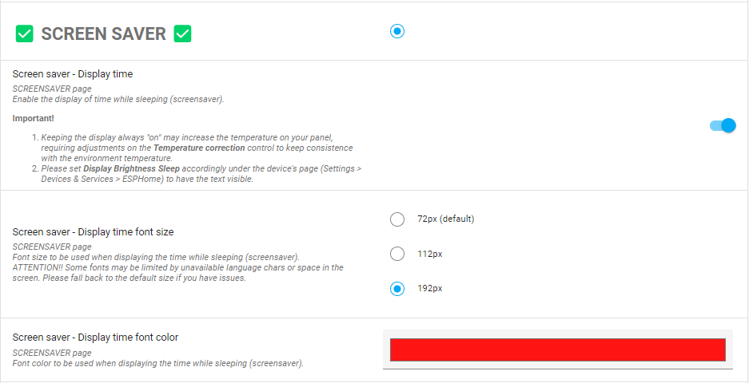
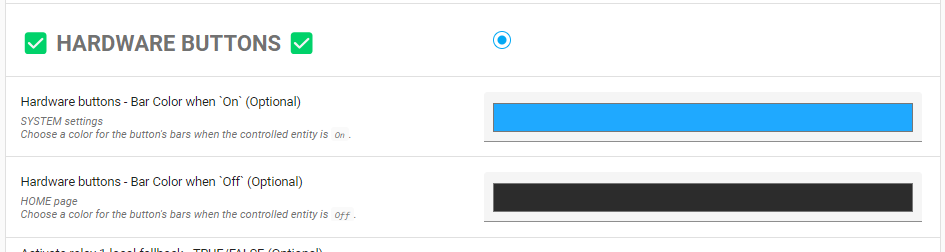
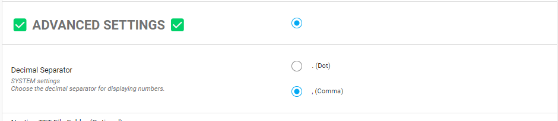
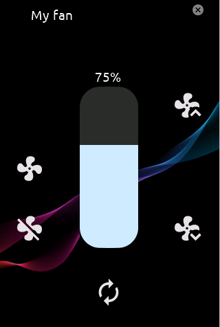
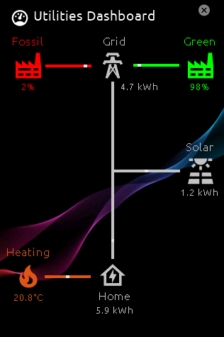
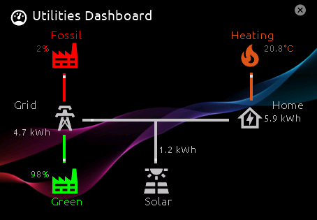
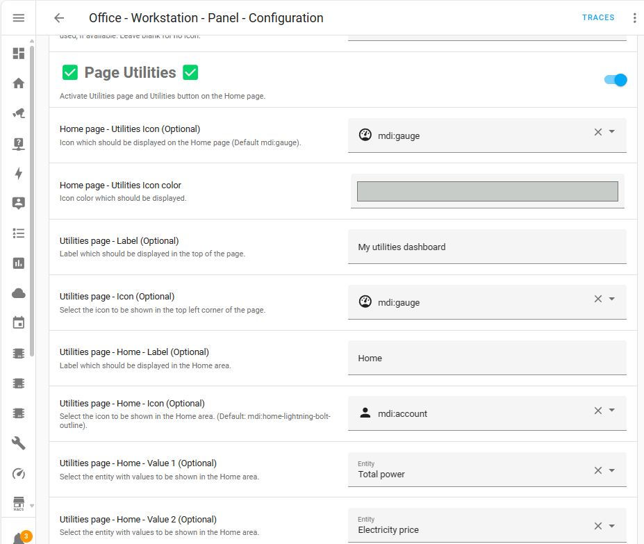

# v4.3 - Welcome to Framework ESP-IDF, an Utilities Dashboard and Enhanced Localization
## General
This milestone release is not just about adopting a new technical foundation;
it's about enhancing the capabilities and experiences of our users through significant performance improvements,
more comprehensive API documentation, customizable user interfaces and improved localization.

And with a nice Utilities Dashboard as a bonus!!

Our dedication to refining the user experience and expanding customization options continues, with this release featuring:

- **Utilities Dashboard**: A new addition, offering a customizable overview for essential utility metrics such as solar production,
wind energy, EV charging status, battery levels, and water or gas consumption.

- **Comprehensive API Documentation**: Simplifying customization and integration for developers and users, enabling tailored experiences with detailed service documentation.

- **Localization and Personalization**: Advances in user-defined settings, like decimal separators and value translations, contribute to a more intuitive interface.
We’ve also streamlined the display to exclude empty pages, making navigation more efficient.

- **Performance and Functionality**: The shift to the ESP-IDF framework not only boosts performance but also paves the way for future enhancements,
keeping NSPanel at the forefront of smart control technology.

As we embrace the ESP-IDF framework, we're excited to explore the new horizons it brings to the NSPanel firmware. Dive into v4.3 and discover the advancements that await.

## ESP-IDF Framework Transition
With this release, we've officially transitioned to the **ESP-IDF** framework.
This move is part of our ongoing efforts to enhance the memory capacity and expand the features available on the ESP, facilitating broader customization and new functionalities.

For users updating to this version:
- **Flashing Required**: To adopt the ESP-IDF framework, flashing your device using a serial cable is necessary. This step mirrors the initial custom firmware setup process.
- **Arduino Framework Still Available**: For those who prefer the `arduino` framework or require Over-The-Air (OTA) updates, it remains an option.
Detailed guidance on how to choose your framework is provided in our [customization documentation](https://github.com/Blackymas/NSPanel_HA_Blueprint/blob/main/docs/customization.md#frameworks).

This transition is a significant milestone for us, promising a robust platform for our community.
We're here to help with any questions or assistance needed during this change.
For more details and support, visit our [community discussion](https://github.com/Blackymas/NSPanel_HA_Blueprint/discussions/1756).

## Updating
Please review your settings post-update to ensure compatibility.
Refer to the update procedures [here](https://github.com/Blackymas/NSPanel_HA_Blueprint/blob/main/docs/howto.md#update-blueprint).

## Breaking Changes and Guidance
With this release, we're implementing several important changes.
While we strive to improve the panel, we understand that changes can affect your setups.
Here's a detailed overview and guidance for a smooth transition:

1. **Home Assistant v2024.3.0 is required**. You can see the full version compatibility list [here](docs/version_compatibility.md).

2. **Transition to ESP-IDF Framework**: This release marks the official switch to the ESP-IDF framework, enhancing performance and allowing for more complex features. 
   - **What to Do**: You'll need to flash your device with the new firmware using a serial connection.
   Detailed instructions are available in our [installation guide](docs/install.md#flashing-the-device-for-the-first-time).
   - **Support for Arduino Framework**: If you're not ready to make the switch or prefer the Arduino framework, it's still supported for OTA updates.
   See our [framework customization documentation](https://github.com/Blackymas/NSPanel_HA_Blueprint/blob/main/docs/customization.md#frameworks) for details on how to select your preferred framework.

3. **Several Services Changed**: In our pursuit to enhance integration capabilities and future-proof our services, we've undertaken a comprehensive restructuring of our API.
This change is aimed at improving functionality and compatibility but may require adjustments to your current automations.
   - **What to Do**: We strongly encourage you to review our updated [API documentation](docs/api.md).
   This resource has been meticulously updated to assist you in updating your automation scripts accordingly.
   Pay special attention to the examples section, which offers valuable insights and practical guidance for adapting your existing setups seamlessly.

4. **15s Hardware Button Press No Longer Restarts the Device**: This feature was removed to repurpose the hardware button for more versatile uses.
   - **What to Do**: If you relied on this feature, see our [customization guide](https://github.com/Blackymas/NSPanel_HA_Blueprint/blob/main/docs/customization.md#restart-with-15s-button-press) for alternatives.
   Additionally, the reset pin remains an option for manual resets.

5. **Relay Fallback Switches Removed**: These switches were deprecated and have now been removed to streamline the firmware and reduce memory usage.
   - **What to Do**: For users who utilized customizations to expose these switches, refer to our updated customization guide.
   Alternatively, use the `esphome.xxxxx_init_hardware` service for a similar functionality without the memory overhead.

6. **Home Page Redesign**: We've redesigned the Home page layout to incorporate an additional value (sensor) and a utilities button, resulting in a minor repositioning of some components.
This change enhances the page's functionality, offering you a broader overview of your smart home at a glance.
While adjusting to the new layout, you might find some of your usual indicators or controls have shifted places, but they're all still readily accessible, designed with intuitive interaction in mind.

We appreciate your understanding and patience during this transition.
Our goal is to ensure NSPanel continues to evolve in a way that enhances your experience and meets future needs.
Our community and support channels are open for any questions or assistance you may require.

## Overview of noteworthy changes
- [Transition to ESP-IDF as Default Framework](#transition-to-esp-idf-as-default-framework)
- [New API documentation](#new-api-documentation)
- [Selectable font size for screensaver time display](#selectable-font-size-for-screensaver-time-display)
- [Enhanced Visibility of Hardware Button Bars Across Pages](#enhanced-visibility-of-hardware-button-bars-across-pages)
- [User-Defined Decimal Separator](#user-defined-decimal-separator)
- [Page Light with Power Button](#page-light-with-power-button)
- [Page Fan with Oscillate Button](#page-fan-with-oscillate-button)
- [Streamlined Interface: No More Empty Pages](#streamlined-interface-no-more-empty-pages)
- [Enhanced Localization: Translated Values](#enhanced-localization-translated-values)
- [Expanded Entity Selection for Home and Climate Pages](#expanded-entity-selection-for-home-and-climate-pages)
- [Introducing the Utilities Dashboard](#introducing-the-utilities-dashboard)
- [Expanded Support for "Lock" Entities on Buttons and Chips](#expanded-support-for-lock-entities-on-buttons-and-chips)
- [Additional Value on Home Page](#additional-value-on-home-page)
- [Automatic Font Size Adjustment for Entity Page Values](#automatic-font-size-adjustment-for-entity-page-values)

## Details of noteworthy changes
### Transition to ESP-IDF as Default Framework
We've transitioned to ESP-IDF, enhancing our platform's performance and capabilities.
This change promises new possibilities for your projects.
Those continuing with the Arduino framework can find instructions for setting framework preferences.

For more information, visit our [discussion](https://github.com/Blackymas/NSPanel_HA_Blueprint/discussions/1756).

### New API documentation
Now all the services available are listed in a comprehensive documentation, making easier for people who want to customize their systems,
integrate to other automations and to encourage new collaborators to our repository.

For more details, please visit our [API documentation](docs/api.md).

### Selectable font size for screensaver time display
Now you can chose the font size for your clock display in the screen saver. There are 3 sizes available:

#### 72px

### 112px

### 192px

<!-- markdownlint-disable MD028 -->
> [!IMPORTANT]
> For this time to be displayed you must select a brightness higher than 0 on the device's page (under **Settings** > **Devices & Services** > **ESPHome**).

> [!WARNING]
> Some fonts may not support all the languages.

> [!WARNING]
> Bigger fonts may not fit well on your display and the selected time format.
> Please select a different font in that case.
<!-- markdownlint-enable MD028 -->

### Enhanced Visibility of Hardware Button Bars Across Pages
The hardware button bars, which display the status of entities linked to physical buttons, are now configurable to appear across all pages,
including the screensaver, providing a constant visual reference to your system's status.
This update introduces a new setting within the blueprint, allowing you to customize the visibility of these bars according to your preferences.
Whether you need continuous monitoring on certain pages or want to maintain a cleaner look on others, this flexibility enhances your control.

Additionally, we've introduced the option to personalize the color of these bars, offering further customization to match your panel's aesthetic or to signify different statuses at a glance.

This feature enhances the NSPanel's functionality by ensuring important status indicators are always within view, tailored precisely to how you use your smart home.

### User-Defined Decimal Separator
You can now select the decimal separator for displaying numbers on your NSPanel.
This feature allows for consistency with your regional number format preferences, improving the clarity of numerical information.
Simply go to the settings to choose between the dot (.) and comma (,) as your decimal separator for a display that matches your preference.

This update aims to enhance the flexibility and usability of the NSPanel interface for users worldwide.

### Page Light with Power Button
The page Light has been updated to include a power button, simplifying the process of toggling your light on or off.
This intuitive addition allows for quick adjustments directly from the page Light, enhancing the user experience by providing a straightforward control mechanism.

This enhancement streamlines light management, making it more accessible and convenient for everyday use.

### Page Fan with Oscillate Button
The Fan page now features an oscillate button, making it easier to control your fan's oscillation settings.
This convenient update enables users to activate or deactivate the oscillation function with a single tap, directly from the Fan page itself.
It's designed to improve the user experience by offering a simple and effective control option.

This update simplifies fan operation, enhancing accessibility and usability for all users.

### Streamlined Interface: No More Empty Pages
We've improved the NSPanel interface by ensuring that only populated pages are displayed, both for button and entities pages.
This update creates a more intuitive and clutter-free experience, automatically hiding any pages without assigned entities.
There's no need for additional setup; if a page has no entities linked to it, it simply won't appear on your panel, making navigation smoother and more efficient.

### Enhanced Localization: Translated Values
In a significant step towards a more localized user experience, the values displayed on the NSPanel are now translated using Home Assistant's `state_translated` function, introduced in HA v2024.3.0.
This means that not only are the project's strings translated, but also values provided by Home Assistant, such as those from text sensors or binary sensors.
This enhancement simplifies readability and usability for users interacting with the panel in different languages.

> [!NOTE]
> The translations are managed by Home Assistant and will correspond to the language settings
> specified under [**Settings** > **System** > **General**](https://my.home-assistant.io/redirect/general/).

### Expanded Entity Selection for Home and Climate Pages
With the latest update, we've significantly broadened the range of entities that can be incorporated into the Home and Climate pages,
aligning these sections with the extensive capabilities of the Entities pages.
This enhancement enables a more versatile and detailed representation of your smart home's metrics directly on your NSPanel,
from environmental sensors to energy monitors, offering a tailored view of your home's status at a glance.

When combined with the [Translated Values](#enhanced-localization-translated-values),
this expanded entity selection not only allows for a more personalized dashboard but also ensures that the information displayed is accessible and understandable,
regardless of your preferred language.
Together, these features elevate the NSPanel's functionality, providing you with a richer, more contextually relevant interface that adapts to your specific monitoring needs and preferences.

### Introducing the Utilities Dashboard
The "Utilities Dashboard" is a versatile feature tailored to offer a straightforward overview of your chosen utility metrics.
It's designed for flexibility, allowing you to customize up to six data points, such as solar production, wind energy, EV charging status,
battery levels, water, and gas consumption, according to what's relevant to your home.
This customization ensures that the dashboard only displays the utilities you're monitoring, maintaining a clean and uncluttered interface.

 

### Expanded Support for "Lock" Entities on Buttons and Chips
We're enhancing the NSPanel's integration capabilities by extending support for "lock" entities to both buttons and chips.
This development significantly broadens your ability to interact with and control lock mechanisms directly from the NSPanel.
Whether securing your home or managing access to different areas, these updates streamline the control process, integrating seamlessly with your smart home's security setup.

### Additional Value on Home Page
In our continuous effort to enhance the NSPanel's utility and efficiency, we're pleased to announce that the Home page now accommodates a fourth value, complete with its icon.
This addition allows for a more comprehensive at-a-glance view of your essential metrics directly from the home screen, ensuring that crucial information is always just a glance away.

### Automatic Font Size Adjustment for Entity Page Values
We've enhanced the entities pages with an automatic font size adjustment feature to improve the display of values, especially for longer strings or values with lengthy units.
This smart adjustment reduces the occurrence of truncated values by dynamically resizing the font based on the string length.
While the selection of fonts for the panel remains limited, this automatic resizing significantly enhances readability,
ensuring that all displayed information is clear and fully visible at a glance.

## v4.3.1 - Ensuring Compatibility with ESPHome v2024.3.0 and Enhancing Stability
Patch v4.3.1 focuses primarily on ensuring full compatibility with the latest ESPHome v2024.3.0 IP address format changes, crucial for the smooth compilation and operation of the NSPanel project.
This timely update addresses critical compatibility issues, alongside implementing key bug fixes and optimizations.
It underscores our ongoing commitment to enhancing stability and ensuring a reliable experience for all NSPanel users, keeping pace with the evolving ESPHome ecosystem.

### Support for ESPHome v2024.3.0 IP Address Format
- **Criticality:** Critical (required for compiling with ESPHome 2024.3.0)
- **Affected Components:** ESPHome
- **Description:** This update introduces necessary adjustments to accommodate the new IP address format introduced by ESPHome v2024.3.0,
ensuring uninterrupted project compilation and enhancing compatibility.
This critical update is the cornerstone of patch v4.3.1, deployed simultaneously with ESPHome to ensure NSPanel users experience no disruption in service.
This adaptation ensures that NSPanel firmware remains fully functional and up-to-date with ESPHome's latest advancements,
reaffirming our commitment to providing a seamless and stable user experience.

### Button Bars Visibility Enhancement and Configuration Change
- **Criticality:** Breaking Change (with Enhancement)
- **Affected Components:** Blueprint
- **Description:** The visibility of button bars, indicating the status of entities linked to hardware buttons,
has been updated to be visible across all pages by default, including the screensaver.
This enhancement improves the accessibility of crucial status information.
Users who previously customized the visibility settings for button bars will need to review and adjust their configurations to align with the new default behavior.
This change enables users to selectively exclude button bars from specific pages if desired, providing greater flexibility and control over the interface's appearance.

### Service `hw_button_state` Update
- **Criticality:** Breaking Change (with Enhancement)
- **Affected Components:** Blueprint and ESPHome
- **Description:** The method for controlling the state of hardware buttons has been refined with the introduction of a `button_mask` parameter.
This update simplifies the process of simultaneously updating the visual state of multiple hardware buttons,
enhancing user interaction by providing a more intuitive interface for managing button states.
Users can now specify the buttons they wish to control using a single `button_mask` parameter,
offering a streamlined approach for activating or deactivating the on-screen indication bars of the hardware buttons.
This change fosters a more flexible and efficient user experience in configuring the visual feedback for button states.

### Celsius Display Issue for Embedded Temperature Sensor Resolved (#1834)
- **Criticality:** Medium
- **Affected Components:** ESPHome
- **Description:** Addressed an issue where the NSPanel's built-in temperature sensor incorrectly displayed temperature readings in Celsius, even when Fahrenheit was expected.
This fix ensures temperature readings are accurately represented according to the user's settings, improving usability and consistency across the system.

### Resolution for Panel Naming When `device_name` Is Not Provided (#1907)
- **Criticality:** Medium
- **Affected Components:** ESPHome
- **Description:** Corrected a bug that caused the new "Device Name" sensor to report "nspanel"
and therefore fail on defining services names when a `device_name` substitution was not specified by the user.

### External Temperature Sensor Selection Now Correctly Overrides Embedded Sensor Value (#1911)
- **Criticality:** Medium
- **Affected Components:** Blueprint and ESPHome
- **Description:** Fixed a display issue where the built-in sensor's temperature reading persisted despite configuration for an external sensor.

### Utilities Dashboard Now Correctly Omits Default Labels When Customized (#1899)
- **Criticality:** Minor
- **Affected Components:** Blueprint
- **Description:** Enhanced the utilities dashboard by ensuring custom labels properly replace or remove default ones for a personalized display.

### Clarification and Improvements to `rtttl_play` Service Documentation (#1901 and #1912)
- **Criticality:** Minor
- **Affected Components:** Documentation
- **Description:** Updated documentation for clearer guidance on using the `rtttl_play` service for custom sounds and alerts.

### Correction of Missing Icon Display Issue on Entities Page 3 (#1902)
- **Criticality:** Minor
- **Affected Components:** TFT
- **Description:** Addressed a bug preventing certain icons from displaying on the third Entities page, ensuring a consistent user interface.

### Icons No Longer Appear "Disabled" for Sensor Values of 0.0 (#1902)
- **Criticality:** Minor
- **Affected Components:** Blueprint
- **Description:** Resolved an incorrect icon color display issue where they appeared disabled at a sensor value of exactly 0.0.

### Vertical Alignment Improvements on Entities Pages for Enhanced Readability (#1903)
- **Criticality:** Minor
- **Affected Components:** TFT
- **Description:** Adjusted the vertical alignment of text and icons on Entities pages for a more visually appealing presentation.

### Enhanced Guidance on Handling Duplicated Entities on the Device's Page (#1905)
- **Criticality:** Minor
- **Affected Components:** Documentation
- **Description:** Updated documentation to better address and resolve issues related to entity duplication on the device's page on Home Assistant.

### Compilation Guidance Updated for Customizations with the Latest Version (#1914)
- **Criticality:** Minor
- **Affected Components:** Documentation
- **Description:** Resolved documentation issues leading to compilation errors during customization, facilitating smoother custom feature implementation.

### Elimination of Transient Icon Flashes on the Home Page During Page Transitions (#1915)
- **Criticality:** Minor
- **Affected Components:** Blueprint,  ESPHome and TFT
- **Description:** Fixed a visual glitch where icons briefly flashed during transitions, streamlining the visual experience.

### Real-Time Brightness Adjustment Now Effective Even During Sleep Mode (#1919)
- **Criticality:** Minor
- **Affected Components:** ESPHome
- **Description:** Ensured brightness settings changes are immediately applied, even when the panel is in sleep mode.

### Smooth Cursor Movement on Utilities Page Near Zero Sensor Readings (#1926)
- **Criticality:** Minor
- **Affected Components:** Blueprint
- **Description:** Ensured cursor movement on the Utilities page is smooth and accurate, even with sensor readings defining the cursor direction is between 0 and 1.

### Notification Screen Clearing Now Functional with `notification_clear` Service Call (#1931)
- **Criticality:** Minor
- **Affected Components:** ESPHome
- **Description:** Enabled clear display of notifications from the screen upon invoking the `notification_clear` service, enhancing display control.

### Page Indicator Removed for Single-Page Views (#1883)
- **Criticality:** Enhancement
- **Affected Components:** TFT
- **Description:** Improved UI by removing unnecessary page indicators when only one page is present, simplifying navigation.

### Entities Page Font Adjustment for CJK Fonts Improved (#1884)
- **Criticality:** Enhancement
- **Affected Components:** ESPHome
- **Description:** Optimized font sizing and display on Entities pages for CJK fonts, addressing readability issues.

### User Option Added to Disable Entities Page Icons for a Text-Focused View (#1885)
- **Criticality:** Enhancement
- **Affected Components:** Blueprint
- **Description:** Introduced an option to disable icons on Entities pages, allowing for a simplified, text-only display.

### Utilities Page Line Cursor Size Customization Option Added (#1910)
- **Criticality:** Enhancement
- **Affected Components:** Blueprint
- **Description:** Provided customization options for cursor size on the Utilities dashboard, enhancing data visualization.

### Temperature Measurement Sampling Enhancement (#1918)
- **Criticality:** Enhancement
- **Affected Components:** ESPHome
- **Description:** Enhanced the temperature reporting mechanism of the NSPanel's built-in temperature sensor by implementing a sampling method.
Now, the sensor collects 12 intermediate measurements and calculates their average before reporting the temperature.
This enhancement, which does not alter the 1-minute measurement interval, aims to provide smoother and more stable temperature readings,
improving accuracy and reliability for users monitoring their environment.

### Boot Page Visual Feedback Enhancements for Clearer System Status Display (#1923)
- **Criticality:** Enhancement
- **Affected Components:** ESPHome and TFT
- **Description:** Updated the Boot page to offer clearer visual feedback on version information and system status, with a new progress bar.

## v4.3.2 - Enhancements and Critical Fixes for a Seamless Experience
In this patch, we focus on enhancing the NSPanel experience by introducing critical fixes and requested enhancements to improve overall system stability and user interaction.
This update addresses key issues, such as the incorrect display of the "boot" page upon wake-up, and optimizes the performance of the Utilities Dashboard to prevent potential overload states.
With updates across firmware, user interface, and documentation, v4.3.2 underscores our dedication to delivering a seamless and robust smart home control solution.

### Device Reboot Issue on Wake Up Resolved (#1947 and #1976)
- **Criticality:** Medium
- **Affected Components:** Blueprint
- **Issue Number:** #1947 and #1976
- **Description:** Resolved a critical issue causing the NSPanel to boot to the "boot" page rather than the "home" page under certain conditions, such as upon waking.
This correction ensures the panel directly accesses the "home" page, streamlining user interaction by promptly presenting the main interface.
Effective implementation of this fix necessitates clearing the build files before updating.
The procedure below guides you through cleaning build files in the ESPHome Dashboard, an essential step to actualize this update.

### Utilities Dashboard Performance Bug Resolved (#1949 and #1964)
- **Criticality:** Medium
- **Affected Components:** Blueprint and ESPHome
- **Issue Number:** #1949 and #1964
- **Description:** Fixed a significant performance bug in the "Utilities Dashboard" related to sensors with high update frequencies.
Previously, sensors updating frequently could overload the Home Assistant host, causing the blueprint execution to delay.
As updates persisted, this led to multiple instances of the blueprint being triggered, eventually hitting the limit of 50 concurrent instances.
This update minimizes the issue, ensuring smooth operation and reducing the chances of a overload state, thereby maintaining efficient and reliable dashboard performance.

#### How to Clean-up Build Files
1. Navigate to your ESPHome Dashboard.
2. Select the 3-dot menu adjacent to your device's listing.
3. Choose "**Clean Build Files**".

> [!IMPORTANT]
> Cleaning build files is a mandatory step for this update to apply successfully.
> It ensures your NSPanel operates smoothly with the new improvements post-update.

### Fix for Inverted Chip Icon Color Issue (#1928)
- **Criticality:** Minor
- **Affected Components:** Blueprint, TFT
- **Issue Number:** #1928
- **Description:** Resolved an issue where the color of icons on inverted chips did not display correctly on the home page, affecting the visual distinction and readability of these elements.
This fix ensures that icons on inverted chips are now properly rendered, maintaining consistency and enhancing the overall aesthetic of the user interface.
This correction contributes to a more intuitive and visually appealing experience for users, reinforcing the clarity of information presented on the NSPanel.

### Fix for Numeric Button Page Labels Not Displaying (#1961)
- **Criticality:** Minor
- **Affected Components:** Blueprint
- **Issue Number:** #1961
- **Description:** Resolved an issue where button page labels consisting solely of numbers were not being displayed, ensuring that numeric titles are now properly shown.
This fix enhances interface clarity by allowing users to utilize numerical identifiers for their button pages, thereby improving navigation and usability within the NSPanel environment.

### Automatic Update for Weather Icon at Sunrise and Sunset (#1971)
- **Criticality:** Minor
- **Affected Components:** Blueprint
- **Issue Number:** #1971
- **Description:** Addressed a bug where the weather icon on the home page did not automatically update to reflect changes at sunrise and sunset, necessitating a manual page reload.
With this fix, the icon now refreshes automatically to provide an accurate representation of the weather conditions in relation to the day and night cycle.
This improvement ensures a more dynamic and responsive user interface, enhancing the visual experience by seamlessly integrating natural environmental changes.

### Fix for Missing Titles and Icons on Detailed Entities Pages (#1978)
- **Criticality:** Minor
- **Affected Components:** Blueprint
- **Issue Number:** #1978
- **Description:** Resolved an issue on detailed entities pages where page titles and icons were not being displayed, leading to a lack of clarity and navigation challenges for users.
This fix ensures that each detailed page now correctly showcases its respective title and icon,
enhancing the overall user interface by providing immediate context and visual cues for better usability and navigation within the NSPanel environment.

### Swipe Functionality Restored on Button and Home Pages (#1980 and #1994)
- **Criticality:** Minor
- **Affected Components:** TFT
- **Issue Number:** #1980 and #1994
- **Description:** Addressed issues impacting swipe functionality on button pages and the home page, which previously hindered smooth navigation through swipe gestures.
This update restores proper swipe operation, allowing users to effortlessly switch between pages with a simple gesture.
Enhancing swipe responsiveness contributes to a more fluid and intuitive user experience, reinforcing the ease of navigating the NSPanel's interface.

### Typo Correction in Blueprint Inputs (#2003)
- **Criticality:** Minor
- **Affected Components:** Blueprint
- **Issue Number:** #2003
- **Description:** Corrected a minor typo in the blueprint inputs to ensure accuracy and clarity in the configuration options.
This adjustment, made in the description for the `hw_buttons_bar_color_off` input, showcases our commitment to detail and high-quality documentation,
enhancing user experience by providing clear and precise instructions.
- **Special Thanks:** Our thanks go to @colincachia for this attentive correction.
This action highlights the importance of community involvement and the collective effort to maintain the project's high standards, even in the smallest details.

### Immediate Brightness Adjustment from Home Assistant Fixed
- **Criticality:** Minor
- **Affected Components:** ESPHome
- **Issue Number:** #2006
- **Description:** Resolved a minor issue affecting brightness adjustments made from Home Assistant.
Previously, when the brightness target was reduced via Home Assistant, the change was not immediately reflected on the NSPanel.
This update ensures that any adjustments to brightness settings are promptly applied,
maintaining consistency between the Home Assistant interface and the NSPanel's display for a more synchronized and responsive user experience.

### Custom Binary State Entities for Hardware Button Status Display Enhancement (#1904, #1933, #1959, #1973)
- **Criticality:** Enhancement
- **Affected Components:** Blueprint
- **Issue Number:** #1904, #1933, #1959, #1973
- **Description:** This update introduces the capability to assign custom binary state entities to the hardware button status display.
This significant enhancement allows for the hardware button bar to reflect the status of a different entity than the one assigned to the button itself,
providing users with greater customization and flexibility in their interface interactions.
This development enriches user feedback mechanisms, enabling more intuitive and dynamic control options within the NSPanel environment.
- **Special Thanks:** Our heartfelt appreciation goes to @lafriks for their invaluable contribution and initiative in developing this feature.
These efforts have notably advanced the customization potential of NSPanel, fostering a more versatile and user-centric experience.

### Enhanced Temperature Measurement Strategy (#1918)
- **Criticality:** Enhancement
- **Affected Components:** ESPHome
- **Issue Number:** #1918
- **Description:** Thanks to the dedicated efforts and thorough testing by our community,
the NSPanel's built-in temperature sensor now employs a more sophisticated measurement strategy for enhanced accuracy and responsiveness.
By integrating a combination of four samples per measurement and employing a `sliding_window_moving_average` filter with a window size of six,
the sensor's reporting frequency has been adjusted to every 10 seconds.
This methodological enhancement, chiefly proposed and tested by community members @andythomas and @grigi,
ensures a smoother temperature curve and faster response to environmental changes such as opening a window.
While the adjusted frequency means data is reported more often, ESPHome's efficient data transmission only when changes occur ensures that the impact on Home Assistant's data processing is minimal.
This significant improvement, sparked by proactive community involvement,
not only enhances the NSPanel's functionality but also broadens the scope for more dynamic and responsive environmental automations.
- **Special Thanks:** To @andythomas and @grigi for their exceptional work in testing and proposing these adjustments, truly embodying the spirit of community-driven development.
Your active participation and contributions have been instrumental in refining this feature.

### Enhanced Version Mismatch Notifications for Comprehensive System Compatibility (#1966 and #1968)
- **Criticality:** Enhancement
- **Affected Components:** Blueprint
- **Issue Number:** #1966 and #1968
- **Description:** The version mismatch notification system has been significantly improved to cover all critical components of the NSPanel project,
including the ESPHome firmware, Home Assistant blueprint, and Nextion TFT file.
This update ensures that notifications are more descriptive, pinpointing which component is out of sync and providing specific instructions for resolution.
This targeted approach helps users quickly identify and rectify compatibility issues, maintaining the system's overall harmony and preventing disruptions in functionality.

### Documentation Improvement for TFT Upload Process (#1969)
- **Criticality:** Enhancement
- **Affected Components:** Documentation
- **Issue Number:** #1969
- **Description:** Enhanced the documentation to clarify the necessity of DNS for downloading TFT files from GitHub during the TFT upload process.
This update addresses confusion encountered when manually setting IP addresses as part of customizations, emphasizing that a DNS server must be specified to enable remote TFT downloads.
For setups lacking DNS configuration, the documentation now highlights the alternative of using local TFT transfer via the `nextion_update_url` substitution.
This clarification aims to streamline the TFT update process, ensuring users have a clear understanding of the requirements for successful TFT file downloads and uploads,
thereby enhancing the overall setup experience.

### Documentation Update for "Folder-Watcher" Engine Use (#1974)
- **Criticality:** Enhancement
- **Affected Components:** Blueprint
- **Issue Number:** #1974
- **Description:** Updated documentation to provide clearer instructions on the "folder-watcher" engine's use within the NSPanel project.
This engine, which triggers TFT updates upon changes in a user-specified folder, may not be widely used but offers valuable functionality for those who do.
The documentation now more accurately describes how to leverage this feature for automated TFT updates, aiming to improve understanding and ease of use for interested users.

### Close Icon Visibility Enhancement (#1984)
- **Criticality:** Enhancement
- **Affected Components:** TFT
- **Issue Number:** #1984
- **Description:** Enhanced the visibility of the "close" icon (represented as an "x" sign) located at the top right corner of various pages.
By slightly increasing the size of this icon, users can now more easily identify and interact with it, improving the overall usability of the NSPanel interface.
This minor yet impactful adjustment ensures a smoother, more intuitive navigation experience for all users.

### Alarm Control with Hardware Button Enhancement (#1995)
- **Criticality:** Enhancement
- **Affected Components:** Blueprint
- **Issue Number:** #1995
- **Description:** Enhanced the functionality of hardware buttons for a more intuitive interaction with alarm control panels.
Now, a short click on a hardware button assigned to an entity from the `alarm_control_panel` domain will open its detailed page, aligning with the behavior for `climate` and `media_player` entities.
This update facilitates quicker access to alarm controls directly from the NSPanel, streamlining user interactions.
Long clicks continue to open the detailed page for these and other domains, maintaining a consistent and user-friendly experience across various controls.

### Documentation Updates for Arduino References (#1997)
- **Criticality:** Enhancement
- **Affected Components:** Documentation
- **Issue Number:** #1997
- **Description:** Comprehensive updates and refinements were made to the project documentation, with a particular focus on correcting and clarifying references related to the Arduino framework.
This effort led to a thorough review and subsequent enhancement of various sections of the documentation, improving clarity, accuracy, and usefulness across the board.
Special thanks to the author of this PR, @andythomas, whose dedicated work went beyond just addressing
Arduino framework references to include minor fixes and overall improvements to the documentation.
These contributions have significantly elevated the quality of information available to users, ensuring that the documentation remains a reliable and up-to-date resource for the community.

### Expanded Wake-Up Sensor Support (#1998)
- **Criticality:** Enhancement
- **Affected Components:** Blueprint
- **Issue Number:** #1998
- **Description:** The range of supported device classes for wake-up sensors on the NSPanel has been significantly expanded.
Now, in addition to the previously supported door, motion, and occupancy sensors, the NSPanel firmware accommodates a wider variety of sensor types.
These enhancements enable the panel to wake up from sleep mode upon detecting various environmental changes, improving responsiveness and user interaction.
The newly supported device classes include:
  - door
  - garage_door
  - lock
  - motion
  - occupancy
  - opening
  - smoke
  - sound
  - vibration
  - window
This update broadens the NSPanel's integration capabilities with home automation systems, allowing for a more dynamic and reactive smart home environment.

### Hebrew Translation Text Reversal Fix (#1999)
- **Criticality:** Enhancement
- **Affected Components:** Blueprint
- **Issue Number:** #1999
- **Description:** Addressed a specific issue with the Hebrew translation where text was displayed in reverse order, hindering readability and user experience.
This fix ensures that Hebrew text is correctly aligned and presented, enhancing the interface for Hebrew-speaking users.
The commitment to support diverse languages and correct such localization issues underscores our dedication to providing a user-friendly experience for all NSPanel users,
regardless of their language.

### Enhanced TFT Update Reliability in ESPHome Nextion Component
- **Criticality:** Enhancement
- **Affected Components:** ESPHome
- **Description:** Improved the reliability of TFT updates within the ESPHome Nextion component.
This enhancement optimizes the process of updating the NSPanel's display, ensuring smoother transitions and reducing the potential for update failures.
The upgrade targets the underlying mechanisms of the Nextion component in ESPHome,
refining its functionality to offer a more dependable and efficient update experience for users implementing TFT changes.

## v4.3.3 - Enhancing Flexibility and User Experience
With the v4.3.3 update, we're focused on refining the NSPanel's usability and customization capabilities, addressing user feedback to enhance the intuitive interaction with the panel.
From streamlining light entity controls to expanding text length for entities on the home page, each change is aimed at improving the user experience.
This patch also introduces experimental features, such as prebuilt firmware updates and PSRAM use, pushing the boundaries of what's possible with NSPanel,
while also ensuring a smoother, more reliable interface across different languages and configurations.

### Simplified Light Entity Control on Custom Buttons (#1844)
- **Criticality:** Minor
- **Affected Components:** Blueprint
- **Issue Number:** #1844
- **Description:** Addressed an inconsistency where light entities with only on/off capabilities erroneously showed an extended screen with a brightness slider.
This fix streamlines the control interface for such light entities, aligning with their actual capabilities.

### Deletion of Button Icons from Home Page Enabled (#1992)
- **Criticality:** Minor
- **Affected Components:** Blueprint
- **Issue Number:** #1992
- **Description:** Resolved an issue preventing the removal of button icons from the home page.
Users can now delete or change button icons as needed, providing flexibility in customizing the panel's appearance.

### Correction of Missing Characters on Button Pages for Multi-Byte Languages (#2000)
- **Criticality:** Minor
- **Affected Components:** Blueprint, ESPHome, and TFT
- **Issue Number:** #2000
- **Description:** Resolved a display issue affecting multi-byte languages, where specific characters were missing on the button pages.
This fix ensures complete and accurate representation of all languages across the NSPanel interface, including Hebrew and others where a character may occupy more than a single byte.

### Entity Display Persistence on Home Page Addressed (#2018)
- **Criticality:** Minor
- **Affected Components:** Blueprint
- **Issue Number:** #2018
- **Description:** Fixed a bug where entities removed from the blueprint continued to display on the home page.
This update ensures that the home page accurately reflects the current configuration, removing any unassigned entities.

### Resolved Unintended Climate Control Page Access (#2021)
- **Criticality:** Minor
- **Affected Components:** Blueprint
- **Issue Number:** #2021
- **Description:** Fixed an issue where touching the temperature display on the home page erroneously opened the climate control page, even in the absence of configured climate entities.
This update ensures that interactions with the temperature display are consistent with the available configurations, enhancing the intuitive use of the NSPanel.

### Internal Temperature Reporting Fix After Sleep (#2030)
- **Criticality:** Minor
- **Affected Components:** Blueprint
- **Issue Number:** #2030
- **Description:** Resolved an issue where the internal temperature indicator disappeared for a few seconds upon waking the panel from sleep mode.
This fix ensures the internal temperature, especially when sourced from the panel's internal sensor,
remains consistently displayed without interruption when transitioning from sleep to the home page, enhancing the stability and reliability of environmental monitoring on the NSPanel.

### Advanced Settings Page Entity Name Enhancement (#1909)
- **Criticality:** Enhancement
- **Affected Components:** Blueprint
- **Issue Number:** #1909
- **Description:** Improved the advanced settings page by providing clearer entity names when opened from a custom button,
enhancing user navigation and configuration understanding within the NSPanel settings.

### Support for `mdi:void` Icon on Homepage for Blank Display (#2019)
- **Criticality:** Enhancement
- **Affected Components:** Blueprint
- **Issue Number:** #2019
- **Description:** Implemented support for the `mdi:void` icon on the homepage, allowing for a blank display where no icon is preferred.
This enhancement provides users with greater customization flexibility, enabling a cleaner and more minimalistic interface by opting not to show any icon.

### Extended Text Length for Entities on Home Page (#2020)
- **Criticality:** Enhancement
- **Affected Components:** TFT
- **Issue Number:** #2020
- **Description:** Enhanced the home page by allowing for longer text for entities values.
This improvement accommodates more detailed values, improving clarity and user understanding of displayed data and controls.

### Timezone Selector Added to Blueprint
- **Criticality:** Enhancement
- **Affected Components:** Blueprint and ESPHome
- **Description:** Introduced a timezone selector within the Blueprint configuration, streamlining the setup process and enhancing user convenience.
  This addition simplifies the configuration of the NSPanel, significantly reducing the need for YAML customizations related to timezone settings.
  By providing a direct method to specify the timezone, this enhancement ensures that time displays and other time-sensitive features on the NSPanel accurately reflect the user's local time,
  contributing to a more personalized and accurate user experience.

### Prebuilt Firmware Updates (#2024) - EXPERIMENTAL
- **Criticality:** Enhancement
- **Affected Components:** ESPHome
- **Issue Number:** #2024
- **Description:** The prebuilt firmware has been updated to incorporate the latest fixes and enhancements,
   ensuring users have access to the most current and stable version without the need for manual compilation.
   This is another important step in our goal torwards [Simplifying User Experience for NSPanel Firmware](https://github.com/Blackymas/NSPanel_HA_Blueprint/discussions/1602),
   allowing users to directly download the firmware from GitHub without the need of compiling it locally.
- **Special Thanks:** To @MichaelHeimann for trimming this feature, fixing bugs and reviving this idea.

### Use of PSRAM (#1815, #1946, and #1983) - EXPERIMENTAL
- **Criticality:** Enhancement
- **Affected Components:** ESPHome
- **Issue Number:** #1815, #1946, and #1983
- **Description:** We are introducing the use of PSRAM memory available on the NSPanel.
   This will possibly open space for additional features to be developed in the future and the use of more customizations for your panel.
- **Special Thanks:** To @Bascht74 and @olicooper for giving the directions to enable the use of non-standard pins for PSRAM used in NSPanel,
   and to @X-Ryl669 and @MichaelHeimann for all the tests, tips, and feedback around this.

## v4.3.4 - Urgent Fix for Home Screen Interaction
This patch release addresses a critical issue from the v4.3.3 update that affected the touch functionality on the Home screen, specifically impacting the ability to navigate to the climate page.

### Critical Touch Interaction Bug Fixed (#2040)
- **Criticality:** Critical
- **Affected Components:** Blueprint
- **Issue Number:** #2040
- **Description:** Fixed an issue where users were unable to navigate to the climate control page by touching the temperature display on the Home screen.
This bug was inadvertently introduced in the v4.3.3 update and has been promptly resolved to restore full functionality.
Users can now interact with the temperature display as intended, facilitating seamless access to the climate controls.

This update is essential for ensuring that the NSPanel functions correctly, maintaining the quality and reliability expected by our users.
We apologize for any inconvenience caused and thank you for your continued support.

## v4.3.5 - Experimenting with Bluetooth Capabilities
This patch release v4.3.5 introduces experimental Bluetooth features alongside critical fixes and enhancements.
The new Bluetooth capabilities leverage the previously untapped potential of the NSPanel's Bluetooth modem, enabled by the increased memory availability in the ESP-IDF framework.

### New Bluetooth Features (Experimental)
- **BLE Tracker Add-on**
  - **Description:** This add-on enables the NSPanel to act as a Bluetooth Low Energy (BLE) tracker, allowing it to detect and report the presence of BLE devices in its vicinity.
  This feature is instrumental for presence detection and smart home automation scenarios.

- **Bluetooth Proxy Add-on**
  - **Description:** The Bluetooth Proxy add-on allows the NSPanel to act as a bridge or proxy for other Bluetooth devices, facilitating communication between BLE devices and Home Assistant.
  This can significantly extend the functionality of Home Assistant in managing Bluetooth devices without direct connectivity.

### Temperature Display and Control Fixes
- **Temperature Increment Error in Climate Card Resolved (#2076)**
  - **Criticality:** Medium
  - **Affected Components:** ESPHome
  - **Description:** Corrected a rounding error in the climate card, which caused temperature set points to adjust in increments of 0.9 degrees.
  This fix ensures temperature adjustments are now rounded to the nearest whole number, aligning with expected control behavior.

- **Consistent Temperature Unit Display Across Panels (#2056)**
  - **Criticality:** Medium
  - **Affected Components:** ESPHome
  - **Description:** Resolved an issue where the internal temperature sensor did not convert temperatures from Celsius to Fahrenheit for display on the home screen,
  despite displaying correctly on the climate page. Temperatures are now consistently shown in the user-defined units across all NSPanel displays.

### Control and Interface Enhancements
- **Improved Custom Button Response for Dimmable Color Lights (#2072)**
  - **Criticality:** Minor
  - **Affected Components:** Blueprint
  - **Description:** Fixed a bug where custom buttons for dimmable color lights only toggled the lights on/off.
  The buttons now correctly adjust brightness and color settings, enhancing user control.

- **Homepage Weather and Climate Control Delay Minimized (#2056)**
  - **Criticality:** Minor
  - **Affected Components:** ESPHome and TFT
  - **Description:** Introduced a minor delay optimization for weather updates and climate control interactions on the home page, improving the responsiveness and user experience.

- **Consistent Icon Color Display on Home Page (#2043)**
  - **Criticality:** Minor
  - **Affected Components:** Blueprint
  - **Description:** Addressed an issue where icons on the home page always displayed in white, regardless of the set color.
  Icons now correctly reflect the specified colors, enhancing visual consistency and user interface aesthetics.

### System Stability and Functionality
- **Restoration of Webserver Functionality Post-Upgrade (#2054, #2050)**
  - **Criticality:** Critical
  - **Affected Components:** ESPHome
  - **Description:** Fixed issues that caused the webserver component to stop functioning following recent upgrades.
  This repair restores full webserver functionality, essential for user access and system configuration via a web interface.

- **Reliability Improvements for TFT Uploads with Bluetooth Components (#1946, #1815)**
  - **Criticality:** Medium
  - **Affected Components:** ESPHome
  - **Description:** Enhanced the reliability of TFT file uploads when the Bluetooth proxy or the BLE Tracker are enabled.
  This fix addresses disruptions previously experienced during TFT updates, ensuring smoother and more reliable firmware installations.

This update, v4.3.5, is a significant step towards harnessing the full potential of the NSPanel's hardware capabilities, especially its Bluetooth functionality,
while continuing to refine the user experience and system stability.
We appreciate the community's active involvement in identifying these issues and thank everyone for their contributions to improving the firmware.

## v4.3.6 - Critical Fixes for Custom Buttons
This release of v4.3.6 is an urgent patch to address critical issues affecting the functionality of custom buttons on the NSPanel.
These fixes ensure that custom buttons properly trigger actions for climate and alarm controls, and correct the integration with external thermostat entities.

### Fixes for Custom Button Functionality
- **Climate Page Accessibility Restored (#2067)**
  - **Criticality:** Critical
  - **Affected Components:** Blueprint
  - **Description:** Resolved an issue where the climate page was not opening when triggered from a custom button.
  Users can now access the climate controls directly from the home screen without interruption.

- **Alarm Control from Custom Button Restored (#2081)**
  - **Criticality:** Critical
  - **Affected Components:** Blueprint
  - **Description:** Fixed a malfunction where custom buttons configured for alarm control were unresponsive.
  This update restores full functionality, allowing for immediate access and control of alarm settings from the home page.

- **Integration of External Thermostat Entities Fixed (#2080)**
  - **Criticality:** Critical
  - **Affected Components:** ESPHome
  - **Description:** Corrected an issue introduced in v4.3.5 where external thermostat entities (the ones controlled by Home Assistant) linked to custom buttons were not functioning correctly.
  With this fix, users can again utilize custom buttons to control their external thermostats effectively.

This patch release v4.3.6 ensures that custom buttons on the NSPanel are fully operational, addressing urgent issues that impacted user interaction and control of climate and alarm systems.
We thank our community for their prompt reporting and patience as we continue to enhance the NSPanel experience.

## v4.3.7 - Quick Fix for Captive Portal Compile Error
This patch addresses a critical compile error related to the captive portal feature, ensuring smooth and successful firmware compilations for users utilizing this feature.

### Captive Portal Compile Error Resolved (#2088)
- **Criticality:** Critical
- **Affected Components:** ESPHome
- **Issue Number:** #2088
- **Description:** Fixed a critical issue where users faced a compilation error due to an undeclared reference to 'ap_captive_portal'.
This fix corrects the reference error, restoring the ability to compile with the captive portal enabled.
Users who do not utilize the captive portal can continue without modification, while those who do should see successful compilations without further adjustments.

This release ensures that all users, regardless of their use of the captive portal feature, can compile and update their firmware without interruption.
We apologize for any inconvenience caused and appreciate your patience as we continue to improve the NSPanel firmware.

## v4.3.8 - Enhancements and Bug Fixes
This patch introduces important enhancements and fixes several bugs,
ensuring improved performance and user experience.

> [!WARNING]
> Home Assistant v2024.6.0 and ESPHome v2024.3.0 are required.
> Please take a look at our [Version compatibility matrix](https://github.com/Blackymas/NSPanel_HA_Blueprint/blob/main/docs/version_compatibility.md) for a full list.

### Bluetooth Proxy Addon Crash Fixed (#2119)
- **Criticality:** Major
- **Affected Components:** ESPHome
- **Issue Number:** #2119
- **Description:** Resolved a critical issue where the Bluetooth Proxy addon caused the NSPanel to crash.
  This fix stabilizes the Bluetooth functionality, ensuring reliable performance when the Bluetooth Proxy addon is enabled.

### Climate Page Entity State Icons Display Fixed (#2111)
- **Criticality:** Minor
- **Affected Components:** Blueprint
- **Issue Number:** #2111
- **Description:** Fixed an issue where the entity state icons were not displayed on the climate page.
  This update ensures that all relevant icons are visible,
  providing a complete and informative interface for climate control.

### ESPHome v2024.5.0 Build Warning Resolved (#2117)
- **Criticality:** Minor
- **Affected Components:** ESPHome
- **Issue Number:** #2117
- **Description:** Addressed a warning (error) encountered when building NSPanel using ESPHome version 2024.5.0.
  This fix ensures compatibility with the latest ESPHome version,
  allowing for seamless firmware updates and builds.

### Alarm Page Button Alignment on EU Display Fixed (#2110)
- **Criticality:** Minor
- **Affected Components:** TFT
- **Issue Number:** #2110
- **Description:** Fixed the alignment of buttons on the alarm page for the EU display.
  This update centers the buttons correctly,
  providing a consistent and aesthetically pleasing interface for EU panel users.

### Utility Dashboard Loading Issue Fixed (#2122)
- **Criticality:** Minor
- **Affected Components:** Blueprint, ESPHome
- **Issue Number:** #2122
- **Description:** Resolved an issue where the Utility Dashboard was not loading all information.
  This fix ensures that the Utility Dashboard reliably loads all information each time it is accessed,
  maintaining consistent functionality and performance.

### Temperature Display Unit Fix on Home Page (#755)
- **Criticality:** Minor
- **Affected Components:** Blueprint
- **Issue Number:** #755
- **Description:** Corrected an issue where the temperature display on the home page showed inconsistent unit (e.g., `°`).
  This fix ensures that the unit of measurement provided by Home Assistant is consistently displayed,
  improving the readability and aesthetics of the temperature information.

### Fixed "Unknown Services" Warning for Fan Controls (#2114)
- **Criticality:** Minor
- **Affected Components:** Blueprint
- **Issue Number:** #2114
- **Description:** Addressed a warning generated by Home Assistant for non-existing fan services (`fan.set_percentage`, `fan.oscillate`, `fan.turn_on`) when no fan entities are configured.
  This update prevents unnecessary warnings, ensuring a cleaner and more accurate notification system.

### Wake Up Enhancement for Timeout Sleep Setting (#2055)
- **Criticality:** Enhancement
- **Affected Components:** ESPHome
- **Issue Number:** #2055
- **Description:** Introduced a new feature allowing the NSPanel to wake up when the Timeout Sleep setting is set to 0.
  This enhancement ensures that the display remains active if the sleep timeout is disabled,
  aligning with user preferences for continuous operation.

### Larger Alarm Pin Pad (#2103)
- **Criticality:** Enhancement
- **Affected Components:** TFT
- **Issue Number:** #2103
- **Description:** Enhanced the panel's alarm pin pad by increasing its size for better usability.
  This improvement makes it easier for users to input their alarm pins accurately and comfortably.

### Support for Collapsible Sections in Blueprints
- **Criticality:** Enhancement
- **Affected Components:** Blueprint
- **Description:** Added support for collapsible sections in blueprints, a feature introduced in Home Assistant v2024.6.
  This enhancement makes the blueprint interface much cleaner and more organized by allowing sections to be collapsed.

### Experimental Add-On Cover
- **Criticality:** Enhancement - **EXPERIMENTAL**
- **Affected Components:** ESPHome, Blueprint
- **Description:** Introduced an experimental add-on for cover control.
  This feature is designed to provide advanced cover management options through the NSPanel interface.
  For detailed instructions and usage, refer to the [add-on cover documentation](docs/addon_cover.md).

### Improved Fan Page Control with Unified Power Button (#1886)
- **Criticality:** Enhancement
- **Affected Components:** Blueprint, ESPHome, TFT
- **Issue Number:** #1886
- **Description:** Enhanced the fan control interface by merging the separate on and off buttons into a single unified power button, similar to the light page.
  This update streamlines the user experience, making fan control more intuitive and consistent with other device controls on the NSPanel.

These updates address critical issues and enhance the overall functionality and user experience of the NSPanel.
We appreciate the community's feedback and contributions, which help us continually improve this project.

## v4.3.9 - Ensuring Compatibility with ESPHome v2024.6.0
This patch addresses a critical compatibility issue introduced by the release of ESPHome v2024.6.0.
The OTA format has changed, necessitating updates to ensure seamless firmware updates and system stability for NSPanel users.

> [!WARNING]
> Home Assistant v2024.6.0 and ESPHome v2024.6.0 are required.
> Please take a look at our [Version compatibility matrix](https://github.com/Blackymas/NSPanel_HA_Blueprint/blob/main/docs/version_compatibility.md) for a full list.

### OTA Format Compatibility Update
- **Criticality:** Critical
- **Affected Components:** ESPHome
- **Description:** Updated the NSPanel firmware to be compatible with the new OTA format introduced in ESPHome v2024.6.0.
  This change is essential for maintaining the ability to perform over-the-air updates, ensuring continuous system functionality and stability.

Please ensure you are using Home Assistant v2024.6.0 or later, along with the latest ESPHome version,
to benefit from these updates and maintain optimal performance.

## v4.3.10 - Boot Stability Enhancements and Troubleshooting Support
This patch introduces critical fixes and a new boot screen feature to improve system stability and assist in troubleshooting when BLE is in use.

### BLE-Related Boot Issue Resolved
- **Criticality:** Major
- **Affected Components:** Blueprint, ESPHome, TFT
- **Issue Numbers:** #2155, #2168, #2176 and #2218
- **Description:** Fixed an issue that caused the NSPanel to fail during boot when BLE was enabled.
This fix ensures that devices boot reliably even with BLE active, enhancing system stability.

### New Boot Screen with Troubleshooting Log
- **Criticality:** Enhancement
- **Affected Components:** Blueprint, ESPHome, TFT
- **Description:** Introduced a new boot screen that displays essential logs during the boot process.
This feature aids in troubleshooting by providing real-time information on the panel's status during startup, making it easier to diagnose and resolve issues.

This update is crucial for users leveraging BLE functionality, and the new boot screen is a valuable tool for ensuring smooth operation and efficient troubleshooting.

## v4.3.11 - Hotfix for TFT File Download Issue
This hotfix addresses a critical issue introduced in v4.3.10 where the incorrect TFT file was used during the download process.
The fix has been applied to the release flow, but updating your firmware (ESPHome) is required, and it is recommended to also update the Blueprint and TFT components.

> [!WARNING]
> Home Assistant v2024.8.0 is required.
> Please take a look at our [Version compatibility matrix](https://github.com/Blackymas/NSPanel_HA_Blueprint/blob/main/docs/version_compatibility.md) for a full list.

### Incorrect TFT File Download Issue Resolved (#2223)
- **Criticality:** Major
- **Affected Components:** Release Flow, ESPHome, Blueprint, TFT
- **Issue Number:** #2223
- **Description:** Resolved an issue where the incorrect TFT file was being downloaded during the update process.
This fix ensures that the correct TFT file is used, preventing potential display issues and ensuring that the panel functions as expected.

This update is critical for maintaining the proper functionality of your NSPanel. Please ensure that you update all components as recommended.

## v4.3.12 - Hotfix for Incorrect Timezone Calculation Issues
This hotfix addresses critical issues with timezone handling on the NSPanel,
specifically with POSIX string handling in ESP-IDF v4.4 and resolving an error in the propagation of timezone selection from the Blueprint to ESPHome.
These fixes ensure accurate and consistent time display, fully synchronized with Home Assistant.

### Fix for Incorrect Time Display Due to Timezone Handling (#2363, #2304)
- **Criticality:** Critical
- **Affected Components:** ESPHome, Blueprint
- **Issue Numbers:** #2363, #2304
- **Description:** Resolved issues where the NSPanel displayed incorrect time due to an inverted timezone offset,
  affecting users with time discrepancies between the panel and Home Assistant.
  The fix includes improvements in the propagation of timezone settings from the Blueprint, ensuring the home page accurately reflects the configured timezone.

## Support
For support or more information about this update,
visit our [GitHub repository](https://github.com/Blackymas/NSPanel_HA_Blueprint)
or our [online documentation](https://github.com/Blackymas/NSPanel_HA_Blueprint/blob/main/docs/README.md).

## What's Next?
Discover our upcoming projects in our [Milestones](https://github.com/Blackymas/NSPanel_HA_Blueprint/milestones?direction=asc&sort=title&state=open).

## Special Thanks
We extend our heartfelt thanks to the contributors who have played a pivotal role in enhancing the NSPanel's capabilities and documentation in this release:
- **@shing6326**: For diligently addressing and fixing issues related to the new Fan oscillating feature.
Your efforts have significantly improved its functionality and reliability (#1839).
- **@andythomas**: For the comprehensive enhancements made to our documentation.
Your contributions have made our guides more informative and accessible, enriching the user experience for everyone (#1865).
-  **@AJediIAm**: For the valuable contributions in reviewing and improving the installation documentation (#2106 & #2107).
-  **@briangunderson**: For updating the docs to reflect to the new name for '**action**' (formelly '**service**') on Home Assistant v2024.8.0 (#2236)

## Previous releases
- [v4.3.11 - Hotfix for TFT File Download Issue](https://github.com/Blackymas/NSPanel_HA_Blueprint/releases/tag/v4.3.11)
- [v4.3.10 - Boot Stability Enhancements and Troubleshooting Support](https://github.com/Blackymas/NSPanel_HA_Blueprint/releases/tag/v4.3.10)
- [v4.3.9 - Ensuring Compatibility with ESPHome v2024.6.0](https://github.com/Blackymas/NSPanel_HA_Blueprint/releases/tag/v4.3.9)
- [v4.3.8 - Enhancements and Bug Fix](https://github.com/Blackymas/NSPanel_HA_Blueprint/releases/tag/v4.3.8)
- [v4.3.7 - Quick Fix for Captive Portal Compile Error](https://github.com/Blackymas/NSPanel_HA_Blueprint/releases/tag/v4.3.7)
- [v4.3.6 - Critical Fixes for Custom Buttons](https://github.com/Blackymas/NSPanel_HA_Blueprint/releases/tag/v4.3.6)
- [v4.3.5 - Experimenting with Bluetooth Capabilities](https://github.com/Blackymas/NSPanel_HA_Blueprint/releases/tag/v4.3.5)
- [v4.3.4 - Urgent Fix for Home Screen Interaction](https://github.com/Blackymas/NSPanel_HA_Blueprint/releases/tag/v4.3.4)
- [v4.3.3 - Enhancing Flexibility and User Experience](https://github.com/Blackymas/NSPanel_HA_Blueprint/releases/tag/v4.3.3)
- [v4.3.2 - Enhancements and Critical Fixes for a Seamless Experience](https://github.com/Blackymas/NSPanel_HA_Blueprint/releases/tag/v4.3.2)
- [v4.3.1 - Ensuring Compatibility with ESPHome v2024.3.0 and Enhancing Stability](https://github.com/Blackymas/NSPanel_HA_Blueprint/releases/tag/v4.3.1)
- [v4.3 - Welcome to Framework ESP-IDF, an Utilities Dashboard and Enhanced Localization](https://github.com/Blackymas/NSPanel_HA_Blueprint/releases/tag/v4.3.0)
- [v4.2.6 - Enhancing Stability and User Experience](https://github.com/Blackymas/NSPanel_HA_Blueprint/releases/tag/v4.2.6)
- [v4.2.5 - Celebrating 1000 Stars with Enhanced Functionality and UI Improvements](https://github.com/Blackymas/NSPanel_HA_Blueprint/releases/tag/v4.2.5)
- [v4.2.4 - Critical bug fixes](https://github.com/Blackymas/NSPanel_HA_Blueprint/releases/tag/v4.2.4)
- [v4.2.3 - Bug fixes and minor enhancements](https://github.com/Blackymas/NSPanel_HA_Blueprint/releases/tag/v4.2.3)
- [v4.2.2 - Bug fixes and minor enhancements](https://github.com/Blackymas/NSPanel_HA_Blueprint/releases/tag/v4.2.2)
- [v4.2.1 - Bug fixes](https://github.com/Blackymas/NSPanel_HA_Blueprint/releases/tag/v4.2.1)
- [v4.2 - Multi-Alarm Control, Dual Thermostat Functionality, and More](https://github.com/Blackymas/NSPanel_HA_Blueprint/releases/tag/v4.2)
- [v4.1.4 - Support to Home Assistant 2023.12.0](https://github.com/Blackymas/NSPanel_HA_Blueprint/releases/tag/v4.1.4)
- [v4.1.3 - Bug fixes](https://github.com/Blackymas/NSPanel_HA_Blueprint/releases/tag/v4.1.3)
- [v4.1.2 - Bug fixes and minor enhancements](https://github.com/Blackymas/NSPanel_HA_Blueprint/releases/tag/v4.1.2)
- [v4.1.1 - UI Enhancements and Reintroduction of `play_rtttl` Service](https://github.com/Blackymas/NSPanel_HA_Blueprint/releases/tag/v4.1.1)
- [v4.1 - Easier TFT transfer](https://github.com/Blackymas/NSPanel_HA_Blueprint/releases/tag/v4.1)
- [v4.0.2 - Bug fixes](https://github.com/Blackymas/NSPanel_HA_Blueprint/releases/tag/v4.0.2)
- [v4.0.1 - Bug fixes](https://github.com/Blackymas/NSPanel_HA_Blueprint/releases/tag/v4.0.1)
- [v4.0 - Alarm and Media player pages, Climate add-ons and a more robust panel](https://github.com/Blackymas/NSPanel_HA_Blueprint/releases/tag/v4.0)
- [v3.4.1 - Patch for issues when compiling with ESPHome 2023.7.0](https://github.com/Blackymas/NSPanel_HA_Blueprint/releases/tag/v3.4.1)
- [v3.4 - New climate page and some bug fixes](https://github.com/Blackymas/NSPanel_HA_Blueprint/releases/tag/v3.4)
- [v3.3 - New improvements and some issues fixed](https://github.com/Blackymas/NSPanel_HA_Blueprint/releases/tag/v.3.3)
- [v3.2.2 - fixed some bugs performance improvement](https://github.com/Blackymas/NSPanel_HA_Blueprint/releases/tag/v3.2.2)
- [v3.2.1 - New features and some fixes](https://github.com/Blackymas/NSPanel_HA_Blueprint/releases/tag/v3.2.1)
- [v3.2 - New features and custom configurations](https://github.com/Blackymas/NSPanel_HA_Blueprint/releases/tag/v.3.2)
- [v3.1.0 - New features and US Version](https://github.com/Blackymas/NSPanel_HA_Blueprint/releases/tag/v.3.1.0)
- [v3.0.0 - major update with many features and improvements](https://github.com/Blackymas/NSPanel_HA_Blueprint/releases/tag/v.3.0.0)
- [v2.2.0 - 25 new languages added](https://github.com/Blackymas/NSPanel_HA_Blueprint/releases/tag/v.2.2.0)
- [v2.1.0 - New Domains, Buttons and Button Page Label](https://github.com/Blackymas/NSPanel_HA_Blueprint/releases/tag/v2.1.0)
- [v2.0.2](https://github.com/Blackymas/NSPanel_HA_Blueprint/releases/tag/v2.0.2)
- [v2.0.1 - Bug Fixes](https://github.com/Blackymas/NSPanel_HA_Blueprint/releases/tag/v2.0.1)
- [v2.0.0](https://github.com/Blackymas/NSPanel_HA_Blueprint/releases/tag/v2.0.0)
