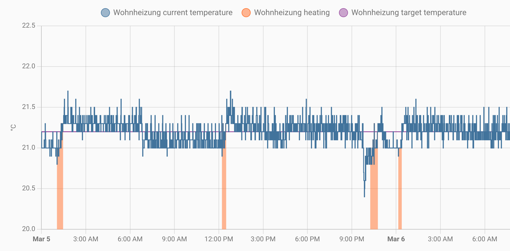

# Add-on: Climate

## Description

This add-on enables the use of your panel's relays to act as a thermostat (either cooler or heater)
using the internal temperature sensor and independent of the network availability.

### Attention
1. The NSPanel is limited to 2A per relay.
Don't use it for directly power your cooler/heater if exceeding the panel specifications:
    - 150W/110V/Gang, 300W/110V/Total
    - 300W/220V/Gang, 600W/220V/Total
2. A target temperature must be set on the climate entity in Home Assistant or the page Climate in your panel.

> [!NOTE]
> More details on the [Sonoff NSPanel's page](https://sonoff.tech/product/central-control-panel/nspanel/)
> and the [product specifications document](https://sonoff.tech/wp-content/uploads/2021/11/%E4%BA%A7%E5%93%81%E5%8F%82%E6%95%B0%E8%A1%A8-NSPanel-20210831.pdf).

## Installation

You will need to add the reference to `addon_climate_heat`, `addon_climate_cool` or `addon_climate_dual` files on your ESPHome settings in the `package` section
and after the `remote_package` (base code), as shown below (for `heat` in this example):

> [!NOTE]
> Occasionally, ESPHome updates may result in the `entity_id` of embedded thermostats being appended with `_2`. 
> If you experience this change, refer to this [forum post](https://community.home-assistant.io/t/esphome-devices-all-renamed-with-2-added/388146) on the Home Assistant Forum for guidance.

```yaml
substitutions:
  # Settings - Editable values
  device_name: "YOUR_NSPANEL_NAME"
  friendly_name: "Your panel's friendly name"
  wifi_ssid: !secret wifi_ssid
  wifi_password: !secret wifi_password

  # Add-on configuration (if needed)
  ## Add-on climate
  heater_relay: "1"  # Possible values: "1" or "2"

# Customization area
##### My customization - Start #####
##### My customization - End #####

# Basic and optional configurations
packages:
  remote_package:
    url: https://github.com/Blackymas/NSPanel_HA_Blueprint
    ref: main
    refresh: 300s
    files:
      - nspanel_esphome.yaml # Basic package
      # Optional advanced and add-on configurations
      # - esphome/nspanel_esphome_advanced.yaml
      # - esphome/nspanel_esphome_addon_ble_tracker.yaml
      # - esphome/nspanel_esphome_addon_bluetooth_proxy.yaml
      # - esphome/nspanel_esphome_addon_climate_cool.yaml
      - esphome/nspanel_esphome_addon_climate_heat.yaml
      # - esphome/nspanel_esphome_addon_climate_dual.yaml
```

## Configuration

The following keys are available to be used in your `substitutions`:

<!-- markdownlint-disable MD013 MD033 -->
Key|Required|Supported values|Default|Description
:-|:-:|:-:|:-:|:-
cooler_relay|Mandatory for *cool* and *dual*|`1` or `2`|`0` (disabled)|Relay used for control the cooler. User `1` for "Relay 1" or `2` for "Relay 2".
heater_relay|Mandatory for *heat* and *dual*|`1` or `2`|`0` (disabled)|Relay used for control the heater. User `1` for "Relay 1" or `2` for "Relay 2".
temp_units|Optional|`°C` or `°F`|`°C`|Temperature unit.
min_off_time|Optional|Positive integer representing the number of seconds|`300`|Minimum duration (in seconds) the cooling/heating action must be disengaged before it may be engaged.
min_run_time|Optional|Positive integer representing the number of seconds|`300`|Minimum duration (in seconds) the cooling/heating action must be engaged before it may be disengaged.
min_idle_time|Optional|Positive integer representing the number of seconds|`30`|Minimum duration (in seconds) the idle action must be active before calling another climate action.
target_low|Optional|Number representing a temperature in the selected unit|`18`|The initial lower treshold for the target temperature.
target_high|Optional|Number representing a temperature in the selected unit|`24`|The initial higher treshold for the target temperature.
temp_min|Optional|Number representing a temperature in the selected unit|*cool: `15`*<br>*heat: `7`*<br>*dual: `7`* |The minimum temperature the climate device can reach. Used to set the range of the frontend gauge.
temp_max|Optional|Number representing a temperature in the selected unit|*cool: `45`*<br>*heat: `35`*<br>*dual: `45`* |The maximum temperature the climate device can reach. Used to set the range of the frontend gauge.
temp_step|Optional|Number representing a temperature in the selected unit|`0.5`|The granularity with which the target temperature can be controlled.
cool_deadband|Optional|Number representing a temperature hysteresis in the selected unit|`0.5`|The minimum temperature differential (temperature above the set point) before engaging cooling.
cool_overrun|Optional|Number representing a temperature hysteresis in the selected unit|`0.5`|The minimum temperature differential (cooling beyond the set point) before disengaging cooling.
heat_deadband|Optional|Number representing a temperature hysteresis in the selected unit|`0.5`|The minimum temperature differential (temperature below the set point) before engaging heat.
heat_overrun|Optional|Number representing a temperature hysteresis in the selected unit|`0.5`|The minimum temperature differential (heating beyond the set point) before disengaging heat.

<!-- markdownlint-enable MD013 MD033 -->

- All values must be delimited with `""`
- For more details on the keys, please take a look at [ESPHome Base Climate Configurations](https://esphome.io/components/climate/index.html#base-climate-configuration)
and [ESPHome Climate Thermostat - Additional actions behavior](https://esphome.io/components/climate/thermostat.html#additional-actions-behavior).

## Examples

### Cooler

```yaml
substitutions:
  # Settings - Editable values
  device_name: "YOUR_NSPANEL_NAME"
  friendly_name: "Your panel's friendly name"
  wifi_ssid: !secret wifi_ssid
  wifi_password: !secret wifi_password

  # Add-on configuration (if needed)
  ## Add-on climate
  cooler_relay: "1"     # Possible values: "1" or "2"
  temp_units: "°F"      # Temperatures in Fahrenheit
  temp_min: "40"        # Min supported temperature is 40°F
  temp_max: "80"        # Max supported temperature is 80°F
  temp_step: "1"        # Temperature granularity is 1°F
  cool_deadband: "1.2"  # Temperature delta before engaging cooling
  cool_overrun: "1.2"   # Temperature delta before disengaging cooling

# Customization area
##### My customization - Start #####
##### My customization - End #####

# Basic and optional configurations
packages:
  remote_package:
    url: https://github.com/Blackymas/NSPanel_HA_Blueprint
    ref: main
    refresh: 300s
    files:
      - nspanel_esphome.yaml # Basic package
      # Optional advanced and add-on configurations
      # - esphome/nspanel_esphome_advanced.yaml
      # - esphome/nspanel_esphome_addon_ble_tracker.yaml
      # - esphome/nspanel_esphome_addon_bluetooth_proxy.yaml
      - esphome/nspanel_esphome_addon_climate_cool.yaml
      # - esphome/nspanel_esphome_addon_climate_heat.yaml
      # - esphome/nspanel_esphome_addon_climate_dual.yaml
```

### Heater

```yaml
substitutions:
  # Settings - Editable values
  device_name: "YOUR_NSPANEL_NAME"
  friendly_name: "Your panel's friendly name"
  wifi_ssid: !secret wifi_ssid
  wifi_password: !secret wifi_password

  # Add-on configuration (if needed)
  ## Add-on climate
  heater_relay: "1"     # Possible values: "1" or "2"
  temp_units: "°F"      # Temperatures in Fahrenheit
  temp_min: "40"        # Min supported temperature is 40°F
  temp_max: "80"        # Max supported temperature is 80°F
  temp_step: "1"        # Temperature granularity is 1°F
  heat_deadband: "1.2"  # Temperature delta before engaging heat
  heat_overrun: "1.2"   # Temperature delta before disengaging heat

# Customization area
##### My customization - Start #####
##### My customization - End #####

# Basic and optional configurations
packages:
  remote_package:
    url: https://github.com/Blackymas/NSPanel_HA_Blueprint
    ref: main
    refresh: 300s
    files:
      - nspanel_esphome.yaml # Basic package
      # Optional advanced and add-on configurations
      # - esphome/nspanel_esphome_advanced.yaml
      # - esphome/nspanel_esphome_addon_ble_tracker.yaml
      # - esphome/nspanel_esphome_addon_bluetooth_proxy.yaml
      # - esphome/nspanel_esphome_addon_climate_cool.yaml
      - esphome/nspanel_esphome_addon_climate_heat.yaml
      # - esphome/nspanel_esphome_addon_climate_dual.yaml
```


### Dual

```yaml
substitutions:
  # Settings - Editable values
  device_name: "YOUR_NSPANEL_NAME"
  friendly_name: "Your panel's friendly name"
  wifi_ssid: !secret wifi_ssid
  wifi_password: !secret wifi_password

  # Add-on configuration (if needed)
  ## Add-on climate
  heater_relay: "1"     # Possible values: "1" or "2"
  cooler_relay: "2"     # Possible values: "1" or "2"
  temp_units: "°F"      # Temperatures in Fahrenheit
  temp_min: "40"        # Min supported temperature is 40°F
  temp_max: "80"        # Max supported temperature is 80°F
  temp_step: "1"        # Temperature granularity is 1°F
  cool_deadband: "1.2"  # Temperature delta before engaging cooling
  cool_overrun: "1.2"   # Temperature delta before disengaging cooling
  heat_deadband: "1.2"  # Temperature delta before engaging heat
  heat_overrun: "1.2"   # Temperature delta before disengaging heat

# Customization area
##### My customization - Start #####
##### My customization - End #####

# Basic and optional configurations
packages:
  remote_package:
    url: https://github.com/Blackymas/NSPanel_HA_Blueprint
    ref: main
    refresh: 300s
    files:
      - nspanel_esphome.yaml # Basic package
      # Optional advanced and add-on configurations
      # - esphome/nspanel_esphome_advanced.yaml
      # - esphome/nspanel_esphome_addon_ble_tracker.yaml
      # - esphome/nspanel_esphome_addon_bluetooth_proxy.yaml
      # - esphome/nspanel_esphome_addon_climate_cool.yaml
      # - esphome/nspanel_esphome_addon_climate_heat.yaml
      - esphome/nspanel_esphome_addon_climate_dual.yaml
```

### Real Use Case Example: Water Underfloor Heating with NSPanel
The NSPanel works nicely as a replacement for existing water underfloor heating controllers, installed at eye level and often powered by 100-240VAC.
In my specific use case, the control valve is of the 'normally closed' type, meaning that an open relay indicates 'no heating.'
I have utilized relay #1 for this purpose. It's important to note that this setup does not act as a PID controller, but operates on a simple on-off mechanism.
The system initiates heating at a preset value below and turns it off at a value above the set point.
I have set these values to `0.1°C` below and `0.1°C` above the target temperature, respectively.
These adjustments have been effectively maintaining the desired temperature in all of our four rooms.
The thermostat's settings range from a minimum of `15°C` to a maximum of `22°C`, with a granularity of `0.1°C` for adjustments.
Furthermore, I have selected `18.3°C` as the default target temperature.

```yaml
 ##### addon-configuration #####
  ## addon_climate ##
  heater_relay: "1" #Use relay 1
  temp_min: "15" 
  temp_max: "22" 
  temp_step: "0.1"
  cold_tolerance: "0.1"
  hot_tolerance: "0.1"
    
  ##### CHANGE ME END #####
climate:
  - id: !extend thermostat_embedded
    visual:
      temperature_step: ${temp_step}
    preset:
      - name: Home
        default_target_temperature_low: 18.3
        mode: "heat"
```

Please note that employing any filter to smooth the temperature readings, such as averaging, is discouraged if the relevant timescale exceeds 1min.
Such filtering methods can delay the response times of an already slow underfloor heating system.
Despite this, the temperature stability achieved is quite satisfactory, as illustrated in the graph below.


*On March 24th (around 9:20 PM) and March 25th (around 7:30AM) a window was opened, and all heaters were set to 'off.' for 30min*
