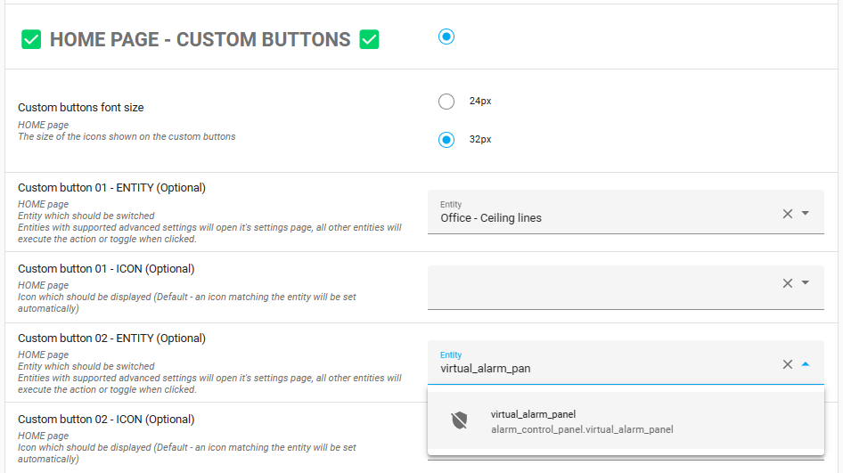

# Alarm Control Panel

You can control an Alarm Control Panel from your NSPanel, which allows you to set the alarm mode to standard 
modes supported by Home Assistant (Home, Away, Night, Vacation, or Custom bypass) or disarm the alarm.

Currently, the NSPanel supports alarms without a code or with a numeric code. For alarms using a text code, 
the NSPanel will display it, but interactions (like button clicks) will send service calls to Home Assistant 
without the code, leading to failed operations that require a code.

> [!IMPORTANT]
> **Security advisory**
> The default communication between your NSPanel (ESPHome) and Home Assistant (HA) is not encrypted. This 
> could allow someone with network access to monitor and replicate the service calls. This risk is 
> particularly relevant when controlling your alarm system.
>
> To enhance security, we strongly recommend enabling API encryption for NSPanel users managing an Alarm 
> system. Follow the instructions in the ["API encryption" example here](customization.md#api-encryption) 
> to implement this security measure.
## Configuration

### Allow the device to make Home Assistant service calls

First, you need to configure your Home Assistant to permit your NSPanel to make service calls. While 
most services are handled via the Blueprint, ESPHome needs to send events with all necessary data in 
plain text for these service calls. To mitigate any security risks, alarm-related calls are managed 
directly by the panel.

To enable this:
1. Go to your ESPHome integrations panel (Settings > Devices and Services > ESPHome).
2. Click "Configure" next to your panel's entry.

   

3. Select the "Allow the device to make Home Assistant service calls" option.

   

### Blueprint settings

To assign Alarm Control Panel entities to buttons:
1. Open the NSPanel Blueprint automation.
2. Find the button configuration section.
3. Choose a button and select your alarm control panel entity.
4. Click "Save" to complete setup.

   

Follow these steps to ensure your NSPanel is correctly configured for controlling your alarm system.
## Controlling your alarm from your panel

When an alarm control panel is configured in your Blueprint automation, the alarm icon appears on your 
NSPanel's Home page or the respective button page. This icon changes based on the alarm state, detailed 
in the following table.

Clicking this button opens the Alarm Control Panel page. Here, you can adjust alarm settings with a 
single click or return to the Home page.

### Description of states shown with the alarm icon

<!-- markdownlint-disable MD013 -->
State | Color | Icon | Icon Name | Description
-- | -- | -- | -- | --
disarmed | White |  | mdi:shield-off-outline | The alarm is disarmed (off).
armed_home | Green |  | mdi:shield-home-outline | The alarm is armed in home mode.
armed_away | Green |  | mdi:shield-lock-outline | The alarm is armed in away mode.
armed_night | Green |  | mdi:shield-moon-outline | The alarm is armed in night mode.
armed_vacation | Green |  | mdi:shield-airplane-outline | The alarm is armed in vacation mode.
armed_custom_bypass | Green |  | mdi:shield-half-full | The alarm is armed in bypass mode.
pending | Amber |  | mdi:shield-outline | The alarm is pending (towards triggered).
arming | Amber |  | mdi:shield-outline | The alarm is arming.
disarming | Amber |  | mdi:shield-off-outline | The alarm is disarming.
triggered | Red |  | mdi:shield-alert-outline | The alarm is triggered.
unknown/unavailable | White |  | mdi:shield-alert-outline | The alarm state is unknown or unavailable.
<!-- markdownlint-enable MD013 -->
