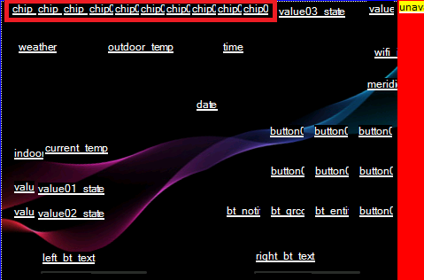
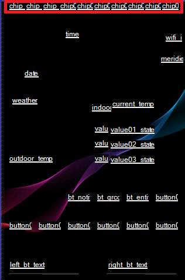
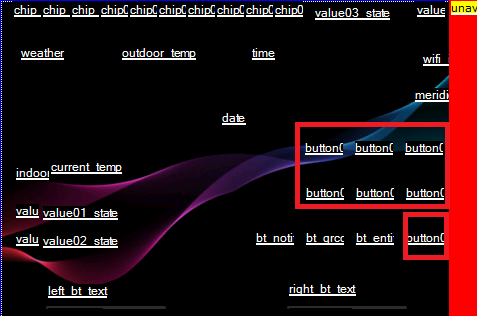
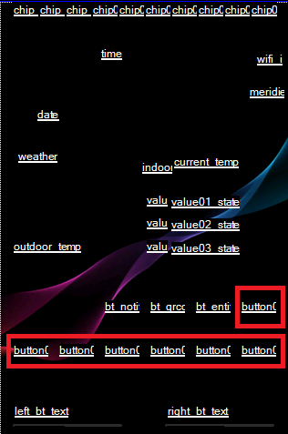
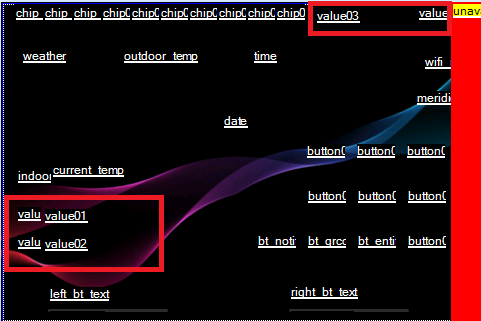
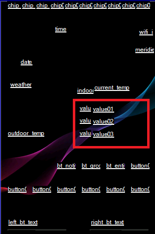

# API
This document provides details on custom services designed for integration with Home Assistant, including their usage, parameters, and examples.

## Summary
- [Service Documentation](#service-documentation)
  - [Button Service (`button`)](#button-service-button): Configures properties and state of buttons on a specified button page.
  - [Command Service (`command`)](#command-service-command): Sends a custom command directly to the display.
  - [Component Color Service (`component_color`)](#component-color-service-component_color): Changes the foreground color of a specified component on the display.
  - [Component Text Service (`component_text`)](#component-text-service-component_text): Updates the text of a specified component on the display.
  - [Component Value Service (`component_val`)](#component-value-service-component_val): Updates the value of a specified component on the display.
  - [Components Visibility Service (`components_visibility`)](#components-visibility-service-components_visibility): Hides or shows a specified component on the display.
  - [Entity Details Show Service (`entity_details_show`)](#entity-details-show-service-entity_details_show): Displays detailed information for a specific entity.
  - [Hardware Button State Indication Service (`hw_button_state`)](#hardware-button-state-indication-service-hw_button_state):
Updates the visual state (on/off) of the left and right hardware button indicators on the panel.
  - [Icon Service (`icon`)](#icon-service-icon): Updates a chip or custom button's icon, color, and visibility.
  - [Initialization Service: Global (`init_global`)](#initialization-service-init_global): Transfers global settings on initialization.
  - [Initialization Service: Hardware (`init_hardware`)](#initialization-service-init_hardware): Transfers NSPanel hardware settings during initialization.
  - [Initialization Service: Home Page (`init_page_home`)](#initialization-service-init_page_home): Transfers settings for the "Home" page on initialization.
  - [Initialization Service: Settings Page (`init_page_settings`)](#initialization-service-init_page_settings): Transfers settings for the "Settings" page on initialization.
  - [Notification Clear Service (`notification_clear`)](#notification-clear-service-notification_clear): Clears the current notification from the screen.
  - [Notification Show Service (`notification_show`)](#notification-show-service-notification_show): Displays a notification-message on the screen.
  - [QR Code Service (`qrcode`)](#qr-code-service-qrcode): Displays a QR code on the panel or updates the QR code information for local control.
  - [RTTTL Play Service (`rtttl_play`)](#rtttl-play-service-rtttl_play): Plays melodies encoded in the RTTTL format.
  - [Upload TFT Service (`upload_tft`)](#tft-file-update-service-upload_tft): Enables TFT file updates from a URL, requiring the "Upload TFT" add-on.
  - [Utilities Group Refresh Service (`utilities_group_refresh`)](#utilities-group-refresh-service-utilities_group_refresh): Updates utility group display values and direction indicators.
  - [Value Service (`value`)](#value-service-value): Updates an entity to display specific values.
  - [Wake Up Service (`wake_up`)](#wake-up-service-wake_up): Activates the display from a screensaver or low-brightness state.
  - [Alarm Settings Page Service (`page_alarm`)](#alarm-settings-page-service-page_alarm): Updates the Alarm page with current state information.
  - [Climate Page Service (`page_climate`)](#climate-page-service-page_climate): Updates the Climate page with current state information.
  - [Media Player Page Service (`page_media_player`)](#media-player-page-service-page_media_player): Updates the Media Player page with current state information.
- [Screen Components](#screen-components)
  - [Home page - Chips](#home-page---chips)
    - [User-defined Chips](#user-defined-chips)
    - [Relays Chips](#relays-chips)
    - [Climate Chip](#climate-chip)
  - [Home page - Custom Buttons](#home-page---custom-buttons)
  - [Home page - Values](#home-page---values)
  - [Entities Pages - Values](#entities-pages---values)

## Service Documentation

### General Guidance
In general, there's no validation on the content of the parameters in a service call.
Please make sure to fulfill the validation from the service caller side, otherwise it can drive to a crash in the ESPHome side, it will most likely restart the panel.

One example is with colors. In almost all cases, it is expected an array with 3 unsigned integers between 0 to 255.
If you send anything different, the conversion to the RGB565 used by Nextion will crash.

### Table of Contents
<!-- markdownlint-disable MD013 -->
| Service ID | Service Name | Description |
|------------|--------------|-------------|
| [`button`](#button-service-button) | [Button Service](#button-service-button) | Configures properties and state of buttons on a specified button page. |
| [`command`](#command-service-command) | [Command Service](#command-service-command) | Sends a custom command directly to the display. |
| [`component_color`](#component-color-service-component_color) | [Component Color Service](#component-color-service-component_color) | Changes the foreground color of a specified component on the display. |
| [`component_text`](#component-text-service-component_text) | [Component Text Service](#component-text-service-component_text) | Updates the text of a specified component on the display. |
| [`component_val`](#component-value-service-component_val) | [Component Value Service](#component-value-service-component_val) | Updates the value of a specified component on the display. |
| [`components_visibility`](#components-visibility-service-components_visibility) | [Components Visibility Service](#components-visibility-service-components_visibility) | Hides or shows a specified component on the display. |
| [`entity_details_show`](#entity-details-show-service-entity_details_show) | [Entity Details Show Service](#entity-details-show-service-entity_details_show) | Displays detailed information for a specific entity. |
| [`hw_button_state`](#hardware-button-state-indication-service-hw_button_state) | [Hardware Button State Indication Service](#hardware-button-state-indication-service-hw_button_state) | Updates the visual state (on/off) of the left and right hardware button indicators on the panel. |
| [`icon`](#icon-service-icon) | [Icon Service](#icon-service-icon) | Updates a chip or custom button's icon, color, and visibility. |
| [`init_global`](#initialization-service-init_global) | [Initialization Service](#initialization-service-init_global) | Transfers global settings on initialization. |
| [`init_hardware`](#initialization-service-init_hardware) | [Initialization Service](#initialization-service-init_hardware) | Transfers NSPanel hardware settings during initialization. |
| [`init_page_home`](#initialization-service-init_page_home) | [Initialization Service](#initialization-service-init_page_home) | Transfers settings for the "Home" page on initialization. |
| [`init_page_settings`](#initialization-service-init_page_settings) | [Initialization Service](#initialization-service-init_page_settings) | Transfers settings for the "Settings" page on initialization. |
| [`notification_clear`](#notification-clear-service-notification_clear) | [Notification Clear Service](#notification-clear-service-notification_clear) | Clears the current notification from the screen. |
| [`notification_show`](#notification-show-service-notification_show) | [Notification Show Service](#notification-show-service-notification_show) | Displays a notification-message on the screen. |
| [`page_alarm`](#alarm-settings-page-service-page_alarm) | [Alarm Settings Page Service](#alarm-settings-page-service-page_alarm) | Updates the Alarm page with current state information. |
| [`page_climate`](#climate-page-service-page_climate) | [Climate Page Service](#climate-page-service-page_climate) | Updates the Climate page with current state information. |
| [`page_media_player`](#media-player-page-service-page_media_player) | [Media Player Page Service](#media-player-page-service-page_media_player) | Updates the Media Player page with current state information. |
| [`qrcode`](#qr-code-service-qrcode) | [QR Code Service](#qr-code-service-qrcode) | Displays a QR code on the panel or update the QR code information for local control. |
| [`rtttl_play`](#rtttl-play-service-rtttl_play) | [RTTTL Play Service](#rtttl-play-service-rtttl_play) | Plays melodies encoded in the RTTTL format. |
| [`upload_tft`](#tft-file-update-service-upload_tft) | [Upload TFT Service](#tft-file-update-service-upload_tft) | Enables TFT file updates from a URL, requiring the "Upload TFT" add-on. |
| [`utilities_group_refresh`](#utilities-group-refresh-service-utilities_group_refresh) | [Utilities Group Refresh Service](#utilities-group-refresh-service-utilities_group_refresh) | Updates utility group display values and direction indicators. |
| [`value`](#value-service-value) | [Value Service](#value-service-value) | Updates an entity to display specific values. |
| [`wake_up`](#wake-up-service-wake_up) | [Wake Up Service](#wake-up-service-wake_up) | Activates the display from a screensaver or low-brightness state. |
<!-- markdownlint-enable MD013 -->

### Button Service: `button`
Configures the properties and state of buttons on a specified button page, allowing for dynamic updates to button appearance and behavior based on specified parameters.

**Usage:**
This service is designed for dynamic user interface adjustments, enabling the customization of button states, icons, colors, and labels.
It's particularly useful for reflecting changes in device states or user interactions within the UI.

**Parameters:**
- `page` (string): The page identifier where the button is located.
- `id` (string): The button's unique identifier.
- `state` (bool): The state of the button, which can affect its background picture and other visual elements.
- `icon` (string): Icon codepoint from [HASwitchPlate Material Design Icons](https://htmlpreview.github.io/?https://github.com/jobr99/Generate-HASP-Fonts/blob/master/cheatsheet.html).
Example: "\uE6E8" for `mdi:lightbulb-on-outline`.
- `icon_color` (int[]): The RGB color array for the icon.
- `icon_font` (int): The Nextion font identifier for the icon (default is 8).
- `bri` (string): Brightness level or other dynamic information to display on the button close to the icon.
- `label` (string): The main text label displayed on the button.

**Home Assistant Example:**
```yaml
service: esphome.<your_panel_name>_button
data:
  page: "buttonpage01"
  id: "button08"
  state: true
  icon: "\uE6E8"           # Example for mdi:lightbulb-on-outline
  icon_color: [255, 0, 0]  # Red
  icon_font: 2
  bri: "75%"
  label: "Living Room"
```
> [!NOTE]
> Replace `<your_panel_name>` with the specific name of your panel configured in Home Assistant.
> This service dynamically updates the specified button's properties to match the provided parameters.

### Command Service: `command`
Sends a custom command directly to the display, enabling direct interaction and dynamic content updates.

**Usage:**
This service is particularly useful for advanced customizations and direct display manipulations, such as showing messages, updating statuses, or any other display-centric commands.

**Parameters:**
- `cmd` (string): The command string to be sent to the display. Please refer to [The Nextion Instruction Set](https://nextion.tech/instruction-set/) for a comprehensive list of commands supported.

**Home Assistant Example:**
```yaml
service: esphome.<your_panel_name>_command
data:
  cmd: "page home"  # Go to page "Home"
```

> [!NOTE]
> Replace `<your_panel_name>` with your specific panel name as configured in Home Assistant to ensure correct service execution.
>
> Ensure the command string (`cmd`) is properly formatted according to your display's command processing capabilities.

### Component Color Service: `component_color`
Changes the foreground color of a specified component on the display, enabling dynamic color updates for user interface customization.

**Usage:**
This service is ideal for creating visually dynamic interfaces, allowing elements to change color based on conditions,
events, or user actions, such as indicating status changes or highlighting specific UI components.

**Parameters:**
- `id` (string): Identifier of the component whose color will be updated. It is essential that this matches the component's ID in your display layout to ensure the correct element is targeted.
- `color` (int[]): The new color for the component, specified as an RGB array (e.g., `[255, 0, 0]` for red).

**Home Assistant Example:**
```yaml
service: esphome.<your_panel_name>_component_color
data:
  id: "home.time"
  color: [255, 0, 0]  # Changes the component's color to red
```
> [!NOTE]
> Replace `<your_panel_name>` with your specific panel name as configured in Home Assistant to ensure correct service execution.
>
> Ensure the `id` and color parameters accurately target and define the new color for the component.

### Component Text Service: `component_text`
Updates the text of a specified component on the display, enabling dynamic text content updates.

**Usage:**
Ideal for user interfaces that require real-time text updates, such as status messages, labels, or any text-based information display.

**Parameters:**
- `id` (string): Identifier of the component whose text will be updated. Ensure this matches the component's ID in your display layout.
- `txt` (string): The new text content to display. This can include static text or dynamic information passed at runtime.

**Home Assistant Example:**
```yaml
service: esphome.<your_panel_name>_component_text
data:
  id: "home.time"
  txt: "12:34"
```
> [!NOTE]
> Replace `<your_panel_name>` with your specific panel name as configured in Home Assistant to ensure correct service execution.
>
> Make sure the `id` corresponds to the correct component on your display for the text update to work as intended.

### Component Value Service: `component_val`
Updates the value of a specified component on the display, enabling dynamic value updates.

**Usage:**
Ideal for interfaces requiring real-time updates of numerical values, such as counters, temperature readings, or any numeric indicators.

**Parameters:**
- `id` (string): Identifier of the component whose value will be updated. It's crucial this matches the component's ID in your display layout accurately.
- `val` (int): The new integer value to be set for the component. This can represent various data types, depending on the component's purpose (e.g., temperature, humidity levels).

**Home Assistant Example:**
```yaml
service: esphome.<your_panel_name>_component_val
data:
  id: "cover.coverslider"
  val: 25
```
> [!NOTE]
> Replace `<your_panel_name>` with your specific panel name as configured in Home Assistant to ensure correct service execution.
>
> Ensure the `id` accurately matches the component on your display to successfully update its value.

### Components Visibility Service: `components_visibility`
Hides or shows a list of component on the display, allowing for dynamic interface changes.

**Usage:**
This service is ideal for creating interactive user interfaces that adapt by hiding or showing certain elements based on user actions, conditions, or events.

**Parameters:**
- `ids` (string[]): Array of identifiers of the components to be hidden/shown. It is crucial that this matches the component's ID in your display layout to ensure the correct element is hidden/shown.
- `visible` (bool): Set to true to show the component, or false to hide it.

**Home Assistant Example:**
```yaml
service: esphome.<your_panel_name>_component_hide
data:
  ids: [ "date", "time" ]  # Hides the date and time display on Home page
  visible: false
```
<!-- markdownlint-disable MD028 -->
> [!NOTE]
> Replace <your_panel_name> with your specific panel name as configured in Home Assistant to ensure correct service execution.
>
> Ensure the ids matches the component on your display you wish to hide or show.

> [!IMPORTANT]
> This command only works when the page is visible.
> 
> If a component being hidden/shown is not part of the current page, the command will fail and an error message will be logged.
<!-- markdownlint-enable MD028 -->

### Entity Details Show Service: `entity_details_show`
This service is designed to display detailed information about a specific entity within the panel's interface.
It enables users to navigate to a dedicated page showing extensive details about an entity, such as a light or a climate,
and provides a structured way to return to either the home page or a specific button page.

**Usage:**
Ideal for interfaces requiring detailed entity information across various contexts.
By specifying the `entity` and `back_page`, users are offered a seamless navigation experience,
ensuring they can easily access detailed information and return to their initial navigation point within the interface.

**Parameters:**
- `entity` (string): The unique identifier of the entity (`entity_id` in Home Assistant) for which details are displayed.
- `back_page` (string): The page identifier to return to after viewing entity details.
Valid options are `home` for the home page or `buttonpage01` to `buttonpage04` for button pages.
No other pages are supported to maintain navigation consistency.

**Home Assistant Example:**
```yaml
service: esphome.<your_panel_name>_entity_details_show
data:
  entity: "light.living_room"
  back_page: "buttonpage01"
```
> [!NOTE]
> Ensure to replace <your_panel_name> with the specific name of your panel configured in Home Assistant.
> This setup provides a direct and user-friendly way to access and return from detailed entity information, enhancing the interface's usability.

### Hardware Button State Indication Service: `hw_button_state`
This service dynamically updates the on-screen indication bars for the hardware buttons, reflecting the current state of the entities they control.
It's designed to provide immediate visual feedback, enhancing the user interface by showing the active/inactive state of the left and right hardware button indicators on the panel.

**Usage:**  
Utilize this service to modify the visual state (on/off) of hardware button indicators on the panel, corresponding to the state of entities controlled by these buttons.
This allows for visual feedback that matches the operational state of the buttons.

**Parameters:**  
- `button_mask` (int): A bitwise identifier for buttons. Use `1` for the left button, `2` for the right button, and `3` for both buttons.
- `state` (bool): The state to apply to the button(s) indicated by `button_mask`. True for on (active), false for off (inactive).

**Home Assistant Example:**
```yaml
service: esphome.<your_panel_name>_hw_button_state
data:
  button_mask: 3  # Targets both the left (1) and right (2) buttons
  state: true     # Turns the indication bars on for both buttons
```
> [!NOTE]
> Replace `<your_panel_name>` with your specific panel name as configured in Home Assistant.
> This service leverages a bitmask (`button_mask`) for flexible control over multiple hardware buttons simultaneously, offering a streamlined method for updating their visual states.

### Icon Service: `icon`
Updates a chip or custom button's icon, color, and visibility within Home Assistant.

**Usage:**
This service is ideal for dynamically updating icons on your Panel, allowing for a customizable and interactive user interface.

**Parameters:**
- `id` (string): Identifier of the chip or button component. Refer to "[Screen components](#screen-components)" for more details.
- `icon` (string): Icon codepoint from [HASwitchPlate Material Design Icons](https://htmlpreview.github.io/?https://github.com/jobr99/Generate-HASP-Fonts/blob/master/cheatsheet.html).
Example: "\uE6E8" for `mdi:lightbulb-on-outline`.
- `icon_color` (int[]): RGB color array for the icon. Example: `[0, 255, 0]` for green.
- `visible` (bool): Flag indicating whether the icon should be visible (`true`) or hidden (`false`).

**Home Assistant Example:**
```yaml
service: esphome.<your_panel_name>_icon
data:
  id: "home.chip03"
  icon: "\uE6E8"           # Example for mdi:lightbulb-on-outline
  icon_color: [0, 255, 0]  # Green
  visible: true
```
> [!NOTE]
> Ensure the placeholder `<your_panel_name>` is replaced with the specific panel name you will need to reference in your Home Assistant configuration.

### Initialization Service: `init_global`
Transfers global settings from the blueprint to ESPHome,
ensuring that ESPHome is configured with the necessary parameters for operation according to the blueprint specifications.

**Usage:**
This service is crucial during the initialization phase or when global settings need to be updated to reflect changes in the blueprint.
It configures ESPHome with settings that affect overall functionality and user interface aspects.

**Parameters:**
- `blueprint_version` (string): Specifies the version of the blueprint being used.
- `ent_value_xcen` (int): Alignment of values on entities pages (0 for right (default), 1 for center or 2 for left).
- `mui_please_confirm` (string): Localized (language based) message used for asking for confirmation in the UI.
- `mui_unavailable` (string): Localized (language based) message used for  indicating unavailability in the UI.
- `screensaver_time` (bool): Enables or disables the screensaver time display.
- `screensaver_time_font` (int): Specifies the font id for the screensaver time display.
- `screensaver_time_color` (int[]): Specifies the RGB color array for the screensaver time display.
- `decimal_separator` (string): The char to be used as decimal separator.

**Home Assistant Example:**
```yaml
service: esphome.<your_panel_name>_init_global
data:
  blueprint_version: "4.2.5"
  ent_value_xcen: 0
  mui_please_confirm: "Confirme, por favor."
  mui_unavailable: "Indisponível"
  screensaver_time: true
  screensaver_time_font: 11
  screensaver_time_color: [165, 42, 42]  # Reddish-brown
  decimal_separator: ","
```
> [!NOTE]
> Replace `<your_panel_name>` with the specific name of your panel configured in Home Assistant.
>
> This service should be called to update ESPHome with the latest global settings as specified in your blueprint.

### Initialization Service: `init_hardware`
Configures NSPanel hardware settings in ESPHome according to the specifications provided in the blueprint,
ensuring each component operates with the correct parameters for control, appearance, and fallback behavior.

**Usage:**
This service is essential for initializing or updating button and relay configurations to reflect changes in the blueprint.
It tailors ESPHome's hardware operations for specific use cases, including local control capabilities, iconography, color indications, and fallback states.

**Parameters:**
- `relay1_local_control` (bool): Enables or disables local control for Relay 1.
- `relay1_icon` (string):
Icon codepoint from [HASwitchPlate Material Design Icons](https://htmlpreview.github.io/?https://github.com/jobr99/Generate-HASP-Fonts/blob/master/cheatsheet.html) for Relay 1.
- `relay1_icon_color` (int[]): The RGB color array for Relay 1's icon.
- `relay1_fallback` (bool): Determines the fallback state for Relay 1 in case of communication loss.
- `relay2_local_control` (bool): Enables or disables local control for Relay 2.
- `relay2_icon` (string):
Icon codepoint from [HASwitchPlate Material Design Icons](https://htmlpreview.github.io/?https://github.com/jobr99/Generate-HASP-Fonts/blob/master/cheatsheet.html) for Relay 2.
- `relay2_icon_color` (int[]): The RGB color array for Relay 2's icon.
- `relay2_fallback` (bool): Determines the fallback state for Relay 2 in case of communication loss.
- `button_left` (bool): Enable/disable left button status visualization.
- `button_right` (bool): Enable/disable right button status visualization.
- `button_bar_color_on` (int[]): RGB color array for the hardware button bar when the status is `On`.
- `button_bar_color_off` (int[]): RGB color array for the hardware button bar when the status is `Off`.
- `embedded_climate` (bool): Indicates whether climate control is embedded in the panel.
- `embedded_climate_friendly_name` (string): Provides a friendly name for the embedded climate control.
- `embedded_indoor_temperature` (bool): Determines if indoor temperature display is enabled.

**Home Assistant Example:**
```yaml
service: esphome.<your_panel_name>_init_hardware
data:
  relay1_local_control: true
  relay1_icon: "\uE3A5"           # Example for mdi:numeric-1-box-outline
  relay1_icon_color: [248, 0, 0]  # Red
  relay1_fallback: false
  relay2_local_control: true
  relay2_icon: "\uE3A8"           # Example for mdi:numeric-2-box-outline
  relay2_icon_color: [0, 252, 0]  # Green
  relay2_fallback: true
  button_left: true
  button_right: true
  button_bar_color_on: [31, 169, 255]  # Blueish
  button_bar_color_off: [44, 44, 44]   # Dark gray
  embedded_climate: true
  embedded_climate_friendly_name: "Termostato da Sala"
  embedded_indoor_temperature: true
```
> [!NOTE]
> Replace `<your_panel_name>` with the specific name of your panel configured in Home Assistant.
> This service initializes buttons and relay settings based on the provided parameters, customizing relay functionality and presentation as defined in the blueprint.

### Initialization Service: `init_page_home`
Configures the "Home" page settings and user interface elements in ESPHome,
aligning with the blueprint specifications to create a personalized and functional home screen.

**Usage:**
This service plays a crucial role in the initial setup and ongoing updates of the "Home" page,
facilitating dynamic adjustments to layout, appearance, and interactive elements.
It accommodates extensive customizations, impacting both visual appeal and functionality of UI components.

**Parameters:**
- `date_color` (int[]): RGB color array for the date display.
- `time_format` (string): Format string for displaying time, supporting standard time formatting symbols.
- `time_color` (int[]): RGB color array for the time display.
- `meridiem` (string[]): Array of strings for AM/PM labels, applicable if the time format includes meridiem.
- `chip_font` (int): Font Id for icons or chips displayed on the "Home" page.
- `custom_buttons_font` (int): Font Id for custom button icons on the "Home" page.
- `qrcode` (bool): Flag indicating whether the QR code button is enabled.
- `qrcode_icon` (string):
Icon codepoint from [HASwitchPlate Material Design Icons](https://htmlpreview.github.io/?https://github.com/jobr99/Generate-HASP-Fonts/blob/master/cheatsheet.html)
for the QR code button.
- `qrcode_icon_color` (int[]): RGB color array for the QR code button icon.
- `entities_pages_icon` (string):
Icon codepoint from [HASwitchPlate Material Design Icons](https://htmlpreview.github.io/?https://github.com/jobr99/Generate-HASP-Fonts/blob/master/cheatsheet.html)
for the entities page button.
- `entities_pages_icon_color` (int[]): RGB color array for the entities page button icon.
- `utilities` (bool): Flag indicating whether the utilities page button is enabled.
- `utilities_icon` (string):
Icon codepoint from [HASwitchPlate Material Design Icons](https://htmlpreview.github.io/?https://github.com/jobr99/Generate-HASP-Fonts/blob/master/cheatsheet.html)
for the utilities page button.
- `utilities_icon_color` (int[]): RGB color array for utilities page button icon.
- `outdoor_temp_font` (int): Font Id for outdoor temperature indication on the "Home" page.

**Home Assistant Example:**
```yaml
service: esphome.<your_panel_name>_init_page_home
data:
  date_color: [255, 255, 255]                      # White
  time_format: "HH:mm"
  time_color: [255, 255, 255]                      # White
  meridiem: ["AM", "PM"]
  chip_font: 8
  custom_buttons_font: 9
  qrcode: true
  qrcode_icon: "\uE432"                            # Example for mdi:qrcode-scan
  qrcode_icon_color: [0, 255, 0]                   # Green
  entities_pages_icon: "\uEDCF"                    # Example for mdi:format-list-bulleted-square
  entities_pages_icon_color: [0, 0, 255]           # Blue
  utilities: true
  utilities_icon: "\uE299"                         # Example for mdi:gauge
  utilities_icon_color: [255, 255, 255]            # White

  outdoor_temp_font: 5
```
> [!NOTE]
> Ensure to replace `<your_panel_name>` with the actual name of your panel configured in Home Assistant.
> This service customizes the "Home" page with specified settings, enhancing the panel's interface based on the project's blueprint.

### Initialization Service: `init_page_settings`
Populates the "Settings" page with configurable options in the panel,
tailored according to the project's blueprint to create a user-friendly and cohesive settings interface.

**Usage:**
This service is crucial for the initial configuration and subsequent updates of the "Settings" page.
It facilitates the customization of labels and functionalities, including reboot actions and screen brightness adjustments, directly from the panel's interface.
This customization ensures that the settings are not only accessible but also intuitive for end-users.

**Parameters:**
- `reboot` (string): Text label for the reboot button, guiding users on the action to restart the device.
- `brightness` (string): Description label for adjusting the screen's brightness.
- `bright` (string): Label preceding the slider for selecting the high brightness level, indicating the option for a brighter screen setting.
- `dim` (string): Label preceding the slider for selecting the dimmed brightness level, indicating the option for a lower light setting.

**Home Assistant Example:**
```yaml
service: esphome.<your_panel_name>_init_page_settings
data:
  reboot: "Restart Device"
  brightness: "Screen Brightness"
  bright: "Bright Mode:"
  dim: "Dim Mode:"
```
> [!NOTE]
> Replace `<your_panel_name>` with the specific name of your panel configured in Home Assistant.
> This service customizes the "Settings" page according to specified labels, enhancing user interaction with device settings.

### Notification Clear Service: `notification_clear`
Removes any displayed notification from the screen, allowing the display to return to its normal state or view.

**Usage:**
This service is essential after displaying notifications or alerts.
It ensures the user interface remains clean and uncluttered by clearing messages once they are no longer needed or have been acknowledged.

**Home Assistant Example:**
```yaml
service: esphome.<your_panel_name>_notification_clear
```
> [!NOTE]
> Replace `<your_panel_name>` with the specific name of your panel configured in Home Assistant to ensure the service executes correctly.
This simple action clears the current notification from the display, maintaining a tidy interface.

### Notification Show Service: `notification_show`
Displays a notification message on the screen, enabling dynamic presentation of information or alerts.

**Usage:**
Designed for scenarios requiring immediate feedback or notification on the display,
this service is suitable for showing alerts, informational messages, or updates directly on the screen interface.

**Parameters:**
- `label` (string): A brief title or label for the notification, typically displayed in a prominent, bold format.
- `message` (string): The detailed message or content of the notification, providing the main information or alert to the user.
The system will automatically wrap text to fit the display unless `\r` is used to insert manual line breaks. When `\r` is present,
the system respects only the line breaks provided by the user, enhancing message formatting control.

**Home Assistant Example:**
```yaml
service: esphome.<your_panel_name>_notification_show
data:
  label: "Security Alert"
  message: "Front door opened at 10:30 PM\rPlease check the entrance."
```
> [!NOTE]
> Replace `<your_panel_name>` with the specific name of your panel configured in Home Assistant.
> The action ensures the service executes correctly, displaying the notification with the specified `label` and `message`.
>
> Utilize `\r` within the message for custom line breaks, offering precise formatting control.

### Alarm Settings Page Service: `page_alarm`
Populates the alarm settings page with the current configuration and state information,
seamlessly integrating with the panel's interface to reflect the latest settings and statuses of the alarm system.

**Usage:**
The `page_alarm` service is specifically designed to dynamically update the alarm settings page, providing users with immediate access to the alarm system's controls and information.
It plays a crucial role in ensuring a responsive and user-friendly interface for alarm management, allowing for real-time interaction with the alarm system directly from the panel.

**Parameters:**
- `page_title` (string): The title displayed at the top of the alarm settings page.
- `state` (string): The current state of the alarm system, such as "armed_home" or "disarmed".
- `supported_features` (int): A bitmask indicating the features supported by the alarm system.
This determines the controls and options available on the alarm settings page.
The bitmask values are aligned with the
[Home Assistant Alarm Control Panel Supported Features](https://github.com/home-assistant/core/blob/33ff6b5b6ee3d92f4bb8deb9594d67748ea23d7c/homeassistant/components/alarm_control_panel/const.py#L32).
- `code_format` (string): Specifies the code format required for arming/disarming the alarm system, such as numeric or alphanumeric.
- `code_arm_required` (bool): Indicates whether a code is required to arm the system.
- `entity` (string): The entity ID of the alarm system, used for state updates and control actions.
- `mui_alarm` (string[]): An array of localized text strings for the alarm control buttons, supporting various alarm states and actions.

**Home Assistant Example:**
```yaml
service: esphome.<your_panel_name>_page_alarm
data:
  page_title: "Home Security System"
  state: "disarmed"
  supported_features: 31  # Example: Supports arm/disarm, home/away modes, etc.
  code_format: "number"
  code_arm_required: true
  entity: "alarm_control_panel.home_alarm"
  mui_alarm:
    - "Zuhause"
    - "Abwesend"
    - "Nacht"
    - "Urlaub"
    - "Umgehen"
    - "Entwaffnen"
```
> [!NOTE]
> Ensure to replace `<your_panel_name>` with the actual name of your panel configured in Home Assistant.
> This service configuration allows for the alarm settings page to dynamically reflect the current features, state, and control options of your alarm system, enhancing the overall user experience.

### Climate Page Service: `page_climate`
Updates the climate page with the current state information, seamlessly integrating with the panel's interface to display the latest climate settings and statuses.

**Usage:**
Designed to dynamically update the climate page, this service ensures users have instant access to climate control settings and information.
It's crucial for maintaining a responsive and informative interface for efficient climate management.

**Parameters:**
- `current_temp` (float): The current temperature.
- `supported_features` (int): Bitmask indicating the climate device's supported features.
These features determine the available climate controls and settings on the device.
The bitmask values correspond to features such as temperature control, mode setting, fan speed adjustment, etc., as defined in Home Assistant's climate component constants.
For detailed descriptions of each feature and its corresponding bitmask value, refer to the
[Home Assistant Climate Component Constants](https://github.com/home-assistant/core/blob/33ff6b5b6ee3d92f4bb8deb9594d67748ea23d7c/homeassistant/components/climate/const.py#L156C7-L156C27).
- `target_temp` (float): The set target temperature.
- `target_temp_high` (float): The high end of the target temperature range, for devices that support temperature ranges.
- `target_temp_low` (float): The low end of the target temperature range.
- `temp_step` (int): Increment step for temperature adjustment, effectively the granularity of temperature change allowed.
- `total_steps` (int): Total number of steps for temperature adjustment, calculated as ((temp_max - temp_min) / temp_step).
- `temp_offset` (int): Offset applied to the temperature reading for calibration.
- `climate_icon` (string): Icon representing the current climate status,
selected from [HASwitchPlate Material Design Icons](https://htmlpreview.github.io/?https://github.com/jobr99/Generate-HASP-Fonts/blob/master/cheatsheet.html).
- `embedded_climate` (bool): Flag indicating if climate controls are embedded within the interface.
- `entity` (string): Entity ID for the climate device.

**Home Assistant Example:**
```yaml
service: esphome.<your_panel_name>_page_climate
data:
  current_temp: 22.5
  supported_features: 1 | 4  # Assuming '1' is for temperature control and '4' is for fan mode, as an example.
  target_temp: 24.0
  target_temp_high: 25.0
  target_temp_low: 19.0
  temp_step: 5               # Adjust in 0.5°C increments.
  total_steps: 56            # Calculated based on the device's temperature range and step.
  temp_offset: 70            # Applied as a calibration offset.
  climate_icon: "\uE392"     # mdi:thermostat
  embedded_climate: true
  entity: "climate.living_room"
  ```
  > [!NOTE]
> Replace `<your_panel_name>` with the specific name of your panel configured in Home Assistant.
> This service ensures the climate page reflects the latest in climate control settings, enhancing the user experience by providing up-to-date information.

### Media Player Page Service: `page_media_player`
Updates the media player page with current configuration and state information,
integrating seamlessly with the panel's interface to display the latest media playback status and controls.

**Usage:**
The `page_media_player` service is specifically tailored to dynamically update the media player page, ensuring users have immediate access to media playback controls and information.
This service is essential for providing a responsive and user-friendly interface for media management, allowing real-time interaction with the media player directly from the panel.

**Parameters:**
- `entity` (string): The entity ID of the media player.
- `state` (string): The current state of the media player (e.g., playing, paused, stopped).
- `is_volume_muted` (bool): Indicates whether the volume is currently muted.
- `friendly_name` (string): The friendly name of the media player to be displayed as the page title.
- `volume_level` (int): The current volume level of the media player.
- `media_title` (string): The title of the currently playing media.
- `media_artist` (string): The artist of the currently playing media.
- `media_duration` (float): The total duration of the currently playing media in seconds.
- `media_position` (float): The current playback position within the media in seconds.
- `media_position_delta` (float): The amount of time in seconds since the last update of the media position.
- `supported_features` (int): A bitmask indicating the features supported by the media player, such as play/pause, next/previous track, volume control, etc.
The bitmask values correspond to the
[Home Assistant Media Player Supported Features](https://github.com/home-assistant/core/blob/33ff6b5b6ee3d92f4bb8deb9594d67748ea23d7c/homeassistant/components/media_player/const.py#L177).

**Home Assistant Example:**
```yaml
service: esphome.<your_panel_name>_page_media_player
data:
  entity: "media_player.living_room"
  state: "playing"
  is_volume_muted: false
  friendly_name: "Living Room Player"
  volume_level: 40
  media_title: "Favorite Song"
  media_artist: "Famous Artist"
  media_duration: 180
  media_position: 30
  media_position_delta: 0.5
  supported_features: 84  # Example: Play, Pause, Next, Previous
```
> [!NOTE]
> Replace `<your_panel_name>` with the specific name of your panel configured in Home Assistant.
> This service ensures the media player page reflects the latest in media playback settings and status, enhancing the user experience by providing up-to-date information.

### QR Code Service: `qrcode`
Displays a QR code on the display, which can be used for various purposes such as sharing a WiFi password or linking to a website.

**Usage:**
This service enables the dynamic display of QR codes on a specified page of the ESPHome user interface, allowing for the convenient sharing of information.
It's particularly useful for settings where quick, scannable access to data is beneficial.

**Parameters:**
- `title` (string): The title or heading to display above the QR code, providing context or instructions.
- `qrcode` (string): The actual data or URL to be encoded into the QR code.
- `show` (bool): A flag that determines whether to immediately display the QR code page upon calling the service.

**Home Assistant Example:**
```yaml
service: esphome.<your_panel_name>_qrcode
data:
  title: "Wi-Fi Access"
  qrcode: "WIFI:T:WPA;S:mynetwork;P:mypass;;"
  show: true
```
<!-- markdownlint-disable MD028 -->
> [!NOTE]
> Replace `<your_panel_name>` with the specific name of your panel configured in Home Assistant.
> This service will generate and display the QR code based on the provided data, navigating to the QR code page if `show` is set to `true`.

> [!NOTE]
> This service is typically invoked during initialization to preload QR Code information based on blueprint settings,
> ensuring the data is accessible on the panel even without Wi-Fi connectivity.
> To update the QR Code information without immediately displaying it, call this service with `show: false`.
> This allows for seamless updates to the QR Code content without disrupting the current user interface.
<!-- markdownlint-enable MD028 -->

### RTTTL Play Service: `rtttl_play`
Plays melodies encoded in the RTTTL format, enabling the integration of audio feedback or alerts with simple text-based melody strings.

**Usage:**
This service is perfect for projects requiring audio signals, such as notifications, alerts, or simple melodies, by interpreting RTTTL (Ring Tone Text Transfer Language) strings.
RTTTL is a compact format for storing melody sequences in a text-based format, making it ideal for simple audio devices like buzzers.

**Parameters:**
- `tone` (string): The RTTTL string representing the melody to be played.
This string must conform to the RTTTL format, which includes the melody's name, default settings, and a sequence of notes. 

**Example Tones:**
For example tones and further inspiration, you can visit examples of RTTTL songs [here](https://codebender.cc/sketch:109888#RTTTL%20Songs.ino).

**Home Assistant Example:**
```yaml
service: esphome.<your_panel_name>_rtttl_play
data:
  tone: "The Simpsons:d=4,o=5,b=160:c.6,e6,f#6,8a6,g.6,e6,c6,8a,8f#,8f#,8f#,2g,8p,8p,8f#,8f#,8f#,8g,a#.,8c6,8c6,8c6,c6"
```
> [!NOTE]
> Replace `<your_panel_name>` with your specific panel name as configured in Home Assistant to ensure correct service execution.
>
> Ensure the `tone` parameter contains a valid RTTTL string to successfully play the melody.

### TFT File Update Service: `upload_tft`
Enables the remote update of the panel's TFT file from a specified URL or a default location, available exclusively with the "Upload TFT" add-on installed.
This service is valuable for downloading alternative TFT files for customization or addressing file access issues.

**Usage:**
This service is crucial for dynamically updating the TFT file, facilitating seamless transitions between different configurations or updates.
It's particularly useful for applying custom interface designs or updates when direct access to the repository is limited.

**Parameters:**
- `url` (string): The URL for downloading the TFT file.
If set to "default", it utilizes the URL from the "**Update TFT - Display Model**" selection in Home Assistant (**Settings** > **Devices & Services** > **ESPHome**).

**Home Assistant Example:**
```yaml
service: esphome.<your_panel_name>_upload_tft
data:
  url: "http://homeassistant.local:8123/local/custom_tft_file.tft"  # URL to the new TFT file
```
<!-- markdownlint-disable MD028 -->
> [!NOTE]
> Replace `<your_panel_name>` with your specific panel name as configured in Home Assistant.
> Using "default" fetches the URL associated with the selected display model in Home Assistant settings, simplifying updates or customizations.

> [!ATTENTION]
> The "Upload TFT" add-on must be installed for this service to be available, enhancing the panel's flexibility for interface customization or troubleshooting.
<!-- markdownlint-enable MD028 -->

### Utilities Group Refresh Service: `utilities_group_refresh`
Updates utility group display values and direction indicators on the panel. This service is used to refresh the displayed values for utility groups dynamically.

**Usage:**
This service is particularly useful for updating display elements associated with utility groups, such as values and directional indicators, based on specified parameters.

**Parameters:**
- `group_id` (string): The unique identifier for the utility group.
- `value1` (string): The first value to be displayed for the group.
- `value2` (string): The second value to be displayed for the group.
- `direction` (int): The direction indicator value for the group.
- `constructor` (bool): A flag to indicate if this is a constructor call, which forces updates regardless of current values.

**Home Assistant Example:**
```yaml
service: esphome.<your_panel_name>_utilities_group_refresh
data:
  group_id: "home"
  value1: "100 kWh"
  value2: "26 °C"
  direction: 1
  constructor: false
```
> [!NOTE]
> Replace `<your_panel_name>` with the specific name of your panel configured in Home Assistant to ensure correct service execution.

This service updates utility group display elements with the specified values and direction indicators dynamically.

### Value Service: `value`
Updates an entity to display specific values, allowing for dynamic updates of icons, names, and value colors within Home Assistant.

**Usage:**
This service is intended for entities that need to display information dynamically, such as sensor readings or state values, with customized icons, names, and color coding for both icon and value.

**Parameters:**
- `id` (string): Identifier of the entity being updated. For details on entity identifiers, refer to "[Screen components](#screen-components)".
- `icon` (string): Icon codepoint from [HASwitchPlate Material Design Icons](https://htmlpreview.github.io/?https://github.com/jobr99/Generate-HASP-Fonts/blob/master/cheatsheet.html).
Indicates the icon displayed next to the value.
- `icon_color` (int[]): RGB color array for the icon, allowing for custom icon colors.
- `name` (string): The display name for the entity, useful for labeling the value displayed.
- `value` (string): The actual value to be displayed next to the icon and name.
- `value_color` (int[]): RGB color array for the value text, enabling custom coloring of the displayed value.

**Home Assistant Example:**
```yaml
service: esphome.<your_panel_name>_value
data:
  id: "sensor.temperature"
  icon: "\uE6E8"           # Example for mdi:thermometer
  icon_color: [255, 0, 0]  # Red
  name: "Temperature"
  value: "75°F"
  value_color: [255, 255, 0] # Yellow
```
> [!NOTE]
> Replace `<your_panel_name>` with your specific panel name as configured in Home Assistant to ensure correct service execution.

### Wake Up Service: `wake_up`
Activates the display from a screensaver or low-power state, enabling dynamic interface adjustments based on user interactions or automated triggers.

**Usage:**
Ideal for scenarios requiring the display to become active upon certain events, such as motion detection, thereby conserving energy while ensuring the display is available when needed.

**Parameters:**
- `reset_timer` (bool): Determines whether to reset the sleep and dimming timers upon waking up the display.
Setting this to `true` ensures the display remains active during user presence, while `false` retains the existing timer durations.

**Home Assistant Example:**
```yaml
service: esphome.<your_panel_name>_wake_up
data:
  reset_timer: true
```
> [!NOTE]
> Replace `<your_panel_name>` with the specific name of your panel configured in Home Assistant.
> This action ensures the service is executed correctly, waking the display and optionally resetting timers based on the reset_timer parameter.

**Practical Use Case: Motion Sensor Activation:**
This service can be seamlessly integrated with a motion sensor to wake the display when motion is detected, making it instantly usable.
Additionally, if the display is already awake, calling this service with `reset_timer: true` can reset the sleep timer,
keeping the display active as long as there is movement and allowing it to sleep normally once no motion is detected.

The example bellow integrates the `wake_up` service with a motion sensor to ensure the display wakes or remains awake during periods of activity, reverting to sleep mode after inactivity.

```yaml
automation:
  - alias: "Wake Display on Motion"
    trigger:
      - platform: state
        entity_id: binary_sensor.motion_sensor_123
        to: 'on'
    action:
      - service: esphome.<your_panel_name>_wake_up
        data:
          reset_timer: true
    mode: restart
```
> [!NOTE]
> Adjust `<your_panel_name>` and `binary_sensor.motion_sensor_123` to your actual panel and sensor entity IDs.
> This setup ensures the display is responsive to environmental conditions, enhancing user interaction while managing energy consumption efficiently.

## Screen components

### Home Page - Chips



#### User-defined Chips
- **Description**: Chips are icons that are shown in specific situations or hidden. Their behaviour is controlled by the blueprint.
- **Type**: Icon only with no touch commands.
- **Availability**: Global (available even when page is not visible).
- **Ids**: `home.chip01` to `home.chip07`.

#### Relays Chips
- **Description**: Icons representing each of the relays states.
- **Type**: Icon only with no touch commands.
- **Availability**: Global (available even when page is not visible).
- **Ids**: `home.chip_relay1` and `home.chip_relay2`.

#### Climate Chip
- **Description**: Icon representing the state of the main climate entity.
- **Type**: Icon only with no touch commands.
- **Availability**: Global (available even when page is not visible).
- **Ids**: `home.chip_relay1` and `home.chip_relay2`.

### Home Page - Custom buttons



### Home Page - Values


This is a multi-component system, with names `value01` to `value03` containing the state of the entity,
where `value01_icon` to `value03_icon` supports the icons.

### Entities Pages - Values
Just like in "[Home Page - Values](#home-page---values)", this is a multi-component system, with names `value01` to `value08` containing the state of the entity,
where `value01_icon` to `value08_icon` supports the icons and, exclusivelly in the Entities pages, `value01_label` to `value08_label`,
which will contain the friendly name or some alternative label for the entities.

Each to these sets are sent using the [Value Service (`value`)](#value-service-value), with up to 8 individual calls to this service for each page construction.
