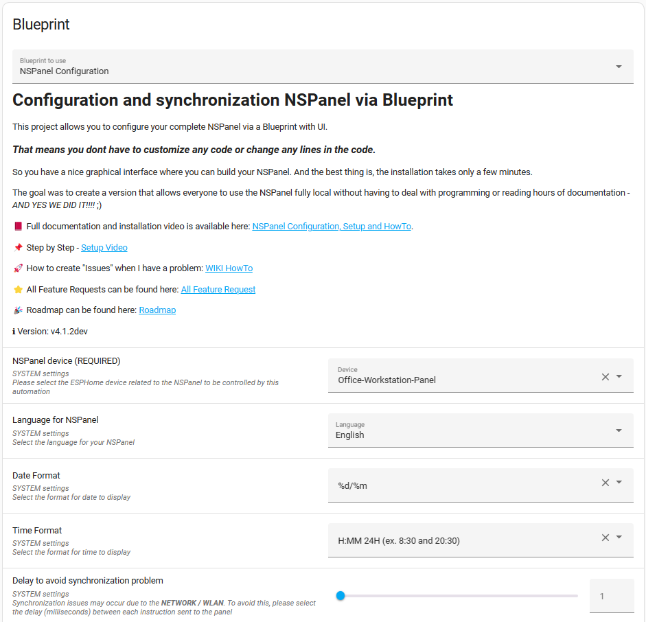
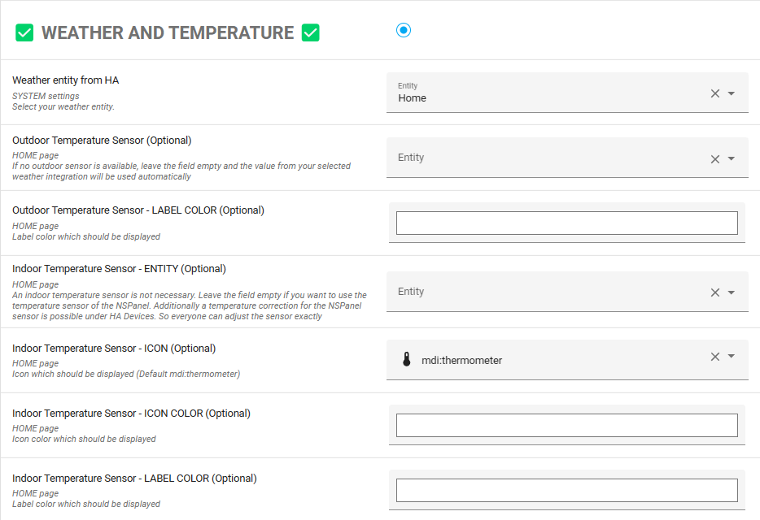
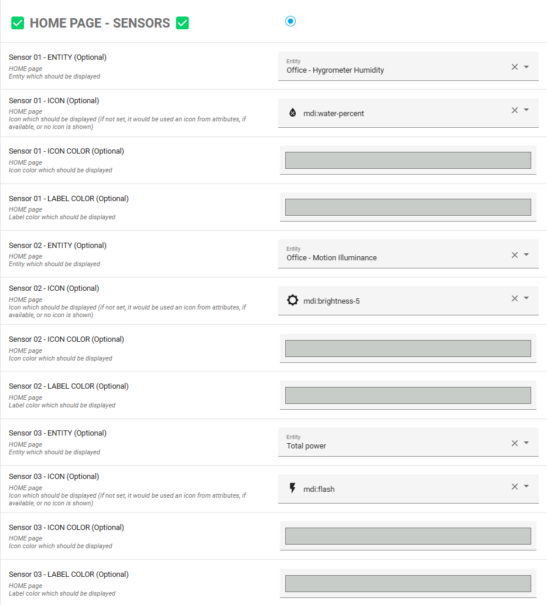
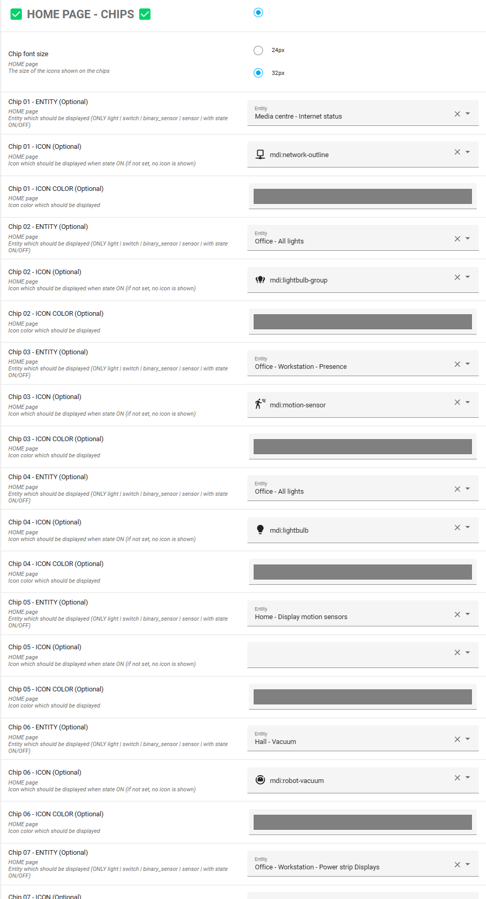
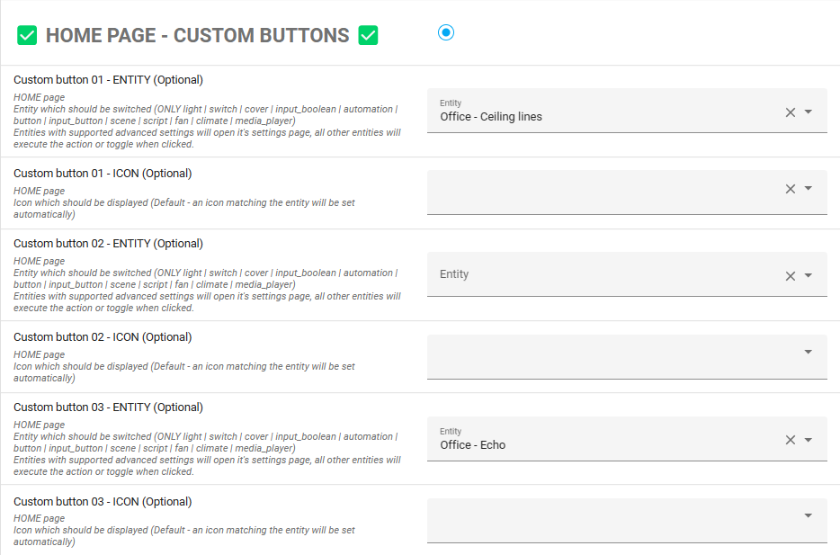

# Blueprint Automation

This article covers the settings in the Blueprint Automation.

The Blueprint Automation is the central configuration element of this solution for the NSPanel.

In principle, the setup of the automation is self-explanatory.
The individual elements of the Blueprint are described below.

It is possible to change both the color of the labels and the icons for most of the elements on each screen.

On the blueprint settings, you will be able to select any of the MDI icons supported by Home Assistant, however, your panel will only support the icons available on the [HASwitchPlate Material Design Icons](https://htmlpreview.github.io/?https://github.com/jobr99/Generate-HASP-Fonts/blob/master/cheatsheet.html).

For an easier overview, the menu items "Icon Color" and "Label Color" will not be described separately in the following documentation.

## Basic settings

### NSPanel device (REQUIRED)

You will be presented with a list of all of your ESPHome ESP32 devices and you must select your panel from the list.

This is technically the only required field, as basic functionality will be available when the Blueprint knows to which panel it have to send the settings.

> [!NOTE]
> You cannot have more than one blueprint based automation per each panel

### Language for NSPanel 

The language can be selected via the drop-down menu.

Currently around 30 languages are supported, but if you cannot find your language there,
please create a [new feature request](https://github.com/Blackymas/NSPanel_HA_Blueprint/issues/new) and we will be happy to help.

### Date format

Select how you want to see the date displayed on your panel (Home page and weather pages are affected).

### Time format

Select how you want to see the time displayed on your panel's Home page.

### Delay to avoid synchronization problems

If the Wi-Fi signal is poor, you may have issues when loading some pages.
If this happens, try to increase this delay as that may help.

## Weather and Temperature

### Weather entity from HA

Select a Weather entity to use.

Most of the weather integrations are supported, however some may be able to provide more information than others.

We run all of our tests with "Accuweather", so the parameters shown on the panel are targetting this integration and will be shown with your integration when available.

### Outdoor temperature Sensor (Optional)

Optionally, the value of an outdoor temperature sensor can be used here.
If no separate sensor is used, the value of the weather integration will be used.

### Indoor Temperature Sensor (Optional)

An indoor temperature sensor is not necessary.
Leave the field empty if you want to use the temperature sensor of the NSPanel.
If the value of the sensor needs to be corrected, this can be done via the temperature correction for the NSPanel under HA Devices.

## Home page - Sensor

### Sensor 01-03 - Entity (Optional)

Up to three sensors can be displayed on the home screen.
Select the corresponding HA entity.

## Home page - Chips

### Chip 01-07 - Entity (Optional)

Used to display HA entities on the home screen.
For example to display the status of a specific switch on the NSPanel.

## Home page - Custom buttons

### Custom button 01-06 - Entity (Optional)

Your panel will show 10 buttons on the Home page.
4 of those are fixed for Notifications, QR Code, Entities pages and Alarm, but you have additional 6 custom buttons that can be assigned to different entities from your Home Assistant.
The behavior of these buttons will depend on the entity's domain (light, media player, etc).

## Alarm Control Panel

An alarm control panel entity can be controlled by your panel.
When you assign the entity here, it's icon will be shown as a button on the Home page.

## Climate

### Climate to Control (Optional)

Here you select the main climate entity controlled by your panel.
It's temperature will be used on the Home page and by clicking on that value you will be able to control the climate settings.

You can optionally use your panel to control a climate system locally, using it's temperature sensor and relays.
You will find more details about this on the Add-on Climate docummentation.

If you are using the Add-on Climate, it will create a climate entity in your panel's device page.
You still have to select that entity on this field in the blueprint settings to have it used as your main climate.

Additional climate entities can be assigned to buttons and will be explained later in this documment.

On the blueprint settings, you will also find settings for sensors and custom buttons to be shown on all the climate pages.

## QR Code

### Activate QR Code (Optional)

Activates the QR Code page and shows the QR Code button on the Home page.

### QR Code content (Optional)

String, which is shown as a QR Code on the NSPanel.
This can be a simple text, a URL or could also be used for a simplified login to the Wi-Fi.
Here is an example (simply change SSID and password to your credentials and either use "WPA" or "WEP"):

`WIFI:S:SSID;T:WPA/WEP;P:PASSWORD;;`

#### Example:

For a network with the following parameters:
- **SSID:** my_ssid
- **Pass:** MySecurePa$$w0rd
- **Type:** WPA

Your QR code string will look like this:

`WIFI:S:my_ssid;T:WPA;P:MySecurePa$$w0rd;;`

For more details about these specifications, please visit the [WPA3™ Specification v3.1, chapter 7](https://www.wi-fi.org/system/files/WPA3%20Specification%20v3.1.pdf#page=24).

## Hardware Buttons

### Activate Relay x local Fallback (Optional)

Normally, the internal relays of the NSPanels are triggered via HA.
If the NSPanel loses Wi-Fi connection or HA is down, the hardware button can then switch the corresponding relay directly.

### Left/Right Hardware Button - Entity (Optional)

The entity that should be switched with the left/right hardware button.

### Left/Right Hardware Button Name - Label (Optional)

Text on the screen above the corresponding hardware button (home screen).

### Left/Right Hardware Button hold assignment - VALUE (optional)

Selection of what action should happen when the button is pressed for a longer time.

### Left/Right Hardware Button custom hold action - VALUE (Optional)

Selection of the action to start when holding the button.

## Button Page 01-04

### Button Page 01-04 name - LABEL (Optional)

Text on the respective button screens.

### Buttons 01 - 32 (Optional)

The buttons can be accessed by swiping on the Home Screen and their functions are completely identical.
Either the individual button pages can be accessed one after the other by swiping to the left, or the button pages can be accessed directly by swiping up, down or to the right.

The buttons are numbered as follows:

#### EU and US landscape models:

|       | Button Page 1 | Button Page 2 | Button Page 3 | Button Page 4 |
| :--:  | :--:          | :--:          | :--:          | :--:          |
| Row 1 | 01 02 03 04   | 09 10 11 12   | 17 18 19 20   | 25 26 27 28   |
| Row 2 | 05 06 07 08   | 13 14 15 16   | 21 22 23 24   | 29 30 31 32   |

#### US model:

|       | Button Page 1             | Button Page 2             | Button Page 3             | Button Page 4             |
| :--:  | :--:                      | :--:                      | :--:                      | :--:                      |
| Row 1 | 01 &nbsp;&nbsp;&nbsp; 02  | 09 &nbsp;&nbsp;&nbsp; 10  | 17 &nbsp;&nbsp;&nbsp; 18  | 25 &nbsp;&nbsp;&nbsp; 26  |
| Row 2 | 03 &nbsp;&nbsp;&nbsp; 04  | 11 &nbsp;&nbsp;&nbsp; 12  | 19 &nbsp;&nbsp;&nbsp; 20  | 27 &nbsp;&nbsp;&nbsp; 28  |
| Row 3 | 05 &nbsp;&nbsp;&nbsp; 06  | 13 &nbsp;&nbsp;&nbsp; 14  | 21 &nbsp;&nbsp;&nbsp; 22  | 29 &nbsp;&nbsp;&nbsp; 30  |
| Row 4 | 07 &nbsp;&nbsp;&nbsp; 08  | 15 &nbsp;&nbsp;&nbsp; 16  | 23 &nbsp;&nbsp;&nbsp; 24  | 31 &nbsp;&nbsp;&nbsp; 32  |

When the respective button is pressed, a toggle action is executed or the corresponding page is automatically opened, e.g.
the cover control for covers, etc.
For 2 state buttons (where toggle is the default action), a long press in the button will open it's corresponding page, when supported.

For each button an own name can be specified optionally.

All buttons offer the possibility to optionally confirm the execution of the action.
This can be activated or deactivated separately for each button via *"Confirm execution of the button press"*.

## Entity Page 01-04

### Activate Entity Page (Optional)

This option activates the entity pages on the Home Screen.
The entity pages can be used for example to display values or statuses of entities on the individual pages.

### Entity Page 01-04 name - LABEL (Optional)

Naming of the corresponding Entity Screens.

### Entity 01 - 32 (Optional)

The entity pages can be accessed by pressing the symbol on the Home Screen and their functions are completely identical.

The entities are numbered as follows:

| Entity page | Entities shown |
| :--:        | :--:           |
| 1           | 01 to 08       |
| 2           | 09 to 16       |
| 3           | 17 to 24       |
| 4           | 25 to 32       |

Additionally there is the possibility to choose an icon of your choice for the Entities button on the Home page.

Of course there is also the possibility to enter a label for each of the 4 pages and the aligment for the values on the entities pages.

## Example Screenshots

