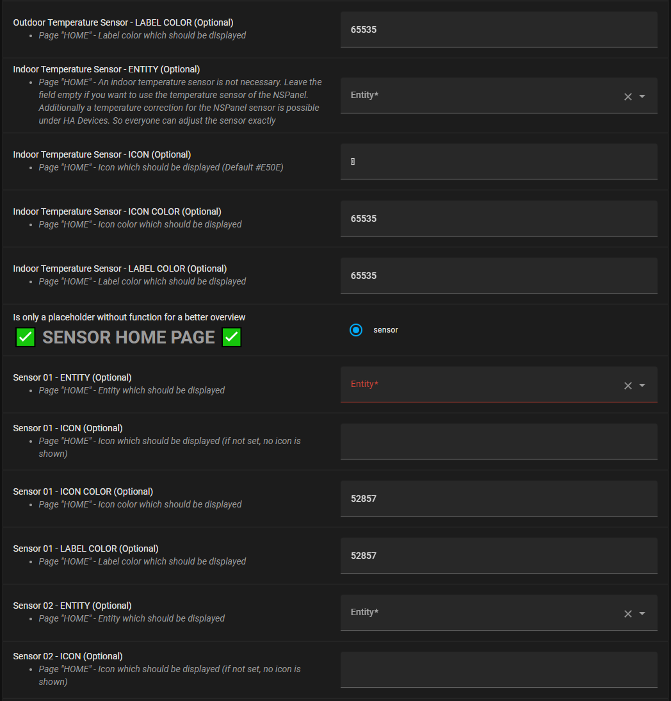

Dieser Artikel befasst sich mit den Einstellungen in der Blueprint Automatisierung. 

Die Blueprint Automation ist das zentrale Konfigurationselement dieser Lösung für das NSPanel.&nbsp;
Im Prinzip ist die Einrichtung der Automatisierung selbsterklärend. Nachfolgend werden die einzelnen Elemente des Blueprints beschrieben.


Es ist möglich, sowohl die Farbe der Labels als auch der Icons für die meisten Elemente auf den einzelnen Screens zu verändern.

Standard für die Farbe ist "65535". Der gewünschten Nextion Farbcode kann unter ```https://nodtem66.github.io/nextion-hmi-color-convert/index.html herausgesucht werden.```

Die Icons unter folgendem Link können verwendet werden: 
```https://htmlpreview.github.io/?https://github.com/jobr99/Generate-HASP-Fonts/blob/master/cheatsheet.html```

Es wird der Übersichtlichkeit halber in der folgenden Dokumentation nicht gesondert auf die Menüeinträge "Icon Color" und "Label Color" eingegangen.

&nbsp;   
# Parameter
### ESPhome Node Name 

Bezieht sich auf den ESPhome-Gerätenamen. **Zulässig sind die Zeichen "__",a-z, 0-9, jedoch keine Sonder- und Leerzeichen**. Dies ist eine Einschränkung seitens HA, da aus dem Device-Name des Blueprints die jeweiligen Entity_IDs generiert werden.

### Language for NSPanel 

Über das Dropdown Menü kann die Sprache ausgewählt werden. Unterstützt werden derzeit 26 Sprachen.

### Delay to avoid synchronization problems

Es kann bei schlechtem WLAN Signal vorkommen, dass Menüs nicht komplett geladen werden. Sollte dies vorkommen, kann hier ein Delay in ms Schritten eingestellt werden, um dies zu kompensieren.


## Weather and Temperature

### Weather Integration

Auswahl zwischen der HA Weather Integration oder dem genaueren Accuweather.

### Weather entity from HA

Dropdown Menü zur Auswahl der zu verwendenden Weather Entität. Beispiel: Wenn in Punkt 7 "Accuweather" ausgewählt wird, so muss hier die Entität für Accuweather ausgewählt werden.

### Outdoor Temperature Sensor (Optional)

Optional kann hier der Wert eines Aussentemperatur Sensor verwendet werden. Falls kein separater Sensor verwendet wird, wird der Wert der Wetter-Integration verwendet.

### Outdoor Temperature Sensor - LABEL COLOR (Optional)

Hier kann die Farbe der Beschriftung des Labels geändert werden. Siehe Link oben im Artikel.

### Indoor Temperature Sensor (Optional)

Optional kann hier der Wert eines InnentemperaturSensor verwendet werden. Wird das Feld leer gelassen, wird der Temperatursensor des NSPanels verwendet. Zusätzlich ist unter HA Devices eine Temperaturkorrektur für den NSPanel-Sensor möglich. 


## Sensor Home Page

### Sensor 01-03 - Entity (Optional)

Bis zu drei Sensoren können auf dem Home Screen dargestellt werden. Hierzu die HA Entität auswählen.


## Chips

### Chip 01-07 - Entity (Optional)

Zur Darstellung von HA Entities auf dem Home Screen. Kann verwendet werden um bspw. den Status eines bestimmten Schalters auf dem NSPanel darzustellen. 


## Climate

### Climate to Control (Optional)

Wenn eine Climate Integration gesteuert werden soll, muss diese hier eingegeben werden. Erreichbar ist diese dann über die Temperatur auf dem Home Screen des NSPanels.

### Climate Control optimistic Mode (Optional)

Abhängig von der Klima Steuerung, kann für ein besseres Ansprechverhalten der Optimistic Mode verwendet werden. Die vorgenommenen Änderungen werden erst bei verlassen des Screens auf das Device übertragen.

### Hot Water Charge Button (Optional)

Optionaler Schalter um bspw. einen Boiler an- bzw. aus zu schalten.


## QR Code

### Activate QR Code - TRUE/FALSE (Optional)

Aktiviert die QR Code Page sowie den Button auf dem Home Screen.

### QR Code content - VALUE (optional)

String, der als QR Code dargestellt werden soll. Dies kann ein Text sein, eine URL oder beispielsweise auch für einen vereinfachten Login ins WiFi verwendet werden (hier einfach SSID und Password ersetzen sowie entweder "WPA" oder "WEP" verwenden):

```WIFI:S:SSID;T:WPA/WEP;P:PASSWORD;;``` 


## Hardware Buttons

### Delay for HW-Buttons hold in seconds - VALUE

Einstellung, wie lange ein Button gedrückt bleiben muss, um einen "hold" zu erkennen. Default: 1 Sekunde.

### Activate Relay x local Fallback (Optional)

Normalerweise werden die internen Relays über HA getriggert. Ist dieser Menüpunkt aktiviert, so wird das jeweilige Relays bei betätigen des Linken bzw. Rechten Hardware Buttons geschaltet, sollte HA offline sein.

### Left/Right Hardware Button - Entity (Optional)

Hier kann die Entitiy ausgewählt werden, welche mit dem linken/rechten Hardware Button geschaltet werden soll.

### Left/Right Hardware Button Name - Label (Optional)

Text auf dem Screen über dem jeweiligen Hardware Button (Home Screen)

### Left/Right Hardware Button hold assignment - VALUE (optional)

Auswahl, welche Action passieren soll, wenn der Button länger gedrückt bleibt.

### Left/Right Hardware Button custom hold action - VALUE (Optional)

Auswahl der zu startenden Action beim Halten des Buttons.


## Button Page 01-04

### Button Page 01-04 name - LABEL (Optional)

Text auf den jeweiligen Button Screens.

### Buttons 01 - 32 (Optional)
Die Buttons sind durch Wischen auf dem Home Screen zu erreichen und in ihrer Funktion völlig identisch.
Entweder können nacheinander die einzelnen Button Pages durch Wischen nach links erreicht werden, oder direkt auf die Button Pages durch Wischen nach oben, unten oder rechts angesprungen werden.

Die Buttons sind wie folgt nummeriert:

 |         | Button Page 1 | Button Page 2 | Button Page 3 | Button Page 4 |
 | ------- | ------------- | ------------- | ------------- | ------------- |
| Zeile 1 | 01 02 03 04   | 09 10 11 12   | 17 18 19 20   | 25 26 27 28   |
 | Zeile 2 | 05 06 07 08   | 13 14 15 16   | 21 22 23 24   | 29 30 31 32   |

Es können folgende Entitäten hinterlegt werden:
- Light
- Switch
- Cover
- Input Boolean
- Automation
- Button
- Input Button
- Scene
- Person
- Script
- Binary Sensor
- Fan
- Climate

Wenn der jeweilige Button gedrückt wird, wird automatisch die korrespondierende Seite aufgerufen, bspw. bei Cover die Coversteuerung etc.
Für jeden Button kann optional ein eigener Name angegeben werden.
Alle Buttons bieten die Möglichkeit, die Ausführung der Aktion optional bestätigen zu lassen. Dies kann separat für jeden Button über *"Confirm execution of the button press"* aktiviert bzw. deaktiviert werden.


## Entity Page 01-04

### Activate Entity Page - TRUE/FALSE (Optional)

Hiermit können die Entity Pages auf dem Home Screen aktiviert werden. Diese können verwendet werden, um bspw. Werte oder Status von Entitäten auf den einzelnen Pages darzustellen.

### Entity Page 01-04 name - LABEL (Optional)

Text auf den jeweiligen Entity Screens.

### Entity 01 - 32 (Optional)

Die Entity Pages sind durch drücken auf das Entity Symbol auf dem Home Screen zu erreichen und in ihrer Funktion völlig identisch.

Die Entities sind wie folgt nummeriert:

|         | Entity Page 1 | Entity Page 2 | Entity Page 3 | Entity Page 4 |
| ------- | ------------- | ------------- | ------------- | ------------- |
| Zeile 1 | 01 02 03 04   | 09 10 11 12   | 17 18 19 20   | 25 26 27 28   |
| Zeile 2 | 05 06 07 08   | 13 14 15 16   | 21 22 23 24   | 29 30 31 32   |

Zusätzlich besteht die Möglichkeit, ein Icon für jede Entität aus derzeit 6896 Icons auszuwählen.
Natürlich gibt es auch die Möglichkeit, eine eigene Entitätsbezeichnung einzugeben und eine Bezeichnung für die 4 Seiten zu vergeben. Wenn kein Entity-Label gesetzt ist, wird der Friendly Name von HA übernommen.

Die derzeit verfügbaren Icons finden sich hier: https://htmlpreview.github.io/?https://github.com/jobr99/Generate-HASP-Fonts/blob/master/cheatsheet.html

Zum Einfügen des ausgewählten Icons auf das "U" des Icons klicken und in das jeweilige Feld im Blueprint einfügen. Es wird danach ein "komisches" Symbol im Blueprint angezeigt, dies ist jedoch korrekt.

 

## Custom Configuration

### Hot Water Temperatur Sensor (Optional)

Optionaler Heiß Wasser Sensor.

### Top 04 Flame

Zeigt ein Flammen-Symbol auf dem Home Screen an, bspw. wenn eine Therme angeschaltet (On) ist.

### Nextion TFT File Folder

Kann freigelassen werden. Wird aber benötigt, wenn eine eigene TFT Konfiguration verwendet werden soll.

### Synchronization of all all values (Optional)

Light und Cover Seiten (Werte) werden kontinuierlich upgedatet (kann zu Flackern führen).

### Synchronization of all all Sliders (Optional)

Light und Cover Seiten (Position der Cover) werden kontinuierlich upgedatet (kann zu Flackern führen).


***

Beispiel Screenshots:





