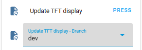

# Guide to Using Different Versions of This Project

## Introduction
This guide provides instructions on how to switch between different versions for each component of this project:
Blueprint, ESPHome, and Nextion TFT, allowing users to access development (`dev`), beta, or previous versions.

<!-- markdownlint-disable MD028 -->
> [!WARNING]
> Use non-main versions at your own risk. Only the `main`/latest release is officially supported.

> [!IMPORTANT]
> Ensure all three components (Blueprint, ESPHome, TFT) are synchronized at the same version for system stability.
<!-- markdownlint-enable MD028 -->

## Suggested Update Order
1. **ESPHome**: Start with ESPHome for its straightforward update process.
2. **TFT**: Then proceed with Nextion TFT.
3. **Blueprint**: Finally, update Blueprint, as it requires more manual effort and careful handling.

## Finding Available Versions
For available versions and branches, visit: [NSPanel_HA_Blueprint Tags](https://github.com/Blackymas/NSPanel_HA_Blueprint/tags).
Take note of the branch (`dev`, `beta`, or `main`) or version name exactly as it is published, as this is case-sensitive.

> [!NOTE]
> **Understanding Tags in GitHub**
> Tags on GitHub mark specific versions of a project, akin to bookmarks.
They're created for each new release, allowing easy access to different project stages.

### Special Versions
- **dev**: The development version, containing the latest code but potentially unstable.
- **beta**: The pre-release version, more stable than `dev` but still undergoing final testing.
- **main**: The default latest version, where you will find the most recent release code.

> [!NOTE]
> When using `dev` or `beta`, report findings in the [issues](https://github.com/Blackymas/NSPanel_HA_Blueprint/issues) section, clearly stating the version.
>
> **Please do not report issues related to old released versions.**

## Instructions

### For ESPHome Component
1. Open your device's YAML config and find the key `ref:`, which is under `remote_package:` in the `packages:` area:

    

2. Change the value of `ref:` to the version you want to install, like `ref: dev` or `ref: v4.1.4`:

    

3. Save your settings and then install it.

<!-- markdownlint-disable MD028 -->
> [!IMPORTANT]
> Older versions may require `arduino` framework.
> Please refer to this guide for setting the framework properly: [Change framework](customization.md#frameworks)

> [!WARNING]
> Older versions of the components may not be compatible with the latest ESPHome compiler or Home Assistant.
> 
> Ensure you are using a compatible version of Home Assistant and the compiler when working with older project versions to avoid potential issues.
> You can use our [Version compatibility matrix](version_compatibility.md) to identify the minimum requirement per version as a reference for possible version incompatibility,
> although we don't have a register of the "Maximum version" supported.
<!-- markdownlint-enable MD028 -->

### For Nextion TFT Component
The instructions to upload TFT will vary depending on the version you are installing and the framework you are using.

#### v4.2 or later (ESP-IDF) or v4.2.5 or later (Arduino)
1. Go to your device's page under **Settings** > **Devices & Services** > **ESPHome**.
2. On the **Configuration** group, select your option for **Update TFT display - Branch** (either the version you want or `dev`/`beta`).
If that option is not visible, please expand the **+n entities not shown** and enable it.

    
3. Press **Update TFT display** and wait for the upload to complete.

#### v4.1 or earlier, or v4.2.4 or earlier for Arduino framework
1. On the GitHub repository, click on your chosen version name on the [NSPanel_HA_Blueprint Tags](https://github.com/Blackymas/NSPanel_HA_Blueprint/tags) list, then select the tab **Code**.
2. Double-check that the correct version is shown below the repository name:

    
3. Locate the TFT file related to your model and download it to your local http server.
4. Double check your `nextion_update_url` substitution is pointing to the right URL where the file you just downloaded is available.

    
5. Go to your device's page under **Settings** > **Devices & Services** > **ESPHome**.
6. On the **Configuration** group, press **Update TFT display** and wait for the upload to complete.

### For Blueprint Component
1. Use your preferred code editor to edit the blueprint file under `/homeassistant/blueprints/automation/Blackymas/nspanel_blueprint.yaml`.
2. In the `source_url` key, change the URL replacing `main` by the version you want to install.
3. Go to **Developer Tools**, select the tab **YAML** and click the button to reload **AUTOMATIONS**.
4. Go to the [Blueprints dashboard](https://my.home-assistant.io/redirect/blueprints/) (under **Settings** > **Automations & Scenes**, then select tab **Blueprints**).
5. Find the Blueprint named **NSPanel Configuration** and click on the 3-dot menu related to that.
6. Click **Re-import blueprint**.
7. Go back to **Developer Tools**, select the tab **YAML** and click the button to reload **AUTOMATIONS**.

## Additional Notes
- Please note that the images provided in this guide might become outdated as the project evolves.
It's always a good idea to refer to the latest version of the project for current details.
- For the most up-to-date information and updates,
refer to the [project's documents](README.md)
and check the [issues](https://github.com/Blackymas/NSPanel_HA_Blueprint/issues)
and [discussions](https://github.com/Blackymas/NSPanel_HA_Blueprint/discussions) sections on our GitHub repository.
