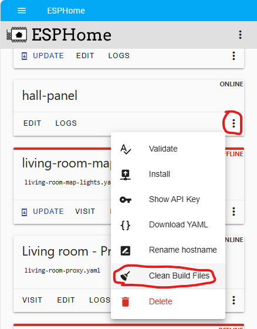
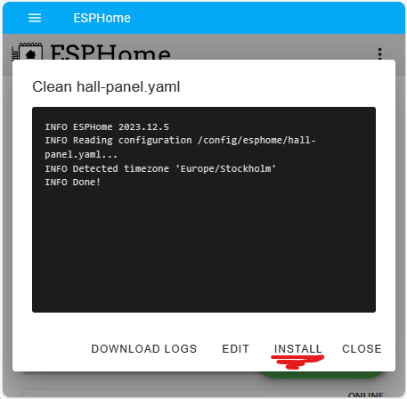
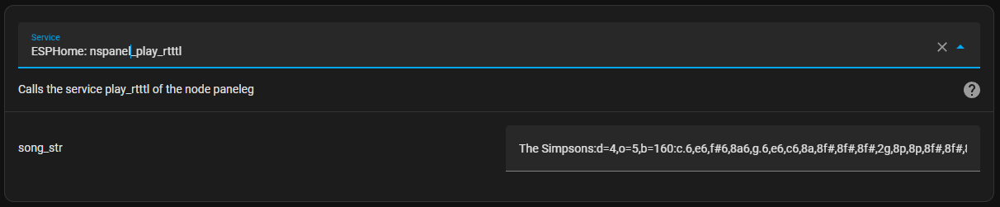

# How-to

In this document, we collect important information, tips, and solutions related to various topics noticed over time.
This is a community-driven resource, and we encourage everyone to contribute their knowledge.

## Community Contribution

If you have a solution or tip to share, please contribute! Your knowledge can significantly help others in the community.
You can write a short message with your findings, and we'll include it here.

## Topics and Solutions
Below are the topics covered in this document, each with relevant tips and solutions.

1. [How do I create "Issues" when I have a problem ](#how-to-create-issues-when-i-have-a-problem)
1. [Update Blueprint](#update-blueprint)
1. [Update ESPHome](#update-esphome)
1. [Update TFT](#update-tft)
1. [Notification via HA](#notification-via-ha)
1. [Climate control with relays](#climate-control-with-relays)
1. [Call a page directly](#call-a-page-directly)
1. [Play RTTTL Sound](#play-rtttl-sound)
1. [Start automations via Input_Boolean](#start-automations-via-input_boolean)
1. [Updating Wi-Fi and OTA passwords in ESPHome with this project](#updating-wi-fi-settings-and-ota-passwords-in-esphome-with-this-project)

## How to create "issues" when I have a problem

> _**To be able to solve your problem, it is important for us to have as much information as possible**_.

* Describe your problem as detailed as possible.
* Please write your ESPHome and Home Assistant version, as the version of files of this project (TFT, ESPHome and Blueprint).
* Please go to your automation and then to the "3 dots" and then to _**Edit as YAML**_.
Copy the complete code and attach it to the ticket
* An important "helper" for solving problems is the trace of an automation.
You can find the trace under _**Settings --> Automations & Scenes --> your NSPanel automation --> Traces (top right)**_

<!-- markdownlint-disable MD028 -->
> [!NOTE]
> TRACES! Please execute again what does not work and open the trace immediately afterwards.
> Often you have to open the trace after the reboot too.
> During the start up, most things are loaded.

> [!IMPORTANT]  
> In the trace you can see by the _**"orange "**_ lines which way the automation has gone.
> Please tell us this path.
> Also, please take one or more screenshots and add them to your ticket.
> Especially important for us is where the _**"Orange "**_ line ends, because most of the time this is also where the problem is.

> [!IMPORTANT]  
> When you have opened the trace, there is a _**"timestamp "**_ at the top.
> It is important that you select the correct timestamp.
<!-- markdownlint-enable MD028 -->

### Example trace after reboot


### Example automations Blueprint

```yaml
alias: YYXYYXYYX - NSPanel Configuration
description: ""
use_blueprint:
  path: nspanel_configuration.yaml
  input:
    nspanel_name: nspanel_dev
    language: DE
    sync_value_ha: select_no
    sync_slider_ha: select_no
    weather: AccuWeather
    accuweather: home_wetter
    outdoortemp: sensor.terrasse_garage_motion_sensor_temperature
    humidity: sensor.kinderzimmer_lea_temperatur_sensor_humidity
    hotwatertemp: sensor.hotwater_temp
    hotwatercharge: switch.charge
    heatingsystemflame: binary_sensor.flamestatus
    climate: climate.nspanel_buro
    left_button_entity: light.haustur_spot_2
    right_button_entity: light.haustur_spot_1
    entity01: light.buro_sideboard
    entity01_name: Sideboard
    entity02: cover.kuche_rollo
    entity02_name: Küche Rollo
    entity03: switch.buro_dart_beleuchtung
    entity03_name: Dart Licht
    delay: 2
    right_button_name: Test 1
    left_button_name: Test 2
```

## Update Blueprint

> [!IMPORTANT]
> To install a new version of the NSPanel, the Blueprint, ESPHome and the TFT must be updated!

1. In Home Assistant, go to Settings > Automation & Scenes, select the tab Blueprints and find the blueprint named "NSPanel Configuration"
2. Click the 3-dot menu and select "Re-import blueprint":

    
3. Click "Re-import" button:

    
4. Reload automations or restart Home Assistant.
5. The new Blueprint is now available.
Settings that have already been made are adopted.
6. Please review the blueprint settings (under Automations tab) for new settings available with the new version.

## Update ESPHome
<!-- markdownlint-disable MD028 -->
> [!IMPORTANT]
> To install a new version of the NSPanel, the Blueprint, ESPHome and the TFT must be updated!

> [!IMPORTANT]
> These instructions are for updating a panel where an older version of these files are already installed.
<!-- markdownlint-enable MD028 -->

These are the steps to flash your panel with an updated version from this project:

1. Go to the ESPHome dashboard (in your Home Assistant) and find the device you want to update.
    Then click the 3-dot menu and select the option "Clean Build Files" to make sure you clean-up your system from the previous versions files:
    

2. When the clean-up process is done, click on **Install** button:
    

3. As your panel is probably already connected to the Wi-Fi, you may select to install **Wirelessly**,
    as it is much easier and you don't have to unassemble your panel.
    

The new firmware will be built and then flashed to your panel, which will restart at the end of this process and start sending logs again:


## Update TFT
> [!IMPORTANT]
> These instructions are for updating a panel where an older version of these files are already installed.

1. (**Arduino only**) Download from our [GitHub repository](https://github.com/Blackymas/NSPanel_HA_Blueprint/) the latest version of the TFT file relative to your panel's model.
2. (**Arduino only**) Upload this file to your local www (http) server. Please use the same URL as indicated by the substitution `nextion_update_url` in your device's YAML.
3. Go to ***Settings --> Devices & Services --> Integrations***, select the display under the ESPHome integration.
4. Press the switch "**Update TFT Display**" under **Configuration**.
5. The display starts the update process and then restarts.

## Notification via HA
To show a notification on the NSPAnel, the following service call can be used:

```yaml
service: esphome.panelname_notification_show
data:
  label: Example text
  text: Example text
```

To clear any notifications, the following service call can be used:

```yaml
service: esphome.panelname_notification_clear
data: {}
```


To use the notifications in an automation, again simply use the service call as shown in the example below:

```yaml
description: ""
mode: single
trigger:
  - platform: state
    entity_id:
      - binary_sensor.motion_detector
    to: "on"
    condition: []
    action:
  - service: esphome.panelname_notification_show
    data:
      label: Motion Detected
      text: Example for a Notification on the Panel Screen
```

## Climate control with Relays
> Attention!! Although these instructions are still valid, since v4.0 there is a better way to setup a climate control using the panel's relays an the [add-on climate](addon_climate.md).

In order to use the NSPanel to control a radiator or underfloor heating, at least one Generic Thermostat must be created in the HA.
More information can be found here: https://www.home-assistant.io/integrations/generic_thermostat/

Example configuration Generic Thermostat:

```yaml
climate:
  - platform: generic_thermostat
    name: Study
    heater: switch.study_heater ## Wenn das NSPanel Relays den Heizkreis Regler schaltet, kann dieses hier definiert werden
    target_sensor: sensor.study_temperature ## Hier kann der NSPanel Sensor verwendet werden
    min_temp: 15
    max_temp: 21
    ac_mode: false
    target_temp: 17
    cold_tolerance: 0.3
    hot_tolerance: 0
    min_cycle_duration:
      seconds: 5
    keep_alive:
      minutes: 3
    initial_hvac_mode: "off"
    away_temp: 16
    precision: 0.1
```

Afterwards, the climate.entity must be assigned accordingly in the panel configuration.

## Call a Page Directly

In user-created automations within Home Assistant, there are scenarios where you might want to automatically display a specific page on your device's screen.
The following services enable this functionality:

### Basic Pages

To open a specific page, you can utilize the `esphome.xxxxxx_send_command_printf` service.
Here's an example that demonstrates how to open the `home` page:

```yaml
service: esphome.xxxxx_send_command_printf
data:
  cmd: page home
```

Currently, the following pages can be accessed using this method:

- `buttonpage01`
- `buttonpage02`
- `buttonpage03`
- `buttonpage04`
- `entitypage01`
- `entitypage02`
- `entitypage03`
- `entitypage04`
- `home`
- `qrcode`
- `screensaver`

For instance, to directly navigate to button page 2, replace `home` in the command with `buttonpage02`:

```yaml
service: esphome.xxxxx_send_command_printf
data:
  cmd: page buttonpage02
```

### Entity-Specific Pages

For entity-specific pages, a more detailed call is required as it involves specifying the entity.
You can use the service `esphome.xxxxx_open_entity_settings_page` as shown in the following example:

```yaml
service: esphome.xxxxx_open_entity_settings_page
data:
  page: climate
  page_label: My thermostat
  page_icon: \uE237
  page_icon_color:
    - 255
    - 0
    - 0
  entity: climate.my_thermostat
  back_page: home
```

The required parameters for this service are as follows:

- **page**: The page to be opened, typically the same as the domain of the entity (e.g., `climate`, `cover`, `light`).
- **page_label**: The title of the page, usually the friendly name of the entity.
- **page_icon**: The UTF-8 code for the icon to be displayed at the top left of the page.
Supported icons are listed on the [HASwitchPlate Material Design Icons](https://htmlpreview.github.io/?https://github.com/jobr99/Generate-HASP-Fonts/blob/master/cheatsheet.html) page.
The code is a 4-character hex string found near the icon in the list. Prefix the icon code with `\u` to indicate it's a UTF-8 hex code.
- **page_icon_color**: An RGB array with values from 0 to 255 for red, green, and blue.
ESPHome automatically converts this array to a [16-bit RGB (RGB565)](https://en.wikipedia.org/wiki/List_of_monochrome_and_RGB_color_formats#16-bit_RGB_(also_known_as_RGB565)) format,
which may lead to some color distortion.
- **entity**: The `entity_id` from Home Assistant for the relevant entity.
- **back_page**: The page to return to when the detailed page is manually closed or after a page timeout.
Only [Basic pages](#basic-pages) are supported.

### Notification Page

To display the notification page, use the `esphome.xxxxx_notification_show` service as shown below:

```yaml
service: esphome.xxxxx_notification_show
data:
  label: "Notification title"
  message: "Attention! This is a placeholder for your notification message."
```

### Wake-up Page

You may have configured a specific **Wake-up page** on your device.
This page is automatically displayed after the device boots up or wakes up from sleep mode (such as the `screensaver` page).
To open this page, you have two options:

1. Directly call the page if it is one of the [Basic pages](#basic-pages).
2. Use the `esphome.xxxxx_wake_up` service as follows:

   ```yaml
   service: esphome.xxxxx_wake_up
   data:
     reset_timer: true
   ```

    The `reset_timer` parameter allows you to control the **Timeout sleep timer**.
    Setting it to `true` resets the timer, while `false` continues counting down from the current value.

The **Wake-up** service differs from a normal page call in that it only opens the wake-up page if the panel is in sleep mode.
If the panel is already active, the current page remains displayed.
This feature is particularly useful in conjunction with a motion sensor to wake up your panel automatically.
By repeatedly calling this service whenever motion is detected, the panel can be either woken up or have its sleep timeout timer reset (if `reset_timer` is set to `true`).

## Play RTTTL Sound

HA can send a RTTTL to the NSPanel, custom melodies are possible.

The use this function, the following service is called: ***nspanel_play_rtttl*** 

You can find many RTTTL strings on the web, the important thing is that they must start with the name and then a colon.

Here is an example:

```txt
The Simpsons:d=4,o=5,b=160:c.6,e6,f#6,8a6,g.6,e6,c6,8a,8f#,8f#,8f#,2g,8p,8p,8f#,8f#,8f#,8g,a#.,8c6,8c6,8c6,c6
```



More information: https://esphome.io/components/rtttl.html#common-beeps

More songs: https://codebender.cc/sketch:109888#RTTTL%20Songs.ino

## Start Automations via Input_Boolean

Although the NSPanel can execute scripts directly over the buttons, there is also the possibility of starting automations directly by the means of Input_Boolean.

For this, a helper must first be created under ***Settings --> Devices&Services --> Helpers***

Now add the created Input_Boolean as a trigger in the desired automation under State.

In the last step, assign the trigger to a button in the Panel Config.

## Updating Wi-Fi settings and OTA Passwords in ESPHome with This Project

### Overview
When you update your Wi-Fi password in a device with firmware from our project,
it's important to remember that the `wifi_password` substitution is used for both Wi-Fi and OTA updates (and a few more places that are not relevant now).
Failing to update both simultaneously can lead to connection issues.

### Step-by-Step Guide

1. **Prepare Your Device for Update**
   - Ensure your device is connected to your computer and is accessible via your current Wi-Fi network.

2. **Update OTA Password First**
   - Open your panel's YAML.
   - Add the following in the customization area:

     ```yaml
     esphome:
       on_boot:
         - priority: 600
           then:
             - lambda: |-
                 id(my_ota).set_auth_password("Your new Wi-Fi password");
     ota:
       password: "Your current Wi-Fi password"
       id: my_ota
     ```

   - Flash your device.
It will use the current password for this flash and will inform your device to start using the new password for the next OTA.
   - When your device starts, **remove the lines above**.
   - Find the `wifi_ssid` and `wifi_password` key in the `substitutions` area (usually at the beginning of the file) and change it to your new Wi-Fi password.
    If that is point to `!secret`, you will have to edit it in your `secrets.yaml` file instead.
   - Flash your device again with the updated YAML.
It will use the current Wi-Fi to connect to your device and the new Wi-Fi password as the OTA password, then will inform your device to connect to the Wi-Fi with the new settings.

3. **Update Wi-Fi Settings in Your Access Point**

### Important Notes

- The device will still be using the old Wi-Fi settings for this update.
If you've already changed your Wi-Fi network settings, this step will fail.
- **Troubleshooting: Unable to Connect via Wi-Fi**
  - If your device cannot connect to Wi-Fi due to a password or SSID change, you will need to flash the device via a serial connection.
  - Connect your device to your computer using a USB-to-Serial adapter.
  - Use the ESPHome flasher tool to upload the new configuration.
  - In this case, don't worry about the OTA password, as it's not required when flashing via serial.

### Verify the Update

- Once the new configuration is uploaded, your device should automatically connect to your Wi-Fi network with the new settings.
- Verify that OTA updates are working with the new password.

### Additional Tips

- **Backup Your Configuration:** Always keep a backup of your ESPHome configuration files.
- **Network Accessibility:** Ensure your device remains within your Wi-Fi network's range during the update process.
- **Serial Flashing:** Familiarize yourself with the process of flashing via serial, as it's a reliable fallback method.

### Conclusion

By carefully updating both your Wi-Fi settings and OTA passwords in your ESPHome configuration, you can avoid connection issues.
Remember to always back up your configuration and be prepared to use a serial connection if Wi-Fi connectivity is lost.
