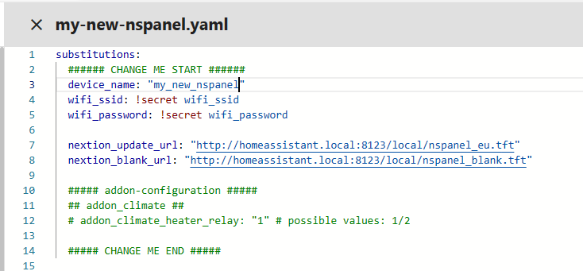

# Getting Started with NSPanel HA Blueprint
Welcome to this setup guide, a community-driven approach to integrating NSPanel into your smart home. Designed for users at all levels, it combines Home Assistant's user-friendly interface with ESPHome's customization options.

Whether you're a first-time smart device user or an enthusiast looking to personalize your setup, this guide provides the necessary tools and instructions. Let's embark on creating a smart home that's uniquely yours.

> [!NOTE]  
> Some images or instructions on this guide might be slighly different due to different configurations depending on your ESPHome and Home Assistant implementation or versions.<br>
> If you find something that is not understandable or needs to be updated, please let us know. You can create an issue reporting this, or fix it yourself and submit a [Pull Request](/Blackymas/NSPanel_HA_Blueprint/pulls) to this repository.

## Summary

- [Preparation](#preparation)
- [ESPHome firmware](#esphome-firmware)
  - [Preparing the ESPHome environment](#preparing-the-esphome-environment)
  - [Setup a device on ESPHome Dashboard](#setup-a-device-on-esphome-dashboard)
  - [Flashing the device for the first time](#flashing-the-device-for-the-first-time)
  - [Integrating your panel to Home Assistant](#integrating-your-panel-to-home-assistant)
  - [Making changes Over The Air (OTA)](#making-changes-over-the-air-ota)
  - [Updating](#updating)
  - [Migrating from other custom firmware](#migrating-from-other-custom-firmware)
- [Upload TFT](#upload-tft)
  - [Select the right file](#select-the-right-file)
  - [Uploading to Nextion](#uploading-to-nextion)
  - [Troubleshooting TFT transfer issues](#troubleshooting-tft-transfer-issues)
- [Blueprint](#blueprint)
  - [Importing the blueprint](#importing-the-blueprint)
  - [Creating an automation](#creating-an-automation)
  - [Editing the settings in your automation](#editing-the-settings-in-your-automation)
- [How to handle multiple panels](#how-to-handle-multiple-panels)
- [Advanced configuration for ESPHome and Home Assistant experts](#advanced-configuration-for-esphome-and-home-assistant-experts)
- [Additional Tips and Resources](#additional-tips-and-resources)

------

## Preparation
Start by ensuring you have all the necessary tools and files. This includes your NSPanel device, a stable internet connection, and access to your Home Assistant instance.

If flashing it for the first time, please look for additional preparation and tools on the [Flashing the device for the first time](#flashing-the-device-for-the-first-time) section later in this guide.

## ESPHome firmware

### Preparing the ESPHome environment
In order to flash your NSPanel, you need a firmware generated by ESPHome. You can use ESPHome as an add-on in your Home Assistant, installed locally in your computer or any other type of installation. This guide will be based on the ESPHome dashboard which is available in all implementations.

- For more information on how to install ESPHome as an add-on to your Home Assistant, please refer to this external guide: [Getting Started with ESPHome and Home Assistant](https://esphome.io/guides/getting_started_hassio)
- For more information on how to install ESPHome manually in your computer, please refer to this external guide: [Installing ESPHome Manually](https://esphome.io/guides/installing_esphome.html)

### Setup a device on ESPHome Dashboard
Once you have the ESPHome Dashboard available, please follow the steps bellow:
1. Click the button **+ New device**
2. Add the unique name of your new device in ESPHome:<br>
<br>&nbsp;
3. Select **ESP32** as device type:<br>
<br>&nbsp;
4. Click **Skip** button, as we don't want to start the installation yet:<br>
<br>&nbsp;
5. Find the entry related to your newly created device in the ESPHome Dashboard and click the button **Edit**.
<br>&nbsp;
6. In the yaml dialog, you might want to copy the `api:` area to another temporary file, just in case. That is not really necessary, but can be used to improve the security in your system (more details later).
<br>&nbsp;
7. Take note also of the device name in the beginning of the file. Under `esphome`, it is the value for `name` (in this examble, the device name is `my-new-nspanel`, with dashes between the words):<br>
<br>&nbsp;

8. Clear all the content and paste the following:
    ```yaml
    substitutions:
      ###### Settings - You can edit these values ######
      device_name: "YOUR_NSPANEL_NAME" 
      wifi_ssid: !secret wifi_ssid
      wifi_password: !secret wifi_password

      nextion_update_url: "http://homeassistant.local:8123/local/nspanel_eu.tft"

      ##### addon-configuration #####
      # heater_relay: "1" # possible values: 1/2 - Used by add-on climate

      ###### Settings - End #####

    ##### My customization - Start #####
    ##### My customization - End #####

    ###### Do not change area - Start ######
    packages:
      remote_package:
        url: https://github.com/Blackymas/NSPanel_HA_Blueprint
        ref: main
        files:
          - nspanel_esphome.yaml # Core package
          # - advanced/esphome/nspanel_esphome_advanced.yaml # activate advanced (legacy) elements - can be useful for troubleshooting
          # - nspanel_esphome_addon_climate_cool.yaml # activate for local climate (cooling) control
          # - nspanel_esphome_addon_climate_heat.yaml # activate for local climate (heater) control
          # - nspanel_esphome_addon_climate_dual.yaml # activate for local climate (dual) control
        refresh: 300s

    esp32:
      framework:
        type: esp-idf
    ###### Do not change area - End ######

    ```
<br>&nbsp;

9. Edit the **Settings** area. As your device name, ideally use the same device name you recorder on the step 7:
<br>&nbsp;

10. For `wifi_ssid` and `wifi_password` you can either replace the existing text by your Wi-Fi credentials or, if you want to keep that information a bit safer (and make easier to share your setting later to help someone or to ask for help), you can leave as it is and edit this later by clicking on the button **Secrets** in the top right area of the ESPHome Dashboard.<br>
This is a quite objective video about secrets if you want to see how it works: [YouTube - 3ATIVE VFX Studio - Home Assistant guide: How I use Secrets in ESPHome]( https://www.youtube.com/watch?v=eW4vKDeHh7Y)

11. You can also edit `nextion_update_url` to point to a local copy of the TFT file.<br>
We will come back to this on the [Upload TFT](#upload-tft) section, but it is important to know that you have this option which could be useful if your panel don't have access to the Internet or if you have trouble when uploading the TFT file directly from the GitHub repository.

12. (optional) You can optionally enable API encryption by adding the key copied on step 6 and adding it to the **My customization** area. This will encrypt the communication between your panel and Home Assistant, which may be important if you will use your panel to transfer sensitive information, like a pin code when disabling an alarm.<br>
This can be set later, if you want to skip it for now.<br>
<br>&nbsp;

13. When all settings are correct, click the button **Save** in the top and close this yaml window.

Done! Your NSPanel is all set into your ESPHome Dashbord.

### Flashing the device for the first time

#### Drive safe

> [!CAUTION]
> **Make sure your panel's controller module is disconnected from main power during all the work.**<br>
>If your device is open and plugged directly into the wall, you’ll be a single touch away from being electrocuted.

> [!WARNING]  
> **You are solely responsible for your own safety.**<br>
> If you feel something is wrong or are uncomfortable with continuing, stop immediately.

- Don't use any eletronic component above 3.3VDC. Make sure you TTL adapter is set to 3.3VDC. Any value above this treshold can permanently damage your panel.
- Use a clean area when disassembling your device and make sure you don't scratch your device's screen.
- Keep all the parts (screws, cables, etc.) safe.

#### Required Tools:
If you are going to flash your NSPanel with ESPHome for the first time you also may need:
1. [USB-to-Serial TTL adapter](https://esphome.io/guides/physical_device_connection#usb-serial-adapter)
2. [jumper wires](https://esphome.io/guides/physical_device_connection#jumper-wires)
3. [breakable headers (optional)](https://esphome.io/guides/physical_device_connection#pcb-headers)
4. An appropriated screw driver for unassembling your panel's controller module (touch plate)

#### Connecting your device via USB-to-Serial TTL interface
Before start unassembling your panel, please take a look at the following material:
- [YouTube - Mark Watt Tech - HOW TO - Setup the SIMPLEST Smart Home Scene Controller](https://www.youtube.com/watch?v=jpSTA_ILB8g&t=323s)
- @blakadder's [Sonoff NSPanel EU Switch in Detail](https://blakadder.com/nspanel-teardown/)
- [ESPHome - Physically Connecting to your Device](https://esphome.io/guides/physical_device_connection)

<<add pictures of the board & wiring>>
<<add step by step how to generate firmware on ESPHome Dashboard>>
<<add step by step how to flash the firmware using serial TTL>>

### Integrating your panel to Home Assistant

### Making changes Over The Air (OTA)
<< add instructions how to flash wirelessly>>

### Updating
<< add instructions how to flash wirelessly>>
<< considerations - update all to the same version >>

### Migrating from other custom firmware
The installation in a NSPanel with Sonoff's original firmware should be straighforward, however, if you have installed some other custom firmware before, you may have additional steps to execute.

#### NSPanel Lovelace UI
If you have already installed on your NSPanel the "nspanel-lovelace-ui" firmware from @joBr99 or from Tasmota, an [intermediate step](lovelace_ui.md) is necessary. Please execute that first before returning here.

#### Other
Please try the standard process and if you find any issue, please [create a new issue](/Blackymas/NSPanel_HA_Blueprint/issues) and inform which custom firmware you have installed before migrating to NSPanel HA Blueprint.

## Upload TFT
### Select the right file
### Uploading to Nextion
### Troubleshooting TFT transfer issues
We have an useful guide for [troubleshooting TFT transfer issues](tft_upload.md). Please take a look there.

## Blueprint
In this area we will provide guidance on how to import the blueprint from our GitHub repository to your Home Assistant, use that to create a new automation to setup your panel and how to update the blueprint when a new version is available.

All these processes are quite easy with the latest versions of Home Assistant, but please come back to us if you have any question or if something isn't very clear.

### Importing the blueprint
Home Assistant makes this step very easy for you. Just click the button bellow and follow it's steps:

[](https://my.home-assistant.io/redirect/blueprint_import/?blueprint_url=https%3A%2F%2Fgithub.com%2FBlackymas%2FNSPanel_HA_Blueprint%2Fblob%2Fmain%2Fnspanel_blueprint.yaml)

### Creating an automation
Now that Home Assistant is equiped with our Blueprint, you have to create a new automation using that newly imported Blueprint. Please follow these steps:
1. On Home Assistant, go to **Settings**, then **Automations & Scenes** and then click on the tab **Blueprints**. Or just follow the link from the button bellow.<br>[](https://my.home-assistant.io/redirect/blueprints/)<br>&nbsp;
1. Find the Blueprint named **NSPanel Configuration** and click on it.
1. On the Blueprint settings, select your panel on the **NSPanel device** input (the very first input).
1. Fill the other relevant entries on the Blueprint settings and then hit the **Save** button.
1. Give a name for your automation. Anything that would help you to identify it later. Then click **Rename**.<br>
<br>&nbsp;

That's it.

> [!TIP]
> For a more compreehensive list of what you can do on your panel's settings, please refeer to the [Blueprint guide](blueprint.md).

### Editing the settings in your automation
You can always edit the settings in your automation to add some new configuration, edit some existing configuration or remove things.

In order to edit it, in Home Assistant, go to **Settings** and then **Automations & Scenes** or click on the button bellow:<br>
[](https://my.home-assistant.io/redirect/automations/)

On the **Automations** page, fnd your automation in the list and click on it.

After changing the settings, please remember to click on **Save** to send the new settings to your panel. It shouldn't take more than a few seconds for your panel to receive the new settings, however some changes won't be visible until the page is reloaded.

> [!TIP]
> For a more compreehensive list of what you can do on your panel's settings, please refeer to the [Blueprint guide](blueprint.md).

## How to handle multiple panels
If you have multiple panels, just repeat the steps above for each panel. You should have one entry per panel on the ESPHome Dashboard, on entry (device) per panel under Home Assistant integrations (**Settings** > **Devices & Services** > **ESPHome**) and one automation per panel under Home Assistant automations.

> [!IMPORTANT]  
> Make sure you don't have the same panel assigned to more than one automation. Unfortunatly Home Assistant don't offers a mechanism to prevent this situation which could drive to your panel not showing what is expected and an unnecessary load over Home Assistant and your Wi-Fi network.

## Advanced configuration for ESPHome and Home Assistant experts
> [!WARNING]  
> Customizations and advanced mode are not supported by this project's team. Use this with caution and only when you know what you are doing.

Before you start customizing your system, we would like to invite you to share anything nice you achieve. You can always create a new [Pull Request](/Blackymas/NSPanel_HA_Blueprint/pulls) to `dev` branch and this will give a chance for other users with similar challenges to take advantage of your discoveries.

### ESPHome

The simpler way to go "advanced" with ESPHome is to use "Customizations". We have a page specifically for that where, again, your contribution is very welcome: [Customization](customization.md)

If you want for some reason use a local copy of `nspanel_esphome.yaml`, you can copy the file from GitHub to you local file system and reference in your ESPHome settings like this:

```yaml
substitutions:
  ###### Settings - You can edit these values ######
  device_name: "YOUR_NSPANEL_NAME" 
  wifi_ssid: !secret wifi_ssid
  wifi_password: !secret wifi_password

  nextion_update_url: "http://homeassistant.local:8123/local/nspanel_eu.tft"

  ##### addon-configuration #####
  # heater_relay: "1" # possible values: 1/2 - Used by add-on climate

  ###### Settings - End #####

##### My customization - Start #####
##### My customization - End #####

###### Do not change area - Start ######
packages:
  local_package: !include packages/nspanel_esphome.yaml

esp32:
  framework:
    type: esp-idf
###### Do not change area - End ######
```

> [!NOTE]  
> Note that a sub-folder was used in the example above in order to avoid that file to be added as an additional device in your ESPHome dashboard.<br>
> You can also have the file in the same folder, but with it's name starting with `.`, so ESPHome dashboard understands that file should be ignored when listing devices.

### Blueprint
The Blueprint file `nspanel_blueprint.yaml` can also be installed manually or you can edit locally your copy of the Blueprint, however be aware that your changes will be lost if you reload the Blueprint from the repository.

### TFT file
On the GitHub repository you will find all the `.HMI` files used in this project. You can use the [Nextion Editor](https://nextion.tech/nextion-editor/) to modify those files and generate your own `.tft` files to be loaded to your device.

For a better understanding on how to use Nextion, please use the following documentation:
- [Nextion Instruction Set](https://nextion.tech/instruction-set)
- [Nextion Editor Guide](https://nextion.tech/editor_guide/)

## Additional Tips and Resources
> [!TIP]
> We have an useful guide for [troubleshooting TFT transfer issues](tft_upload.md). Please take a look there first.

After troubleshooting, if issues persist, consult the [Issues](/Blackymas/NSPanel_HA_Blueprint/issues) and feel free to create a new one asking for more personalized assistance.

Please share as much info as possible, like:
1. Describing (or a picture of) what is in your screen
2. Are updating from a previous version of this same project, or coming from another NSPanel customization (which one?) or customizing for the first time a panel with original Sonoff settings?
3. Please share the ESPHome logs from when your panel starts to the moment the upload fails.
4. Describe what you have already tried.

## Important note
Remember, these steps are a guideline and might vary slightly based on your specific setup and previously installed system.
