# Getting Started with NSPanel HA Blueprint
Welcome to this setup guide, a community-driven approach to integrating NSPanel into your smart home.
This guide is designed to be user-friendly, aiming to assist users who have a basic understanding of Home Assistant and ESPHome.
While it's crafted to be accessible at all levels, a foundational knowledge in smart home automation will help you make the most of it.

Whether you're taking your first steps in customizing your smart home or you're an enthusiast looking to further personalize your setup, this guide provides essential tools and instructions.
Let’s embark on this journey together to create a smart home that’s uniquely yours.

<!-- markdownlint-disable MD028 -->
> [!TIP]
> For troubleshooting TFT transfer issues, the most popular topic for new users, please consult our [TFT Transfer Troubleshooting Guide](tft_upload.md).

> [!NOTE]
> We encourage users with absolute beginner-level knowledge in Home Assistant, ESPHome, or YAML editing to familiarize themselves with the basics of these platforms.
> Our community is here to support, but please note that this guide may not cover the fundamental aspects of Home Assistant and ESPHome extensively.

> [!NOTE]
> Some images or instructions on this guide might be slightly different due to different configurations depending on your ESPHome and Home Assistant implementation or versions.
>
> If you find something that is not understandable or needs to be updated, please let us know.
> You can create an issue reporting this, or fix it yourself and submit a [Pull Request](https://github.com/Blackymas/NSPanel_HA_Blueprint/pulls) to this repository.
<!-- markdownlint-enable MD028 -->

## Summary
- [Preparation](#preparation)
- [ESPHome Firmware](#esphome-firmware)
  - [Preparing the ESPHome Environment](#preparing-the-esphome-environment)
  - [Setting Up a Device on ESPHome Dashboard](#setting-up-a-device-on-esphome-dashboard)
  - [Flashing the Device for the First Time](#flashing-the-device-for-the-first-time)
  - [Integrating Your Panel to Home Assistant](#integrating-your-panel-to-home-assistant)
  - [Making Changes Over The Air (OTA)](#making-changes-over-the-air-ota)
  - [Updating Your NSPanel Firmware](#updating-your-nspanel-firmware)
  - [Migrating from Other Custom Firmware](#migrating-from-other-custom-firmware)
- [Upload TFT](#upload-tft)
  - [Select the Right File](#select-the-right-file)
  - [Uploading to Nextion](#uploading-to-nextion)
  - [Troubleshooting TFT Transfer Issues](#troubleshooting-tft-transfer-issues)
- [Blueprint](#blueprint)
  - [Importing the Blueprint](#importing-the-blueprint)
  - [Creating an Automation](#creating-an-automation)
  - [Editing Automation Settings](#editing-automation-settings)
- [How to Handle Multiple Panels](#how-to-handle-multiple-panels)
- [Advanced Configuration for ESPHome and Home Assistant Experts](#advanced-configuration-for-esphome-and-home-assistant-experts)
- [Additional Tips and Resources](#additional-tips-and-resources)

------

## Preparation
Start by ensuring you have all the necessary tools and files.
This includes your NSPanel device, a stable internet connection, and access to your Home Assistant instance.

If flashing it for the first time, please look for additional preparation and tools on the
[Flashing the device for the first time](#flashing-the-device-for-the-first-time) section later in this guide.

## ESPHome Firmware

### Preparing the ESPHome Environment

To flash your NSPanel, ESPHome firmware is required.
ESPHome can be integrated into your setup in various ways, including as a Home Assistant add-on or through a local installation on your computer.
This guide is based on using the ESPHome dashboard, which is available in all standard implementations.

> [!NOTE]
> 4GB of memory are recommended if you are installing ESPHome as a Home Assistant add-on. 
Therefore, a RasPi 4 with 4GB RAM is the minimum if you are using a Raspberry Pi. 
A manual installation requires at least 2GB of memory and 500MB of swap space or 3GB of memory. 
With less memory the compiler will crash!

- **Installing ESPHome as a Home Assistant Add-On**: For seamless integration with Home Assistant, ESPHome can be installed as an add-on.
This method provides an easy-to-navigate interface and direct integration with your Home Assistant setup.
For detailed instructions on this installation method, refer to [Getting Started with ESPHome and Home Assistant](https://esphome.io/guides/getting_started_hassio).

- **Manual Installation of ESPHome**: A manual installation on your computer might be preferred
if your Home Assistant's host is resource-limited and struggles with compiling ESPHome projects.
Standalone installations on a normal computer typically offer faster and more efficient compiling.
This method is ideal if you're working with a system that doesn't support Home Assistant add-ons or if you prefer a separate management environment for your ESPHome devices.
Detailed steps for a manual installation can be found in the guide [Installing ESPHome Manually](https://esphome.io/guides/installing_esphome.html).

### Setting Up a Device on ESPHome Dashboard

Follow these steps to add a new device in the ESPHome Dashboard:
1. Click the **+ New Device** button.

2. Enter a unique name for your new ESPHome device.  
   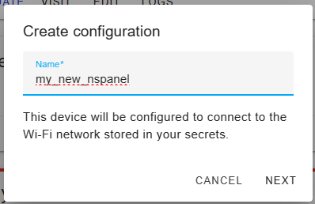

3. Select **ESP32** as the device type.  
   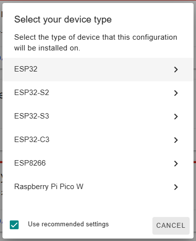

4. Click **Skip** as we're not starting the installation yet.  
   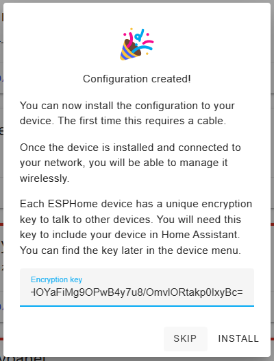

5. Locate your newly created device in the ESPHome Dashboard and click **Edit**.  
   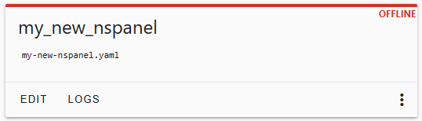

6. (Optional) For enhanced security, consider copying the `api:` entry to your panel's yaml file while adding the key itself to the secrets file
   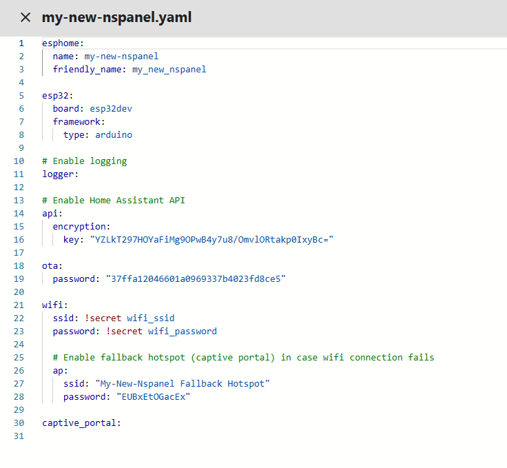

   which can be edited clicking `secrets` at the top right of your ESPHome menu.
   
   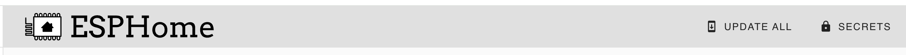

7. Note the device name at the beginning of the file under `esphome`.  
   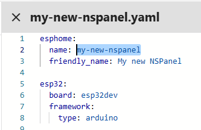

8. Clear all existing content and paste the following YAML configuration:
   ```yaml
   substitutions:
     # Settings - Editable values
     device_name: "YOUR_NSPANEL_NAME"
     friendly_name: "Your panel's friendly name"
     wifi_ssid: !secret wifi_ssid
     wifi_password: !secret wifi_password
     # Add-on configuration (if needed)
     # heater_relay: "1"  # Possible values: "1" or "2"

   # Core and optional configurations
   packages:
     remote_package:
       url: https://github.com/Blackymas/NSPanel_HA_Blueprint
       ref: main
       refresh: 300s
       files:
         - nspanel_esphome.yaml # Basic package
         # Optional advanced and add-on configurations
         # - esphome/nspanel_esphome_advanced.yaml
         # - esphome/nspanel_esphome_addon_ble_tracker.yaml
         # - esphome/nspanel_esphome_addon_bluetooth_proxy.yaml
         # - esphome/nspanel_esphome_addon_climate_cool.yaml
         # - esphome/nspanel_esphome_addon_climate_heat.yaml
         # - esphome/nspanel_esphome_addon_climate_dual.yaml
         # - esphome/nspanel_esphome_addon_cover.yaml
   ```

   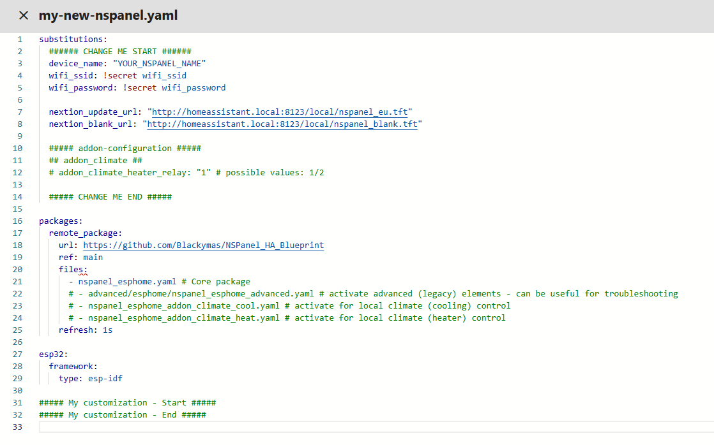

9. Modify the **Settings** section with your device name (as noted in step 7) and Wi-Fi details.  
   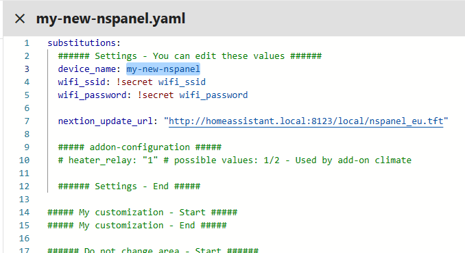

10. For Wi-Fi credentials, use `!secret` for added security or input them directly.
Learn about secrets in ESPHome: [Home Assistant Secrets in ESPHome](https://www.youtube.com/watch?v=eW4vKDeHh7Y).

11. (Optional) Adjust `nextion_update_base_url` to the base URL of a directory hosted on an HTTP or HTTPS server,  
    ensuring the directory is accessible to the NSPanel. The system will automatically append the version and  
    model name to this URL to determine the TFT file location.

    For example, if your base URL is `http://homeassistant.local:8234/local/nspanel/`, and the panel is running  
    version `v4.4.0`, the system will look for the TFT file in `http://homeassistant.local:8234/local/nspanel/v4.4.0/`.  
    For more information on hosting the TFT file and setting up the URL, see the [Upload TFT](#upload-tft) section.

    > [!CAUTION]
    > **Prefer HTTP over HTTPS for File Transfer**  
    > While you might encounter examples using HTTPS in URLs for file transfer,  
    > it is strongly recommended to use HTTP, especially when employing the `arduino` framework.  
    > The support for HTTPS in this context can be unstable, often leading to issues with file transfers.

12. (Optional) Enhance security with API encryption by adding the copied key from step 6 to the **My Customization** area.
    > [!TIP]
    > You can get a new randomly generated valid key from [ESPHome Native API Component](https://esphome.io/components/api.html#configuration-variables) page.

13. After finalizing settings, click **Save** and close the YAML window.

Your NSPanel is now configured in your ESPHome Dashboard.

### Flashing the Device for the First Time

#### Drive Safe
<!-- markdownlint-disable MD028 -->
> [!CAUTION]
> **Disconnect your panel's controller module from main power during all work.**  
> Operating on an open device that's plugged into the wall puts you at risk of electrocution.

> [!WARNING]
> **You are solely responsible for your own safety.**  
> If you're uncomfortable or if something feels wrong, stop immediately.
<!-- markdownlint-enable MD028 -->

- Use only electronic components rated for 3.3VDC. Ensure your TTL adapter is set to 3.3VDC. Exceeding this voltage can cause permanent damage to your panel.
- Maintain a clean work area to prevent damage to your device, especially the screen.
- Keep all small parts, like screws and cables, safely stored.

#### Required Tools
For first-time flashing of your NSPanel with ESPHome, you may need:
1. [USB-to-Serial TTL adapter](https://esphome.io/guides/physical_device_connection#usb-serial-adapter)
2. [Jumper wires](https://esphome.io/guides/physical_device_connection#jumper-wires)
3. [Breakable headers (optional)](https://esphome.io/guides/physical_device_connection#pcb-headers)
4. Appropriate screwdriver to disassemble your panel's controller module (touch plate)

#### Connecting Your Device via USB-to-Serial TTL Interface

Before you begin disassembling your panel, it is recommended to review the following resources for guidance:
- [YouTube - Mark Watt Tech - HOW TO - Setup the SIMPLEST Smart Home Scene Controller](https://www.youtube.com/watch?v=jpSTA_ILB8g&t=323s)
- @blakadder's [Sonoff NSPanel EU Switch in Detail](https://blakadder.com/nspanel-teardown/)
- [ESPHome - Physically Connecting to Your Device](https://esphome.io/guides/physical_device_connection)

While this guide does not cover the firmware transfer process in detail,
here are some important points to consider during the setup:

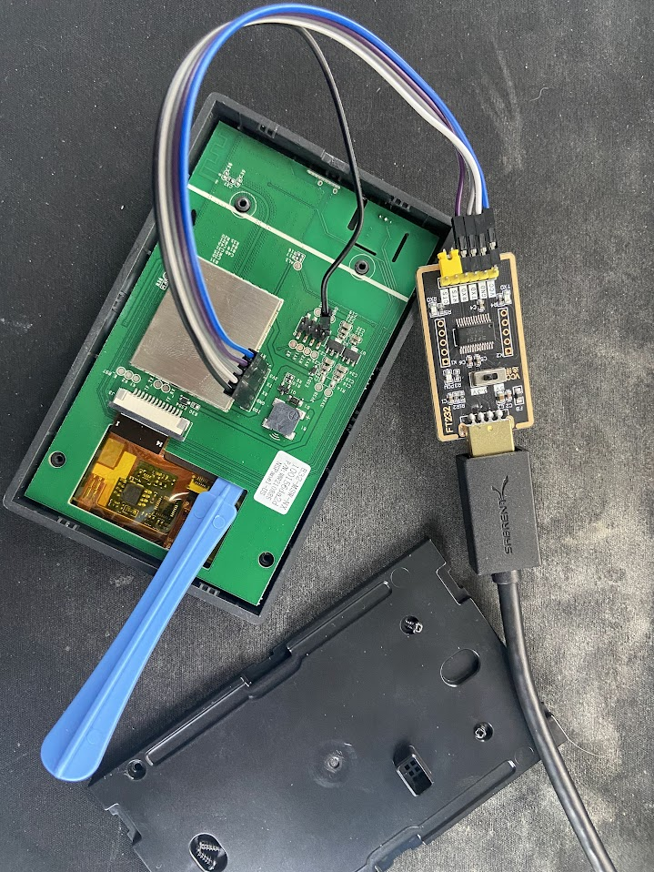
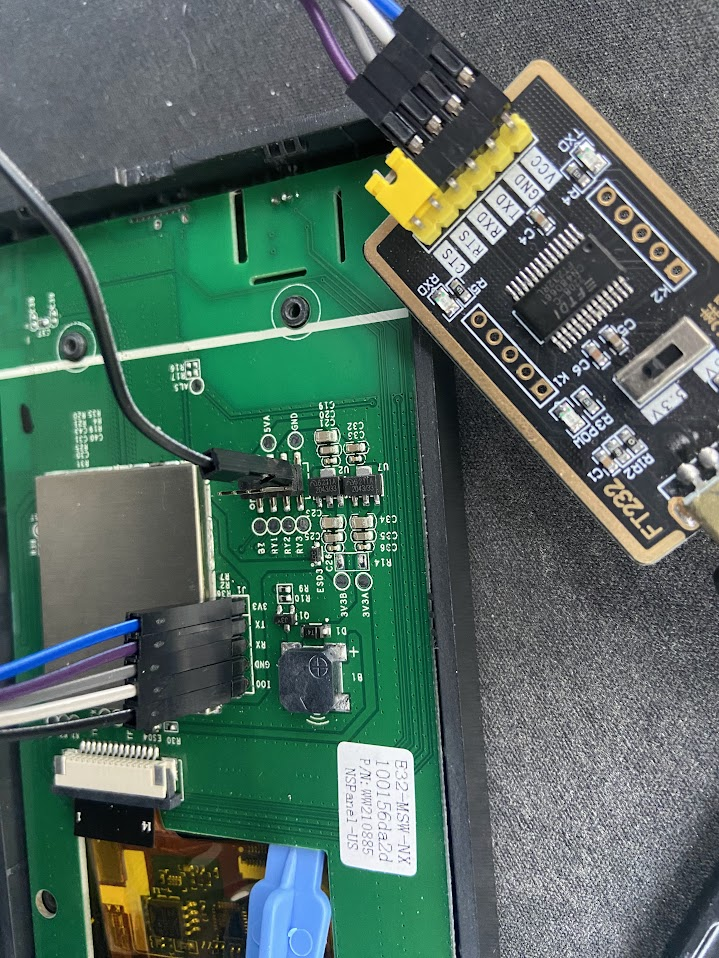
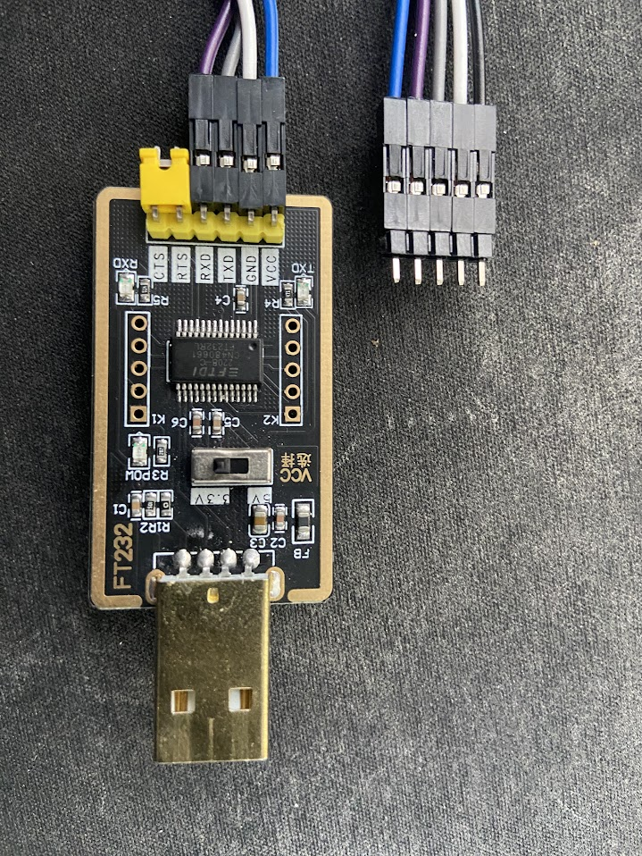

1. Handle with care the pins connecting the front panel (which includes the main board and screen) to the back part (the section mounted to the wall).
These pins are fragile and can break or bend, potentially rendering your panel nonfunctional.
2. Ensure that the pin `IO0` on the panel's board is connected to the `GND` pin on the back part connectors.
This connection is necessary to put the ESP32 into firmware transfer mode.
3. Before connecting the TTL adapter to your panel's board, verify that the adapter is set to output 3.3VDC.
Using a voltage higher than 3.3VDC, such as 5VDC, can damage your panel.
4. To avoid short circuits, consider moving the panel's board away from the metal backing of the display.
The use of a non-conductive tool, like the blue plastic one shown in the picture, can be helpful.

5. Note the cross-connection of `RX` and `TX` pins.
    The following pin-out should be used:
    <!-- markdownlint-disable MD033 -->
      | Panel's Board | TTL USB-to-Serial |
      | :--: | :--: |
      | `3V3` | `VCC`, `3V3`, or `3.3V` |
      | `TX`  | `RX`  |
      | `RX`  | `TX`  |
      | `GND` | `GND` |
      | `IO0` | `GND`<br>This can be connected to a `GND` pin on the panel's board. |
    <!-- markdownlint-enable MD033 -->

By following these guidelines and referring to the provided resources, you can safely prepare your NSPanel for firmware updates.

#### Transferring the Firmware to Your Device
After ensuring your device is properly connected, proceed to update or install the firmware using the ESPHome Dashboard.

1. **Access the ESPHome Dashboard** and locate your NSPanel device.
2. **Open the Installation Options:** Click on the three-dot menu next to your device and select **Install**.

   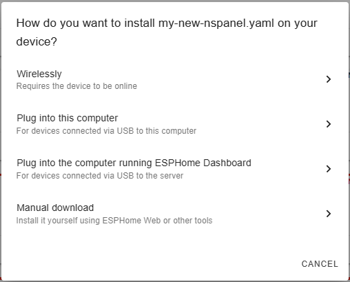

3. **Choose the Installation Method:**
   - If you're **updating** your panel, the **Wirelessly** option is typically the right choice.
   This method will compile and transfer the firmware directly to your panel over Wi-Fi.
   - For **initial installations** or updates via a USB-to-Serial TTL adapter, select either **Plug into this computer** or **Manual download**.
   Both these options will compile the firmware and allow you to download it to your computer.
   


4. **Transfer Firmware via USB-to-Serial TTL:**
   - Navigate to [ESPHome Web](https://web.esphome.io/) on your computer.
   - Click **Connect** and choose the serial interface connected to your USB-to-Serial TTL adapter.
     


   - Once connected, opt to install an existing firmware to your panel.
   Select the compiled firmware file and initiate the installation.
   


The firmware installation process will take a few minutes.
After completion, reassemble your panel and mount it back on the wall.
Power it up, and it should appear online in the ESPHome Dashboard within a couple of minutes, running the latest firmware.

### Integrating your panel to Home Assistant
Once your panel loaded the new ESPHome firmware, it should be automatically detected by Home Assistant and you should get a notification about that.
If that isn't happnening, you can manually add it as a new intgration with the following steps:
> [!TIP]
> You can use [this link](https://my.home-assistant.io/redirect/config_flow_start/?domain=esphome)
> to go directly to the dialog to add a new ESPHome device,
> then you can go directly to step 3.

1. Go to your [ESPHome integration's page](https://my.home-assistant.io/redirect/integration/?domain=esphome) under **Settings** > **Devices & services** > **ESPHome**.
2. If your panel is automatically discovered, just click **Configure**, otherwise, click on **Add device**.
3. Enter your new panel's hostname or IP address and click **Next**.
4. Follow the instructions from your Home Assistant to add your new panel.

After that, you will have access to the **Device's page** related to your NSPanel.
On that page you will find all the entities published by the ESPHome firmware installed in your panel,
which can be use to see it's status and control some of it's settings.

It might take a minute or two until the device's page gets fully populated, but when that is completed, take a look around and get familiar with that page.

You can always get back to the device's page under your [ESPHome integration's page](https://my.home-assistant.io/redirect/integration/?domain=esphome).

### Making Changes Over The Air (OTA)
Once your NSPanel is flashed with ESPHome, updating the firmware wirelessly via Over The Air (OTA) updates is a straightforward process.
This method eliminates the need for a USB-to-serial TTL adapter for most firmware updates.

#### Steps for OTA Updates
1. After making your changes in the yaml editor, click the **Install** button located at the top of the editor.
Alternatively, you can click the three-dot menu next to your device on the ESPHome Dashboard and select **Install**.

   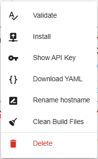

2. A dialog box will appear with different installation options:

   

3. Choose the first option to transfer the firmware **Wirelessly**.
ESPHome will compile the firmware with the new settings and automatically transfer it to your device via Wi-Fi.

   - The compilation and transfer process may take a few minutes.
   - Once complete, your panel will restart automatically with the new firmware.

Using OTA for firmware updates is a time-efficient way to keep your NSPanel updated with the latest changes and enhancements, ensuring a smooth and hassle-free user experience.

### Updating Your NSPanel Firmware
Regularly updating your NSPanel firmware ensures that you have the latest features and improvements from this project and ESPHome.
To update your device's firmware to the latest version, simply follow the [Steps for OTA Updates](#steps-for-ota-updates) as outlined above.

> [!IMPORTANT]  
> This project comprises three integral parts: ESPHome, the TFT file, and the Blueprint.
> It is crucial that all three components are updated to the same version to ensure compatibility and optimal performance.
> When updating the ESPHome firmware, make sure to also update the TFT file and the Blueprint to the corresponding version.

Keeping each component of the NSPanel HA Blueprint in sync with the same version enhances the stability and functionality of your smart panel.

### Migrating from other custom firmware
The installation in a NSPanel with Sonoff's original firmware should be straightforward, however,
if you have installed some other custom firmware before, you may have additional steps to execute.

#### NSPanel Lovelace UI
If you have already installed on your NSPanel the "nspanel-lovelace-ui" firmware from @joBr99 or from Tasmota, an [intermediate step](lovelace_ui.md) is necessary.
Please execute that first before returning here.

#### Other
Please try the standard process and if you find any issue,
please [create a new issue](https://github.com/Blackymas/NSPanel_HA_Blueprint/issues) and inform
which custom firmware you have installed before migrating to NSPanel HA Blueprint.

## Upload TFT

The NSPanel utilizes a Nextion display, which is equipped with its own controller, memory, and firmware.
This setup enables the display to render UI components and respond to commands sent from ESPHome.
The firmware and UI elements for the Nextion display are compiled into a TFT file, which needs to be loaded onto the display for proper functionality.

ESPHome manages the transfer of the TFT file to the Nextion display.
It does this by connecting to an HTTP/HTTPS server, downloading the required TFT file, and then transferring it to the display.
This process is crucial for updating or changing the UI and functionality of the display.

In our GitHub repository, you can find all the necessary TFT files for this project, catering to different models of the NSPanel.
These files are specifically designed to work with the various functionalities and features provided in each update of the NSPanel HA Blueprint.

Make sure to select and upload the correct TFT file corresponding to your specific model of NSPanel to ensure smooth operation and access to all the latest features.

> [!TIP]
> For troubleshooting TFT transfer issues, consult our [TFT Transfer Troubleshooting Guide](tft_upload.md).

### Select the Right File
Open the device's page under [ESPHome integration's page](https://my.home-assistant.io/redirect/integration/?domain=esphome)  
and look for **Update TFT display** and **Update TFT display - Model** under the **Configuration** area.

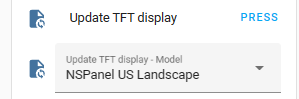

Expand the **Update TFT display - Model** control and find the model that best fits your panel:

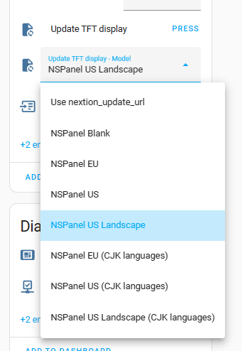

The options are:  
- **Use `nextion_update_base_url`:**  
  This instructs ESPHome to download the TFT file from the base URL specified in your panel's YAML configuration.  
  The system appends the version and model name to the base URL to locate the TFT file.  
  Use this option when hosting custom TFT files on a local server or when experiencing transfer issues  
  from the GitHub repository. This option replaces the legacy `nextion_update_url` and ensures full compatibility.

- **NSPanel Blank:**  
  A very small TFT file that displays a pre-formatted QR code linking to setup instructions.  
  While not functional for controlling your panel, it can be useful during initial setup or when  
  resolving issues caused by the *Nextion Active Reparse Mode* from Sonoff's original TFT or other custom installations.

- **NSPanel EU:**  
  Use this for a Sonoff NSPanel EU model.

- **NSPanel US:**  
  Use this for a Sonoff NSPanel US model installed in portrait orientation (buttons below the screen).

- **NSPanel US Landscape:**  
  Use this for a Sonoff NSPanel US model installed in landscape orientation (buttons on the right).

- **NSPanel EU (CJK languages):**  
  Use this for a Sonoff NSPanel EU model requiring CJK (Chinese/Japanese/Korean) language support.

- **NSPanel US (CJK languages):**  
  Use this for a Sonoff NSPanel US model in portrait orientation (buttons below the screen) with CJK language support.

- **NSPanel US Landscape (CJK languages):**  
  Use this for a Sonoff NSPanel US model in landscape orientation (buttons on the right) with CJK language support.

### Uploading to Nextion
Once the right model is selected, please press the button **Update TFT display**.

In a few seconds your display should start transferring the file correspondent to the selected model.
The transfer screen shows a progress bar with a percentage counter with a black background.

If the transfer don't starts in a few seconds, ESPHome will retry automatically a few times, with different transfer parameters, so the transfer can take up to a minute to start.

Once started, the transfer shouldn't take more than 10 to 20 minutes. If after this time it isn't close to finnish, please cancel the process by restarting your device, then try it again.

> [!TIP]
> For troubleshooting TFT transfer issues, consult our [TFT Transfer Troubleshooting Guide](tft_upload.md).

### Troubleshooting TFT transfer issues
We have an useful guide for [troubleshooting TFT transfer issues](tft_upload.md). Please take a look there.

## Blueprint
This section provides guidance on importing the NSPanel HA Blueprint from our GitHub repository into your Home Assistant,
creating a new automation for your panel setup, and updating the blueprint when new versions are available.
These processes are straightforward with the latest versions of Home Assistant.
If you have any questions or need clarification, please reach out to us.

### Importing the Blueprint
Importing the blueprint into Home Assistant is a simple process. Just click the button below and follow the steps:
<!-- markdownlint-disable MD013 -->
[](https://my.home-assistant.io/redirect/blueprint_import/?blueprint_url=https%3A%2F%2Fgithub.com%2FBlackymas%2FNSPanel_HA_Blueprint%2Fblob%2Fmain%2Fnspanel_blueprint.yaml)
<!-- markdownlint-enable MD013 -->

### Creating an Automation
After importing the Blueprint into Home Assistant, create a new automation using these steps:

1. Go to [**Settings** → **Automations & Scenes** → **Blueprints**](https://my.home-assistant.io/redirect/blueprints/) in Home Assistant.
2. Find the **NSPanel Configuration** Blueprint and click on it.
3. In the Blueprint settings, select your panel in the **NSPanel device** field.
4. Complete the relevant settings and click the **Save** button.
5. Name your automation for easy identification and click **Rename**.
   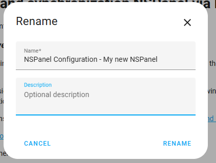

> [!TIP]
> For a comprehensive list of panel settings, refer to the [Blueprint Guide](blueprint.md).

### Editing Automation Settings
You can modify your automation anytime to change configurations:

1. In Home Assistant, go to **Settings** → **Automations & Scenes**. Or use the link below.
   [](https://my.home-assistant.io/redirect/automations/)

2. Find your automation in the list and click on it to edit.

3. After making changes, click **Save**. The new settings will be sent to your panel, usually within seconds. Some changes may require a page reload on the panel to appear.

> [!TIP]
> For a comprehensive list of panel settings, refer to the [Blueprint Guide](blueprint.md).

## How to Handle Multiple Panels
For homes with multiple panels:

1. Repeat the steps in the "Blueprint" section for each panel.

2. Ensure each panel has a unique entry in the ESPHome Dashboard and in Home Assistant under **Settings** → **Devices & services** → **ESPHome**.

3. Create a separate automation for each panel in Home Assistant.

> [!IMPORTANT]
> Avoid assigning the same panel to multiple automations.
> This can cause unexpected behavior and put extra load on Home Assistant and your Wi-Fi network.
> Currently, Home Assistant does not have a mechanism to prevent this.

## Advanced Configuration for ESPHome and Home Assistant Experts

> [!WARNING]
> Customizations and advanced mode are not supported by this project's team. Use them with caution and only if you have the necessary expertise.

Before customizing your system, we encourage you to share any enhancements you make.
Consider creating a [Pull Request](https://github.com/Blackymas/NSPanel_HA_Blueprint/pulls) to the `dev` branch to share your discoveries with the community.

### Advanced ESPHome Configuration
If you want to use your panel in a non-standard way, there are some possibilities for advanced configuration.

> [!WARNING]
> Any advanced configuration listed here isn’t fully supported, so you may be on your own if you decide to use these.

#### Customizations
For advanced customization with ESPHome, start with "Customizations."  
We have a dedicated page for customizations, and we welcome your contributions: [Customization](customization.md).

#### Selecting Remote Packages
You can edit your panel’s YAML to selectively use files from the remote packages.
Typically, a standard installation includes both the "**Core**" and "**Standard**" packages.

If needed, you can modify these packages to control exactly what is installed.
This lets you remove or customize specific functionalities, using [local packages](#local-packages) if required.

This example YAML includes the same components as the standard package, but makes it easier to remove specific functionalities:

```yaml
substitutions:
  # Settings - Editable values
  device_name: "YOUR_NSPANEL_NAME"
  friendly_name: "Your panel's friendly name"
  wifi_ssid: !secret wifi_ssid
  wifi_password: !secret wifi_password
  # Add-on configuration (if needed)
  # heater_relay: "1"  # Possible values: "1" or "2"

# Core and optional configurations
packages:
  remote_package:
    url: https://github.com/Blackymas/NSPanel_HA_Blueprint
    ref: main
    refresh: 300s
    files:
      - esphome/nspanel_esphome_core.yaml  # Core configuration required for basic functionality
      # Optional (and recommended) packages
      - esphome/nspanel_esphome_standard_hw_buzzer.yaml          # Hardware - Buzzer
      - esphome/nspanel_esphome_standard_hw_relays.yaml          # Hardware - Relays
      - esphome/nspanel_esphome_standard_hw_temperature.yaml     # Hardware - Temperature Sensor
      - esphome/nspanel_esphome_standard_page_alarm.yaml         # Page Alarm
      - esphome/nspanel_esphome_standard_page_blank.yaml         # Blank Page
      - esphome/nspanel_esphome_standard_page_buttons.yaml       # Button Pages
      - esphome/nspanel_esphome_standard_page_climate.yaml       # Climate Page
      - esphome/nspanel_esphome_standard_page_confirm.yaml       # Confirm Page
      - esphome/nspanel_esphome_standard_page_cover.yaml         # Cover Page
      - esphome/nspanel_esphome_standard_page_entities.yaml      # Entity Pages
      - esphome/nspanel_esphome_standard_page_fan.yaml           # Fan Page
      - esphome/nspanel_esphome_standard_page_keyb_num.yaml      # Numeric Keyboard Page
      - esphome/nspanel_esphome_standard_page_light.yaml         # Light Page
      - esphome/nspanel_esphome_standard_page_media_player.yaml  # Media Player Page
      - esphome/nspanel_esphome_standard_page_notification.yaml  # Notification Page
      - esphome/nspanel_esphome_standard_page_qrcode.yaml        # QR Code Page
      - esphome/nspanel_esphome_standard_page_settings.yaml      # Settings Page
      - esphome/nspanel_esphome_standard_page_utilities.yaml     # Utilities Page
      - esphome/nspanel_esphome_standard_page_weather.yaml       # Weather Page
      - esphome/nspanel_esphome_standard_upload_tft.yaml         # TFT Upload Capability
      # Optional advanced and add-on configurations
      # - esphome/nspanel_esphome_advanced.yaml
      # - esphome/nspanel_esphome_addon_ble_tracker.yaml
      # - esphome/nspanel_esphome_addon_bluetooth_proxy.yaml
      # - esphome/nspanel_esphome_addon_climate_cool.yaml
      # - esphome/nspanel_esphome_addon_climate_heat.yaml
      # - esphome/nspanel_esphome_addon_climate_dual.yaml
      # - esphome/nspanel_esphome_addon_cover.yaml
```

#### Local Packages
To use a local copy of `nspanel_esphome.yaml`, copy the file from GitHub to your local file system and include it in your ESPHome settings as follows:

```yaml
substitutions:
  # Editable settings
  device_name: "YOUR_NSPANEL_NAME"
  friendly_name: "Your panel's friendly name"
  wifi_ssid: !secret wifi_ssid
  wifi_password: !secret wifi_password
  nextion_update_base_url: "http://homeassistant.local:8123/local/nspanel/"  # For TFT files under `/www/nspanel/vX.X.X/`
  # Add-on configuration
  # heater_relay: "1"  # Possible values: 1/2

##### My customization - Start #####
##### My customization - End #####

packages:
  local_package: !include packages/nspanel_esphome.yaml
```

> [!NOTE] 
> Using local packages allows for greater control and quicker customization since you can modify the configuration without relying on a remote source.
> This can be useful for offline use or if you want to test changes before sharing them.

### Advanced Blueprint Configuration
The Blueprint file `nspanel_blueprint.yaml` can be installed manually.
You can also edit your local copy of the Blueprint, but be aware that reloading the Blueprint from the repository will overwrite local changes.

### Advanced TFT File
All `.HMI` files used in this project are available in our GitHub repository.
Modify these files using the [Nextion Editor](https://nextion.tech/nextion-editor/) and create your own `.tft` files for your device.

For guidance on using Nextion, refer to:
- [Nextion Instruction Set](https://nextion.tech/instruction-set)
- [Nextion Editor Guide](https://nextion.tech/editor_guide/)

## Additional Tips and Resources
> [!TIP]
> For troubleshooting TFT transfer issues, consult our [TFT Transfer Troubleshooting Guide](tft_upload.md) first.

If problems persist after troubleshooting, visit the [Issues](https://github.com/Blackymas/NSPanel_HA_Blueprint/issues) page.
Feel free to create a new issue for personalized assistance, providing details such as:
1. A description or picture of what is displayed on your screen.
2. Information on whether you are updating from a previous version of this project, migrating from another NSPanel customization, or customizing a panel with the original Sonoff settings.
3. ESPHome logs from the start of your panel to the point where the upload fails.
4. A description of what you have already tried.

## Important Note
Remember, these instructions serve as a guideline and may vary based on your specific setup and any systems previously installed.
