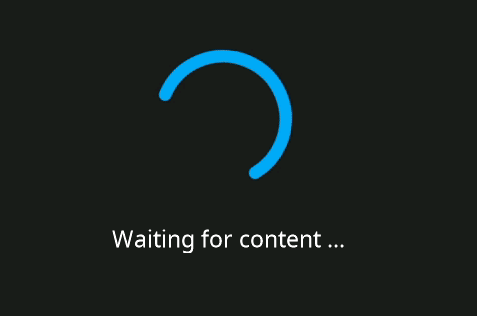
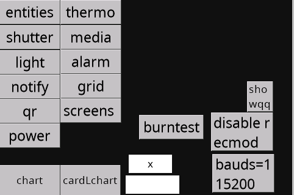

# Migrating from **NsPanel Lovelace UI**

This document applies to users trying to migrate from **NsPanel Lovelace UI**, which is another customization for NSPanel which is available for Tasmota or ESPHome.

If you are coming from there, you have to chose one of the 3 options:

- [Upload TFT using **NsPanel Lovelace UI** tools - ESPHome version](#upload-tft-using-nspanel-lovelace-ui-tools---esphome-version)
- [Upload TFT using **NsPanel Lovelace UI** tools - Tasmota version](#upload-tft-using-nspanel-lovelace-ui-tools---tasmota-version)
- [Upload TFT using this project's tools](#upload-tft-using-this-projects-tools)

## Updating TFT

### Common steps

1. Download the file [`nspanel_blank.tft`](../hmi/nspanel_blank.tft) from our GitHub repository.
2. Upload the same file (`nspanel_blank.tft`) to the folder _**"www"**_ in your Home Assistant
3. Double check if the file is available by trying to download it using your local url (typically [`http://homeassistant.local:8123/local/nspanel_blank.tft`](http://homeassistant.local:8123/local/nspanel_blank.tft)).

### Upload TFT using **NsPanel Lovelace UI** tools - ESPHome version

After following the [**Common steps**](#common-steps), follow the additional steps:

1. On Home Assistant, go to _**"Developer tools --> Actions"**_ and search there for the action named "**ESPHome: DEVICE_NAME_upload_tft**" or `esphome.<<device_name>>_upload_tft`.
2. On the field `URL`, enter the url for your local `nspanel_blank.tft` file (typically `http://homeassistant.local:8123/local/nspanel_blank.tft`).
3. Press the button **PERFORM ACTION**

If everything goes right, you will see the progress bar indicating the file transfer an you will end up with a black screen showing a QR code. Then please follow the instructions from [here](nspanel_blank.md#what-to-do-after-installing-nspanel_blanktft).

### Upload TFT using **NsPanel Lovelace UI** tools - Tasmota version

After following the [**Common steps**](#common-steps),
use the instructions from [**NsPanel Lovelace UI** - Flash Firmware to Nextion Screen](https://docs.nspanel.pky.eu/stable/prepare_nspanel/#flash-firmware-to-nextion-screen) website to upload TFT,
just replacing the file url by the one you have locally (typically `http://homeassistant.local:8123/local/nspanel_blank.tft`).

If everything goes right, you will see the progress bar indicating the file transfer an you will end up with a black screen showing a QR code. Then please follow the instructions from [here](nspanel_blank.md#what-to-do-after-installing-nspanel_blanktft).

### Upload TFT using this project's tools

If you have already installed the ESPHome firmware from this project, this is probably your better option now.

After following the [**Common steps**](#common-steps), follow the additional steps:

1. On your panel's screen showing a ring and a message "Wait for content...", click 9 times in the center of the ring.

    
2. You should get to this page:

    
3. Click on the button "disable recmod"
4. Click on the button "bauds=115200"
5. On Home Assistant, go to _**"Developer tools --> Actions"**_ and search there for the action named "**ESPHome: DEVICE_NAME_upload_tft**" or `esphome.<<device_name>>_upload_tft`.
6. On the field `URL`, enter the url for your local `nspanel_blank.tft` file (typically `http://homeassistant.local:8123/local/nspanel_blank.tft`).
7. Press the button **PERFORM ACTION**

If everything goes right, you will see the progress bar indicating the file transfer an you will end up with a black screen showing a QR code. Then please follow the instructions from [here](nspanel_blank.md#what-to-do-after-installing-nspanel_blanktft).

## Additional Tips and Resources

We have an useful guide for [troubleshooting TFT transfer issues](tft_upload.md). Please take a look there first.

After troubleshooting, if issues persist, consult the [Issues](https://github.com/Blackymas/NSPanel_HA_Blueprint/issues) and feel free to create a new one asking for more personalized assistance.

Please share as much info as possible, like:
1. Describing (or a picture of) what is in your screen
2. Are updating from a previous version of this same project, or coming from another NSPanel customization (which one?) or customizing for the first time a panel with original Sonoff settings?
3. Please share the ESPHome logs from when your panel starts to the moment the upload fails.
4. Describe what you have already tried.

## Important note

Remember, these steps are a guideline and might vary slightly based on your specific setup and previously installed system.
