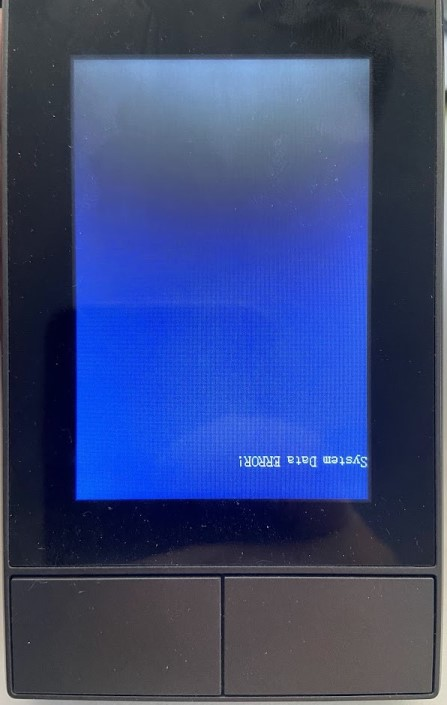
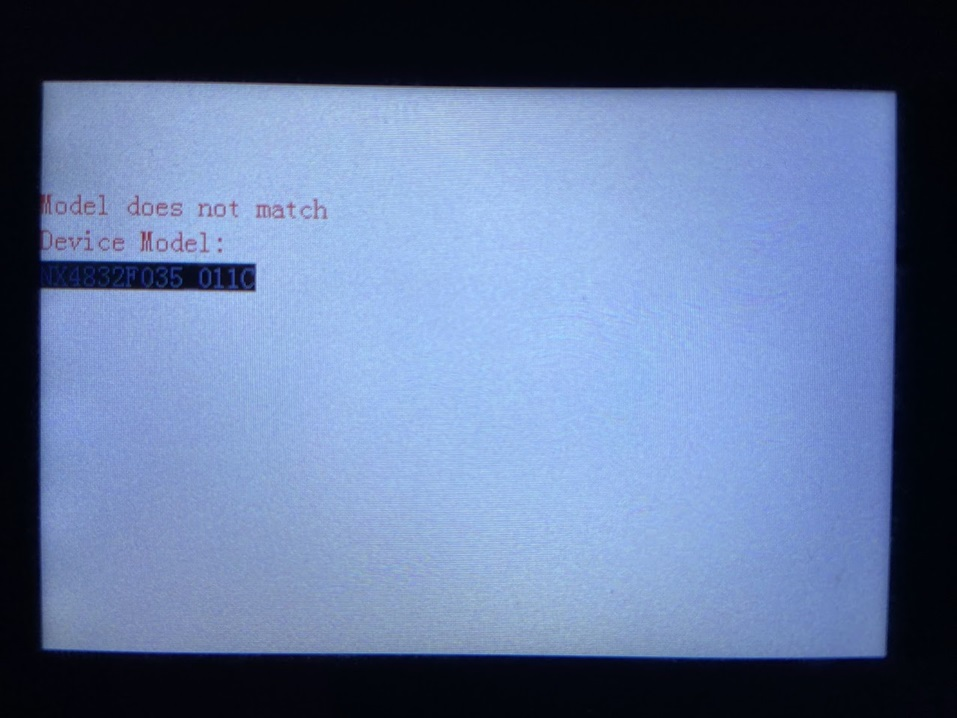
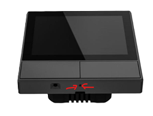

# Troubleshooting TFT transfer

> [!IMPORTANT]  
> If you have already installed the version "nspanel-lovelace-ui" from joBr99 on your NSPanel, an intermediate step is necessary - otherwise,
> it is not possible to install this or any other version.
>
> See [Common Issues | TFT Upload when NSPanel Lovelace UI has been installed](howto.md)

## Common Issues and Troubleshooting
The following is a list of common issues affecting the TFT upload, along with suggested solutions.
These issues are not specific to the NSPanel HA Blueprint project but are common to Nextion displays and ESPHome.

### Resolving "System data ERROR!" on Display


#### Don't Panic!
The "System data ERROR!" message, sometimes displayed upside-down, appears when a TFT upload is incomplete.
While it may seem alarming, this message simply indicates that the TFT file on the display is invalid.
A successful TFT upload will resolve this issue.

### Resolving "Model does not match" on Display


This is one more case where the message sounds more alarming than it actually is.
Often, a simple reboot of the panel is enough to restore the previous TFT file.
This issue typically arises from a corrupt TFT file or server response issues.
For troubleshooting, refer to the following sections:
- [Using a Local Source (Home Assistant)](#using-a-local-source-home-assistant)
- [HTTP Instead of HTTPS](#http-instead-of-https) - Especially important when using the `arduino` framework.
- [Check the File Size by Downloading to Your Computer](#check-the-file-size-by-downloading-to-your-computer)

> [!TIP]
> If the TFT transfer has started, your panel might not respond to the reset button on the
> device's page in Home Assistant or to holding the hardware button for 15 seconds.
> In such cases, you can either power cycle your device using the room's relay on your electrical plate
> or use a pin to press the hardware restart button in a small hole behind the device.
> 

### If using manual IP, make sure you have a DNS server configured
At least one DNS server is required to enable TFT transfer direcly from GitHub, otherwise use `nextion_update_url`.
If you are setting up a manual IP as a customization, please remember to add a valid DNS server for your panel.

### Using the `nspanel_blank.tft` File to Assist
Many TFT upload problems are associated with the Nextion Active Reparse Mode,
which is used in some implementations like the original Sonoff firmware or other popular custom firmwares.
Installing any TFT file from this project will disable this mode.
However, the size of a typical TFT file (7 to 12 Mb) can be challenging for devices with limited memory,
such as the ESP32 in your panel, especially over a serial interface.

To facilitate the process, we've created the `nspanel_blank.tft` file.
Although it's not a fully functional TFT file, it's sufficient to disable the Reparse Mode and is significantly smaller (less than 300kb). 

If you encounter any issues, try installing the `nspanel_blank.tft` file first. This should make it easier to subsequently install larger, fully functional TFT files.

### Enabling TFT upload components
If the components necessary for uploading a TFT file are not available in the device's page under **Settings** > **Devices & services** > **ESPHome**,
and you cannot simply enable the entity on it's settings, please try removing the device integration from there, restart your Home Assistant instance and then add the device again.
It should be automatically detected as a new integration, but if this is not happening,
click the **Add integration** button, select **ESPHome**, add the device hostname or IP address and follow the steps required.

### Wait a Bit Before Starting the TFT Upload
- **Issue**: The Nextion display might not connect to ESPHome immediately after boot.
- **Solution**: Wait up to 2 minutes for the boot script to complete.
If you are already using a TFT from this project, the display of ESPHome version and the framework used (`arduino` vs `esp-idf`) is an indication that a communication was established.
If you haven't installed any TFT yet, look for Nextion related messages on ESPHome logs.
- **Additional Guidance**: Knowing when the device is fully booted and ready to accept the TFT upload can prevent many issues.
Observe any changes in the display or logs indicators to ensure the device is ready.

### Using a Local Source (Home Assistant)
- **Issue**: Problems with downloading the TFT from GitHub.
- **Solution**: Host the TFT file on your Home Assistant and change the `nextion_update_url` accordingly.
- **Step-by-Step Guide**: Here's how you can change your `nextion_update_url`:
    1. Locate your panel's ESPHome configuration file.
    2. Find the line with `nextion_update_url`.
    3. Replace the URL with the local address where your TFT file is hosted.

### HTTP Instead of HTTPS
- **Issue**: HTTPS connections may be problematic with ESP, especially when using `arduino` as framework.
- **Solution**: Use HTTP for hosting the TFT file and updating the `nextion_update_url`.
- **Why HTTP?**: HTTP can be more stable for these connections.
To switch, simply replace 'https' with 'http' in your URLs and make sure your http server supports non-secure connections.

### Remove Customizations
- **Issue**: Customizations like `bluetooth_proxy` and `ble_tracker` may interfere with the upload.
- **Solution**: Temporarily remove any customizations to free up memory.
- **How to Remove Customizations**: Identify any additional features you've added and remove them from your configuration file.
Pay special attention to memory-intensive customizations.

### Use IP Address Instead of DNS
- **Issue**: DNS may cause connection problems.
- **Solution**: Use the IP address of your Home Assistant directly.
- **Example**: Replace `http://homeassistant.local:8123/local/nspanel_blank.tft` with `http://192.168.0.100:8123/local/nspanel_blank.tft`.

### Check the File Size by Downloading to Your Computer
- **Issue**: Ensuring the file size matches the GitHub version.
- **Solution**: Use the same URL you provided to ESPHome to download the file on your computer and compare sizes.
- **Verification Steps**: Download the file, then right-click and select 'Properties' to check the size.
Compare this with the size listed on GitHub or from the file you downlodaded directly from GitHub.

### Power Cycle Your Panel
- **Issue**: General troubleshooting.
- **Solution**: Turn off the power supply, wait for a moment, and then power it back on.
If your panel is already installed in the wall, you can often power cycle it by switching the relay connected to your panel in your electricity relay's panel.
- **How Long to Wait**: It's recommended to wait at least 30 seconds before turning the power back on.
This duration helps ensure that the system resets to a clean state.

> [!TIP]
> If you don't have easy access to your relay's panel, an alternative is to
> use a pin to press the hardware restart button, located in a small hole behind the device.
> Although this action does not replicate a full power cycle, it might resolve the issue in some cases.
> 

### Consider changing the framework
- **Issue**: You might be facing some situation where the transfer engine used by your framework cannot handle it properly.
- **Solution**: ~~Temporarily switch between the frameworks~~ If you're using the deprecated Arduino framework, migrate to ESP-IDF framework.
- **Additional Guidance**: ~~This project supports both `arduino` (ESPHome default) or `esp-idf` (this project default) frameworks.~~
This project officially supports only `esp-idf` framework as of v4.3.22. Arduino framework has been deprecated.
The upload TFT engines have some differences, so using ESP-IDF framework may solve some issues.

> [!WARNING]
> **Arduino framework is deprecated** as of v4.3.22 and no longer officially supported. If you're experiencing issues with Arduino framework, please migrate to ESP-IDF.

You can set the framework you want by adding this to your ESPHome yaml:

#### ESP-IDF (RECOMMENDED)
```yaml
esp32:
  framework:
    type: esp-idf
```

#### Arduino (DEPRECATED - NOT SUPPORTED)
> [!WARNING]
> **DEPRECATED:** Arduino framework support has been discontinued as of v4.3.22.

```yaml
esp32:
  framework:
    type: arduino
```

### Flash your panel again
- **Issue**: Your firmware might be missing some important library, you may be using an outdated version or the ESP may be out of memory.
- **Solution**: Remove all add-ons and non-essential customization and flash your panel again.
- **Step-by-Step Guide**:
    1. Look your yaml file and commment out all the customization (typically on a section name "My customizations") and any of the remote files other than `nspanel_esphome.yaml`.
    2. Flash your panel with the new cleaner yaml. You can do this over the air/wirelessly, although it is recommended to use serial when changing between frameworks
    3. Try to update the TFT file again
    4. Add the add-ons and removed customization back and then flash it again.

### Try an alternative http service
- **Issue**: Your current http server may be overloaded.
- **Solution**: Try another http server installed in your computer.
There are many options available for free to run under you local Windows, MAC or Linux machine.
- **Examples**: Just to name some:
  | Solution | Website | Supported OSs | Pros | Cons |
  |----------|---------|---------------|------|------|
  | NGINX | [nginx.org](https://nginx.org/en/) | Linux, Windows, macOS | High performance, efficient for static content, good for high concurrency | Configuration can be complex for beginners |
  | IIS | [Microsoft Web Platform](https://www.microsoft.com/web/downloads/platform.aspx) | Windows | Integrated with Windows, GUI for setup, good for Windows environments | Limited to Windows OS |
  | Apache | [httpd.apache.org](https://httpd.apache.org/) | Linux, Windows, macOS | Highly reliable and flexible, wide OS compatibility, extensive customization | Can be less efficient under high load than NGINX |
  | XAMPP | [apachefriends.org](https://www.apachefriends.org/index.html) | Linux, Windows, macOS | All-in-one package, easy to install, ideal for beginners | Not optimized for high-traffic sites, more suited for development than production |

## Additional Tips and Resources
After troubleshooting, if issues persist, consult the [Issues](https://github.com/Blackymas/NSPanel_HA_Blueprint/issues) and feel free to create a new one asking for more personalized assistance.

Please share as much info as possible, like:
1. Describing (or a picture of) what is in your screen
2. Are updating from a previous version of this same project, or coming from another NSPanel customization (which one?) or customizing for the first time a panel with original Sonoff settings?
3. Please share the ESPHome logs from when your panel starts to the moment the upload fails.
4. Describe what you have already tried.

## Important note
Remember, these steps are a guideline and might vary slightly based on your specific setup and previously installed system.
