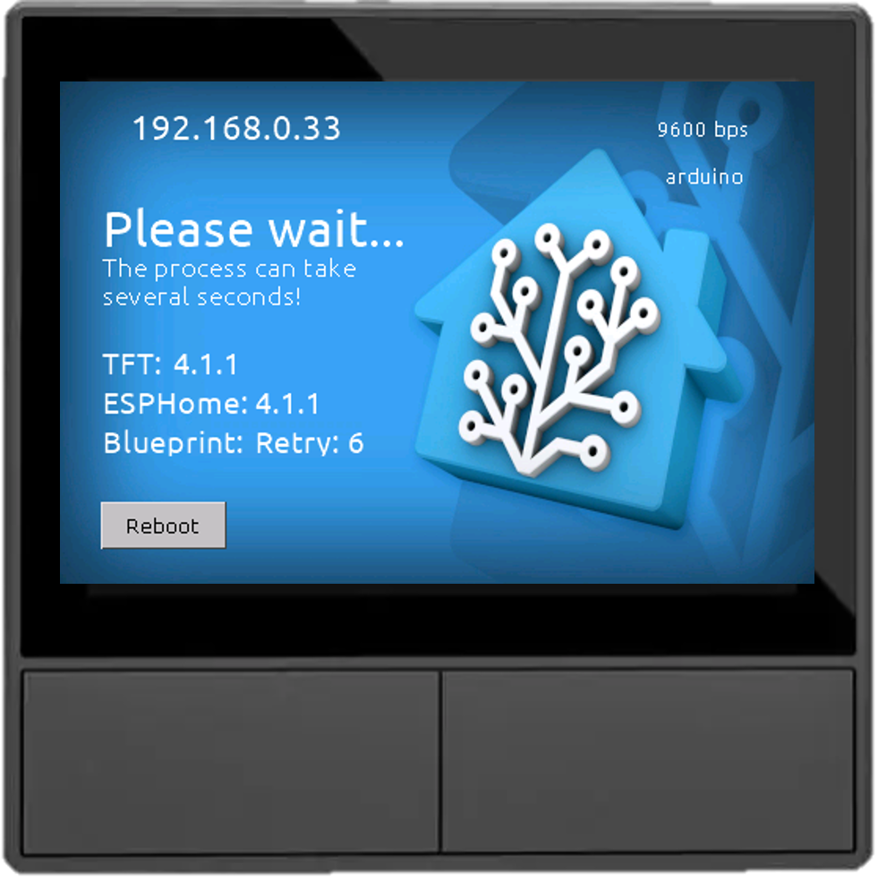
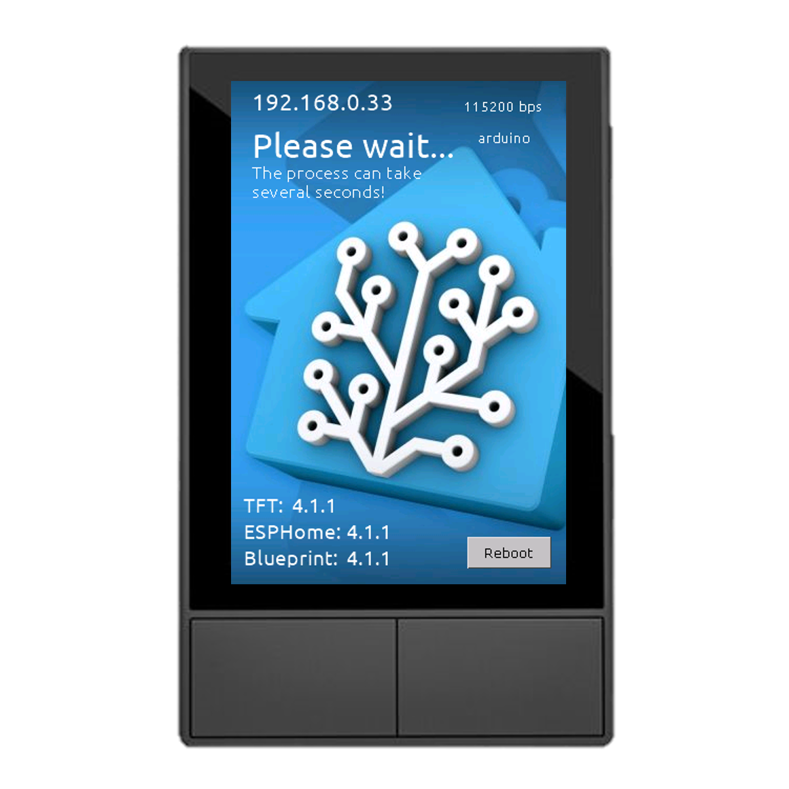
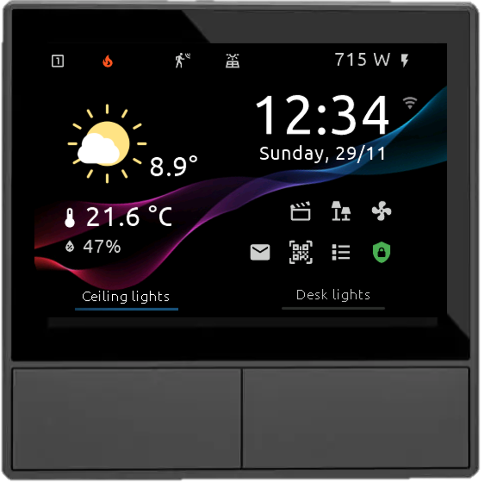
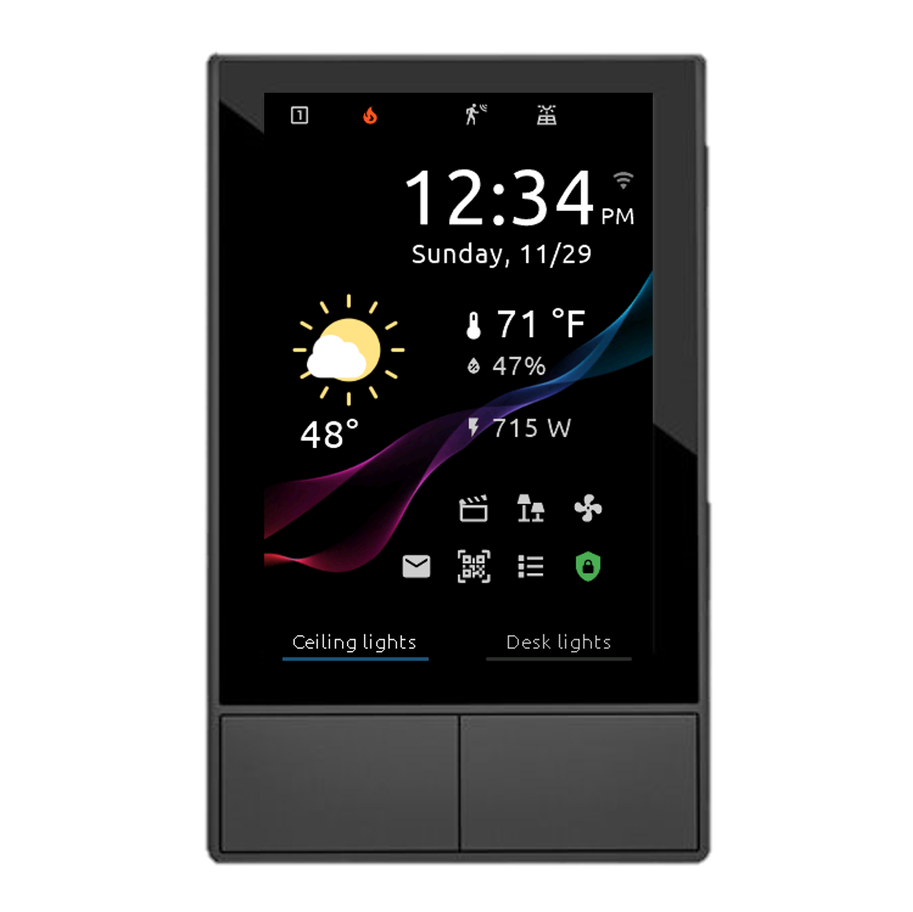
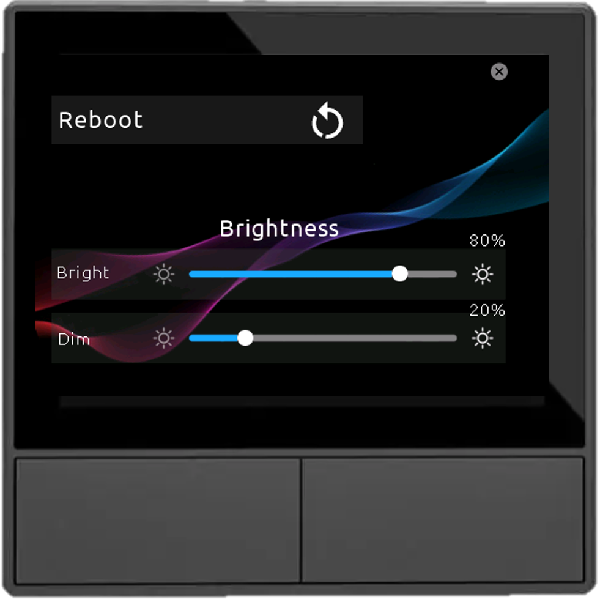
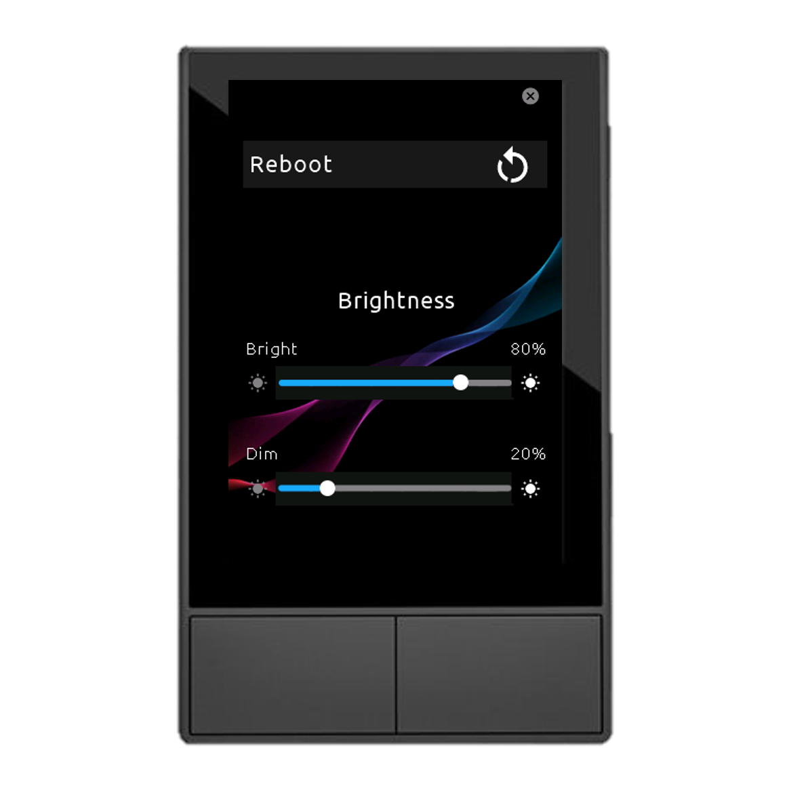

# Nextion instructions used for screenshots

Please select "Instruction codes: utf-8" in the Nextion simulator

## Boot page

```nextion
page boot
baud_rate.txt="115200 bps"
esph_version.txt="4.2"
bluep_version.txt="4.2"
tft_version.txt="4.2"
vis bt_reboot,1
framework.txt="esp-idf"
ip_addr.txt="192.168.0.123"
```





## Home page

**EU version:**

```nextion
page home
date.txt="Sunday, 29/11"
outdoor_temp.txt="8.9°"
time.txt="12:34"
vis wifi_icon,1
wifi_icon.txt=""
weather.pic=11
left_bt_text.txt="Ceiling lights"
left_bt_pic.pic=32
icon_top_01.txt=""
right_bt_text.txt="Desk lights"
icon_top_03.txt=""
icon_top_03.pco=64164
icon_top_06.txt=""
icon_top_08.txt="侀"
current_temp.txt="21.6 °C"
indoortempicon.txt=""
value01_state.txt="47%"
value01_icon.txt=""
bt_notific.txt=""
vis bt_notific,1
bt_qrcode.txt=""
vis bt_qrcode,1
bt_entities.txt=""
vis bt_entities,1
bt_alarm.txt=""
bt_alarm.pco=19818
vis bt_alarm,1
button01.txt=""
button02.txt=""
button03.txt=""
value03_state.txt="715 W"
value03_icon.txt=""
```



**US version:**

```nextion
page home
meridiem.txt="PM"
date.txt="Sunday, 11/29"
outdoor_temp.txt="48°"
time.txt="12:34"
vis wifi_icon,1
wifi_icon.txt=""
weather.pic=11
left_bt_text.txt="Ceiling lights"
left_bt_pic.pic=32
icon_top_01.txt=""
right_bt_text.txt="Desk lights"
icon_top_03.txt=""
icon_top_03.pco=64164
icon_top_06.txt=""
icon_top_08.txt="侀"
current_temp.txt="71 °F"
indoortempicon.txt=""
value01_state.txt="47%"
value01_icon.txt=""
bt_notific.txt=""
vis bt_notific,1
bt_qrcode.txt=""
vis bt_qrcode,1
bt_entities.txt=""
vis bt_entities,1
bt_alarm.txt=""
bt_alarm.pco=19818
vis bt_alarm,1
button01.txt=""
button02.txt=""
button03.txt=""
value03_state.txt="715 W"
value03_icon.txt=""
```



## Settings page

```nextion
page settings
```




## Buttons pages (DRAFT)

```nextion
api=1
page buttonpage01
page_label.txt="Bedroom"
vis 255,1
button01pic.picc=47
button01text.picc=47
button01icon.picc=47
button01bri.picc=47
button01text.txt="Ceiling\rlights"
button01text.pco=10597
button01icon.txt=""
button01icon.pco=64704
button01icon.font=10
button01bri.txt="100%"
button01bri.pco=10597
button02pic.picc=46
button02text.picc=46
button02icon.picc=46
button02bri.picc=46
button05pic.picc=47
button05text.picc=47
button05icon.picc=47
button05bri.picc=47
button05text.txt="Windows\rlights"
button05text.pco=10597
button05icon.txt=""
button05icon.pco=64704
button05icon.font=8
button05bri.txt="100%"
button05bri.pco=10597
button06pic.picc=46
button06text.picc=46
button06icon.picc=46
button06bri.picc=46
```

## Entities pages

**EU version:**

```nextion
api=1
page entitypage01
entity01_label.txt="Power monitoring"
value01_pic.txt=""
value01_label.txt="Kitchen"
value01.txt="1123.1 W"
value01.xcen=2
value02_pic.txt=""
value02_label.txt="Living room"
value02.txt="233.1 W"
value02.xcen=2
value03_pic.txt=""
value03_label.txt="Total (entire home)"
value03.txt="2345.6 W"
value03.xcen=2
value05_pic.txt=""
value05_label.txt="Electricity price"
value05.txt="1.21 €/kWh"
value05.xcen=2
value07_pic.txt=""
value07_label.txt="Electricity cost rate"
value07.txt="1.84 €/h"
value07.xcen=2
```

**US version:**

```nextion
api=1
page entitypage01
entity01_label.txt="Power monitoring"
value01_pic.txt=""
value01_label.txt="Kitchen"
value01.txt="1123.1 W"
value01.xcen=2
value02_pic.txt=""
value02_label.txt="Living room"
value02.txt="233.1 W"
value02.xcen=2
value03_pic.txt=""
value03_label.txt="Total (home)"
value03.txt="2345.6 W"
value03.xcen=2
value05_pic.txt=""
value05_label.txt="Price"
value05.txt="1.21 $/kWh"
value05.xcen=2
value07_pic.txt=""
value07_label.txt="Cost rate"
value07.txt="1.84 $/h"
value07.xcen=2
```

## Sensor page (mockup)

```nextion
api=1
page notification
vis bt_accept,0
vis bt_clear,0
notifi_label.txt="My sensor name"
notifi_text01.txt="1115.4 kWh"
notifi_text01.font=6
```
